# Code Context Retrieval System — Design Document

**Date**: 2026-03-14
**Status**: Approved
**SRS Reference**: docs/plans/2026-03-14-code-context-retrieval-srs.md
**UCD Reference**: docs/plans/2026-03-14-code-context-retrieval-ucd.md
**Template**: docs/templates/design-template.md

## 1. Design Drivers

- **NFR thresholds**: P95 ≤ 1000ms, ≥ 1000 QPS sustained / ≥ 2000 QPS peak, 99.9% uptime, single-node failure tolerance with zero query failures, linear horizontal scaling (±20%)
- **Constraints**: 6 target languages (Java, Python, TypeScript, JavaScript, C, C++), MCP protocol compliance, offline indexing / online query isolation (CON-003), any Git URL as data source
- **Interface requirements**: MCP over stdio/HTTP (AI agents), HTTPS REST + HTML/JS (developers), Git HTTPS/SSH (repositories), HTTP/local embedding model inference
- **User-confirmed tech selections**: tree-sitter (parsing), Qdrant (vector store), Elasticsearch (keyword index), bge-code (embeddings), bge-reranker (reranking)
- **UCD style**: Developer Dark theme, 7 components + 2 pages, JetBrains Mono code font, Lucide Icons

## 2. Approach Selection

**Selected**: Approach B — Python Microservices (Indexing Service + Query Service)

**Justification**:
1. Fully satisfies CON-003 (offline/online isolation) with two independent services
2. Query Service is stateless → supports multi-replica deployment for NFR-006/007
3. Pure Python stack provides native support for bge-code/bge-reranker/tree-sitter without cross-language overhead
4. Moderate operational complexity (2 services) vs. Go+Python dual-stack alternative
5. Perfect alignment with user-confirmed technology selections

**Alternatives considered**:
- **Approach A (Python Monolith)**: Disqualified — violates CON-003, cannot meet NFR-002/006/007
- **Approach C (Go Query + Python Indexing)**: Viable but dual-language stack increases maintenance cost; Go's advantage (goroutine concurrency) unnecessary at 1000 QPS target

## 3. Architecture

### 3.1 Architecture Overview

The system consists of two independent Python services sharing a storage layer:

- **Indexing Service** — Offline batch processing service. Clones repositories, parses code (tree-sitter), generates embeddings (bge-code), writes to search indices (Qdrant + Elasticsearch). Scheduled via Celery + Redis.
- **Query Service** — Online stateless service. Accepts queries (MCP + REST), performs keyword retrieval (ES) + semantic retrieval (Qdrant) in parallel, fuses results, applies neural reranking (bge-reranker), returns top-3 results. Web UI integrated via Jinja2 SSR + HTMX.
- **Storage Layer** — Qdrant (vectors) + Elasticsearch (keywords) + PostgreSQL (metadata: repos, jobs, API keys) + Redis (Celery broker + query cache).

### 3.2 Logical View

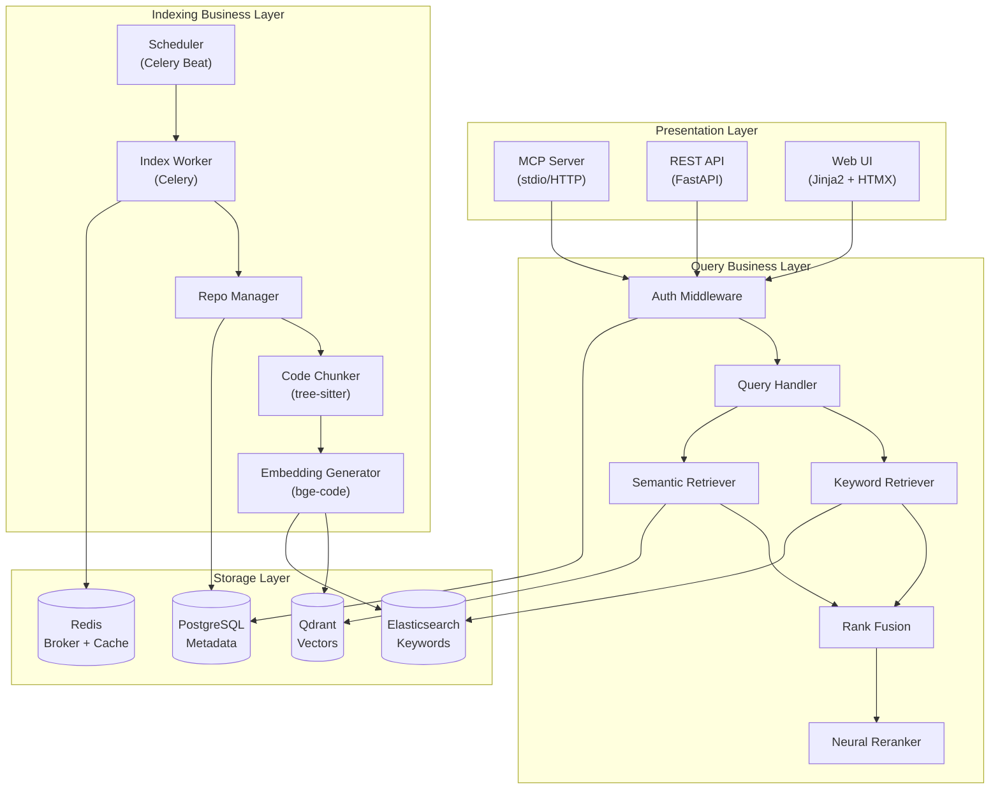

### 3.3 Component Diagram

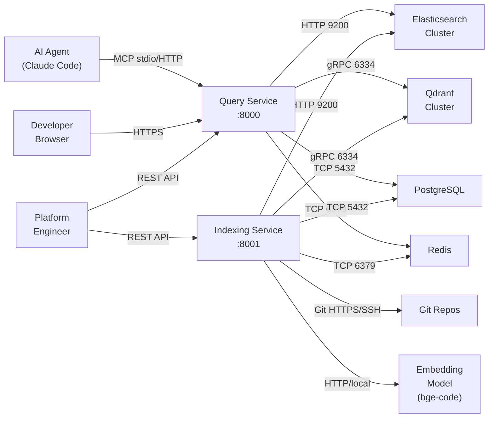

### 3.4 Tech Stack Decisions

| Decision | Choice | Rationale (SRS Trace) |
|----------|--------|----------------------|
| Language | Python 3.11+ | bge-code/bge-reranker/tree-sitter native support; unified stack |
| Web Framework | FastAPI | Async support, auto OpenAPI docs, high-performance ASGI |
| ASGI Server | Uvicorn + Gunicorn (multi-worker) | Multi-process bypasses GIL → NFR-001/002 |
| Task Queue | Celery + Redis | Mature distributed task scheduling, Beat for cron → FR-016 |
| Vector Store | Qdrant | User-confirmed; high-performance vector search → FR-009, NFR-001 |
| Keyword Index | Elasticsearch 8.x | User-confirmed; BM25 keyword retrieval → FR-008 |
| Code Parser | tree-sitter | User-confirmed; multi-language AST parsing → FR-004, CON-001 |
| Embedding Model | BAAI/bge-code-v1 | User-confirmed; code semantic embedding → FR-009 |
| Reranker | BAAI/bge-reranker-v2-m3 | User-confirmed; cross-encoder reranking → FR-011 |
| Metadata DB | PostgreSQL 16 | Relational storage for repos/jobs/API keys |
| Cache | Redis 7 | Celery broker + query result cache → NFR-001 |
| MCP SDK | mcp (Python SDK) | Official MCP protocol implementation → CON-002, IFR-001 |
| Web UI | Jinja2 + HTMX + Prism.js | Lightweight SSR, no SPA build; Prism.js syntax highlighting → FR-014 |

**NFR Satisfaction Strategy:**

| NFR | Strategy |
|-----|----------|
| NFR-001 (P95 ≤ 1000ms) | Redis query cache + Qdrant/ES parallel retrieval + bge-reranker GPU inference |
| NFR-002 (≥ 1000 QPS) | Gunicorn multi-worker (4-8 workers/node) × N query nodes + load balancer |
| NFR-005 (99.9%) | Query Service stateless multi-replica + Qdrant/ES/PG cluster mode |
| NFR-006 (linear scaling) | Stateless Query Service: add node = add throughput; Qdrant/ES sharded horizontal scaling |
| NFR-007 (zero failure) | Multi-replica + health checks + load balancer auto-removes failed nodes |

## 4. Key Feature Designs

### 4.1 Feature Group: Repository Management (FR-001, FR-002, FR-003, FR-004)

#### 4.1.1 Overview
Repository registration, clone/update, content extraction, and multi-granularity code chunking. Forms the core indexing pipeline.

#### 4.1.2 Class Diagram

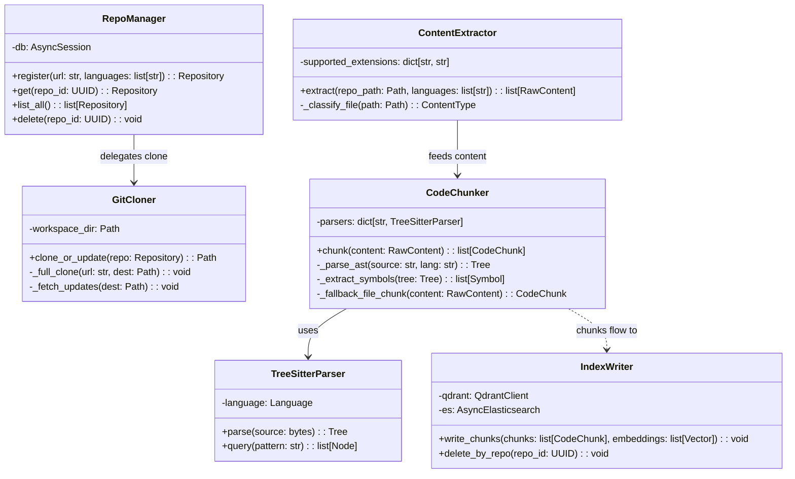

#### 4.1.3 Sequence Diagram — Indexing Pipeline

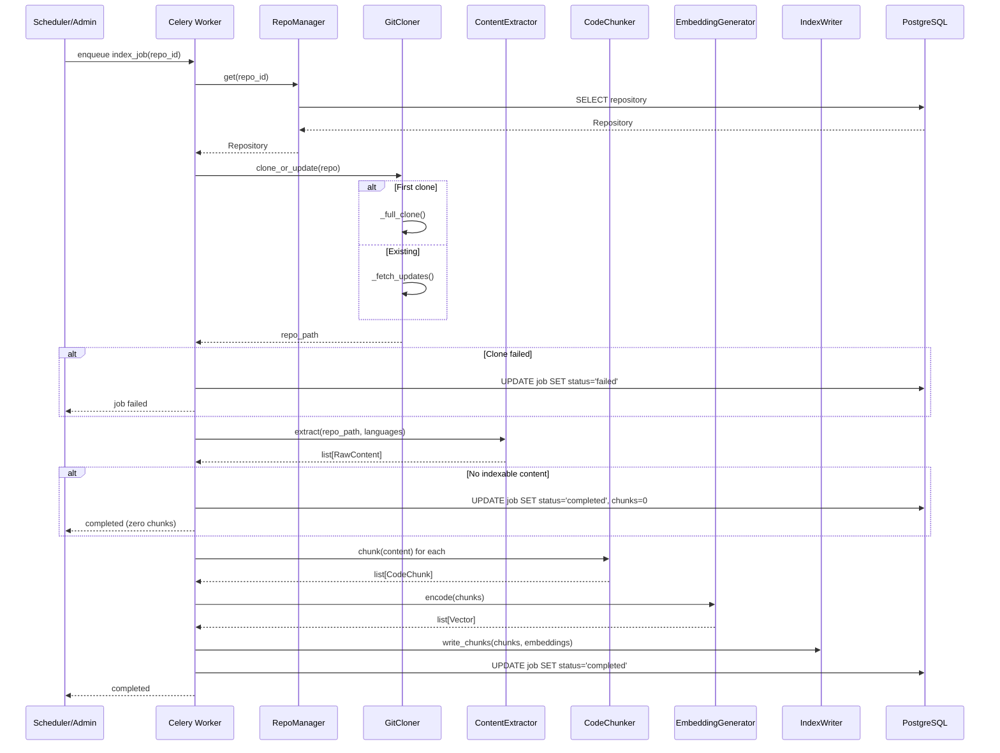

#### 4.1.4 Design Notes
- **tree-sitter parsers**: Load one Language object per target language (6 total), select parser by file extension
- **Unsupported language fallback**: Index entire file as single file-level text chunk without symbol extraction (FR-004 AC2)
- **Incremental update**: clone_or_update uses `git fetch` + `git diff` to identify changed files, reprocess only changed chunks (delete old + write new)
- **Embedding batching**: EmbeddingGenerator uses batch_size=64 for bulk inference, reducing GPU/CPU call overhead

### 4.2 Feature Group: Query Pipeline (FR-005–FR-012)

#### 4.2.1 Overview
Query intake → keyword retrieval + semantic retrieval (parallel) → rank fusion → neural reranking → top-3 response. The core online path.

#### 4.2.2 Class Diagram

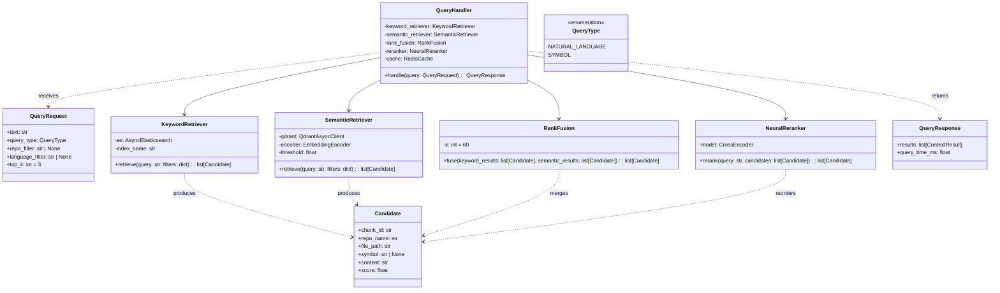

#### 4.2.3 Sequence Diagram — Query Flow

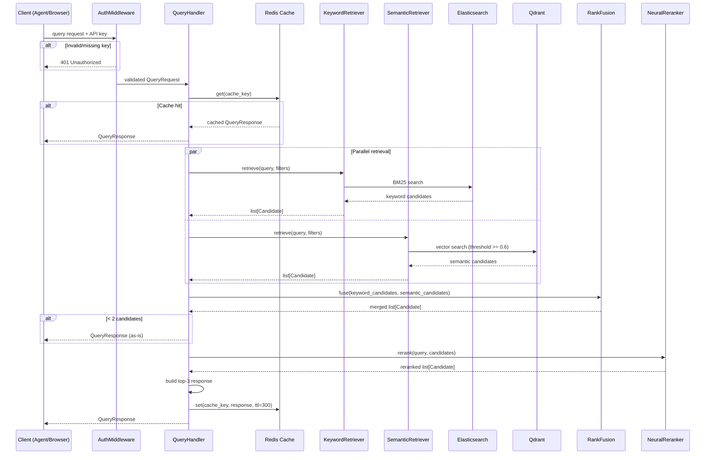

#### 4.2.4 Design Notes
- **Parallel retrieval**: KeywordRetriever and SemanticRetriever execute concurrently via `asyncio.gather()`, not sequentially
- **Rank Fusion**: Reciprocal Rank Fusion (RRF) with k=60, no score calibration needed
- **Semantic threshold**: SemanticRetriever accepts `threshold` parameter (default 0.6); candidates below threshold are discarded
- **Cache strategy**: cache_key = hash(query_text + repo_filter + language_filter), TTL=300s; index update invalidates caches for affected repo
- **Rerank degradation**: Skip reranking model when < 2 candidates, return as-is

### 4.3 Feature Group: Query Interfaces (FR-013, FR-014, FR-015, FR-018)

#### 4.3.1 Overview
MCP protocol service, Web UI, language filtering, API key authentication. The system's external access layer.

#### 4.3.2 Class Diagram

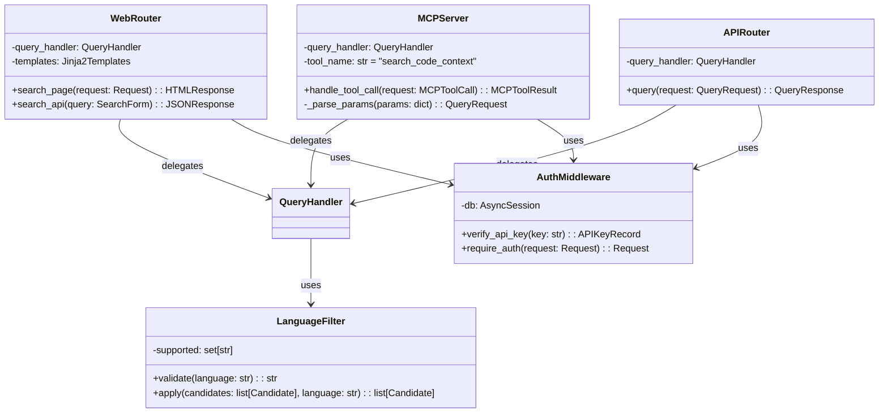

#### 4.3.3 Sequence Diagram — MCP Tool Call

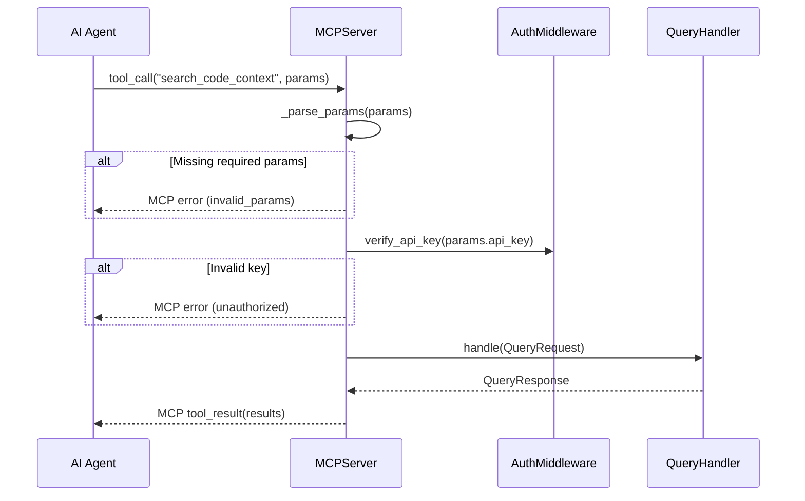

#### 4.3.4 Design Notes
- **MCP implementation**: Uses `mcp` Python SDK, exposes single tool `search_code_context` with params: query (required), repo (optional), language (optional), api_key (required)
- **MCP transport**: Supports stdio (local agent) and HTTP SSE (remote agent)
- **Web UI**: Jinja2 templates + HTMX for search interaction, Prism.js syntax highlighting; UCD Developer Dark theme via CSS custom properties
- **Language filter**: LanguageFilter.validate() checks against CON-001's 6 languages; unsupported → 422 with supported language list
- **Authentication**: AuthMiddleware looks up API key hash in PostgreSQL, verifies key status (active/revoked)

### 4.4 Feature Group: Scheduling & Operations (FR-016, FR-017)

#### 4.4.1 Overview
Scheduled index refresh and manual reindex triggering.

#### 4.4.2 Class Diagram

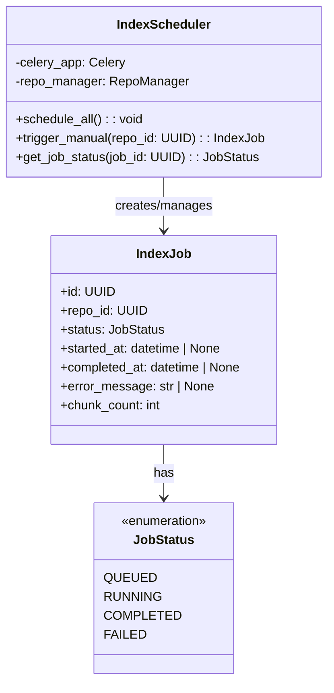

#### 4.4.3 Flow Diagram — Schedule & Manual Reindex

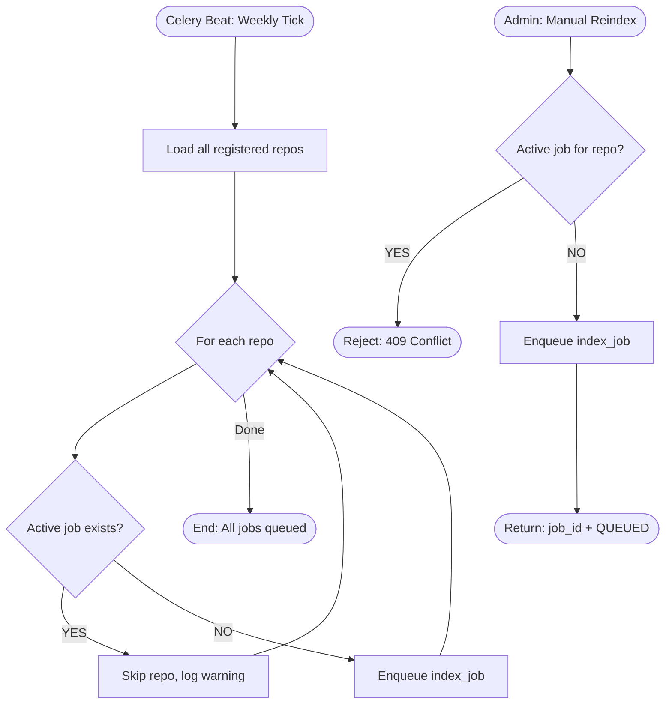

#### 4.4.4 Design Notes
- **Celery Beat**: Default weekly schedule (crontab), configurable via environment variable to daily or custom
- **Job deduplication**: Only one active job (QUEUED or RUNNING) per repo at a time, prevents duplicate indexing
- **Partial failure**: schedule_all() enqueues each repo independently; single repo failure doesn't affect others; failed repos trigger alert notification (log + extensible webhook)

### 4.5 Feature Group: Embedding & Reranking Models

#### 4.5.1 Overview
bge-code embedding encoding and bge-reranker neural reranking. Core model inference components.

#### 4.5.2 Class Diagram

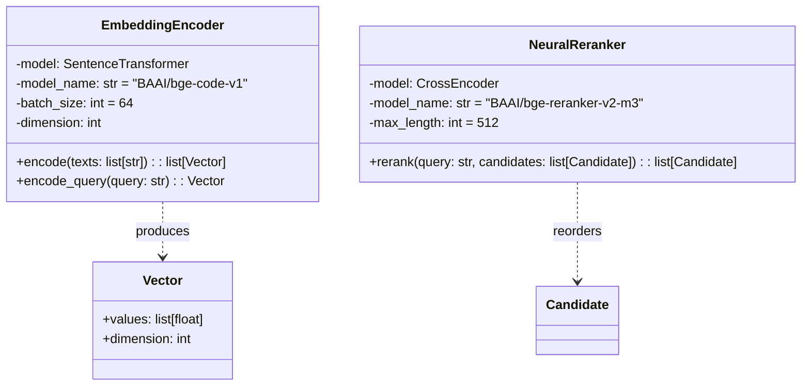

#### 4.5.3 Design Notes
- **EmbeddingEncoder**: Uses `encode()` for batch chunk encoding during indexing; `encode_query()` for single query encoding with query prefix
- **Model loading**: Models loaded once at service startup, not per-request
- **GPU inference**: Prefers GPU (`device="cuda"`) when available; degrades to CPU otherwise
- **Reranker truncation**: Inputs exceeding max_length=512 tokens are truncated to prevent OOM

## 5. Data Model

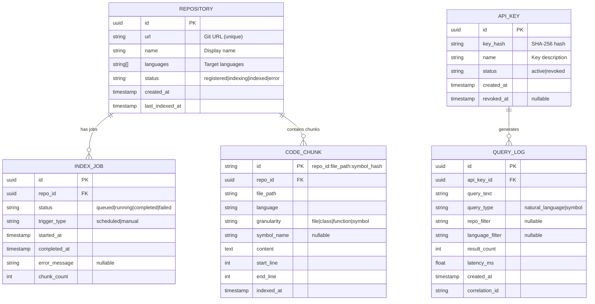

**Storage Distribution:**

| Data | Store | Rationale |
|------|-------|-----------|
| Repository, IndexJob, APIKey, QueryLog | PostgreSQL | Relational metadata, ACID transactions |
| CodeChunk content + metadata | Elasticsearch | BM25 full-text retrieval (FR-008) |
| CodeChunk embeddings | Qdrant | Vector similarity retrieval (FR-009) |
| Cross-store linking | Same `chunk_id` in ES and Qdrant | Enables fusion across retrieval methods |

## 6. API / Interface Design

### REST API (Query Service :8000)

| Method | Path | FR Trace | Auth | Description |
|--------|------|----------|------|-------------|
| POST | `/api/v1/query` | FR-005/006/007/012 | API Key | Submit query, return Top-3 results |
| GET | `/api/v1/query` | FR-005/012 | API Key | GET-style query (query params) |
| POST | `/api/v1/repos` | FR-001 | API Key (Admin) | Register repository |
| GET | `/api/v1/repos` | FR-001 | API Key | List registered repositories |
| POST | `/api/v1/repos/{id}/reindex` | FR-017 | API Key (Admin) | Trigger manual reindex |
| GET | `/api/v1/repos/{id}/jobs` | FR-016/017 | API Key (Admin) | View indexing job status |
| GET | `/api/v1/health` | NFR-005 | None | Health check |
| GET | `/api/v1/metrics` | NFR-008 | None | Prometheus metrics endpoint |

### Query Request/Response Contract

```
POST /api/v1/query
Headers: X-API-Key: <key>
Body: {
  "query": "how to use WebClient timeout",
  "query_type": "natural_language",  // or "symbol"
  "repo": "spring-framework",       // optional
  "language": "Java",               // optional
  "top_k": 3                        // optional, default 3
}

Response 200: {
  "results": [
    {
      "repository": "spring-framework",
      "file_path": "web/src/main/java/WebClient.java",
      "symbol": "WebClient.builder()",
      "score": 0.92,
      "content": "public static WebClient.Builder builder() { ... }"
    }
  ],
  "query_time_ms": 142.5
}
```

### MCP Interface (IFR-001)

| Tool Name | Parameters | Returns |
|-----------|-----------|---------|
| `search_code_context` | query (required), repo (optional), language (optional), api_key (required) | `{ results: [...], query_time_ms: float }` |

Transport: stdio (local) or HTTP SSE (remote)

## 7. UI/UX Approach

**Strategy**: Jinja2 SSR + HTMX + CSS Variables (UCD tokens)

| UCD Component | Implementation | Library |
|---------------|---------------|---------|
| Search Input | `<input>` + HTMX `hx-post` | HTMX |
| Language Filter | Chip buttons with `hx-get` | HTMX |
| Result Card | Jinja2 partial template | Jinja2 |
| Score Badge | CSS class `.score-high/.score-mid/.score-low` | CSS |
| Empty State | Conditional Jinja2 block | Jinja2 |
| Error Alert | HTMX `hx-swap="outerHTML"` on error | HTMX |
| Login Form | Standard `<form>` POST | Native |
| Syntax Highlighting | Prism.js with custom dark theme | Prism.js |

**UCD Token Mapping**: All UCD style tokens defined as CSS custom properties (`--color-primary`, `--font-code`, etc.) in `:root`. Components reference tokens directly. Developer Dark syntax highlighting colors mapped to a custom Prism.js theme.

**Responsive**: CSS Grid + media queries for 3 breakpoints (Desktop ≥1024, Tablet 768-1023, Mobile <768).

## 8. Third-Party Dependencies

| Library / Framework | Version | Purpose | License | Compatibility |
|---|---|---|---|---|
| Python | 3.11+ | Runtime | PSF | Base |
| fastapi | ^0.115.0 | Web framework | MIT | Python ≥3.8 |
| uvicorn[standard] | ^0.34.0 | ASGI server | BSD-3 | Python ≥3.8 |
| gunicorn | ^23.0.0 | Process manager | MIT | Python ≥3.7 |
| celery[redis] | ^5.4.0 | Task queue | BSD-3 | Python ≥3.8 |
| redis | ^5.2.0 | Redis client | MIT | Python ≥3.8 |
| sqlalchemy[asyncio] | ^2.0.36 | ORM + async | MIT | Python ≥3.7 |
| asyncpg | ^0.30.0 | PostgreSQL async driver | Apache-2.0 | Python ≥3.8 |
| alembic | ^1.14.0 | DB migrations | MIT | SQLAlchemy ≥1.4 |
| qdrant-client | ^1.12.0 | Qdrant vector DB client | Apache-2.0 | Python ≥3.8 |
| elasticsearch[async] | ^8.17.0 | Elasticsearch client | Apache-2.0 | ES 8.x |
| sentence-transformers | ^3.3.0 | Embedding encoder (bge-code) | Apache-2.0 | PyTorch ≥1.11 |
| torch | ^2.5.0 | ML runtime | BSD-3 | Python ≥3.8, CUDA 12.x opt |
| tree-sitter | ^0.24.0 | Code parser | MIT | Python ≥3.9 |
| tree-sitter-java | ^0.23.0 | Java grammar | MIT | tree-sitter ≥0.22 |
| tree-sitter-python | ^0.23.0 | Python grammar | MIT | tree-sitter ≥0.22 |
| tree-sitter-typescript | ^0.23.0 | TS/JS grammar | MIT | tree-sitter ≥0.22 |
| tree-sitter-c | ^0.23.0 | C grammar | MIT | tree-sitter ≥0.22 |
| tree-sitter-cpp | ^0.23.0 | C++ grammar | MIT | tree-sitter ≥0.22 |
| mcp | ^1.0.0 | MCP protocol SDK | MIT | Python ≥3.10 |
| gitpython | ^3.1.43 | Git operations | BSD-3 | Python ≥3.7 |
| jinja2 | ^3.1.4 | Template engine | BSD-3 | Python ≥3.7 |
| passlib[bcrypt] | ^1.7.4 | API key hashing | BSD-2 | Python ≥3.7 |
| pydantic | ^2.10.0 | Data validation | MIT | Python ≥3.8 |
| prometheus-client | ^0.21.0 | Metrics export | Apache-2.0 | Python ≥3.8 |
| httpx | ^0.28.0 | HTTP client (testing) | BSD-3 | Python ≥3.8 |
| pytest | ^8.3.0 | Testing framework | MIT | Python ≥3.8 |
| pytest-asyncio | ^0.24.0 | Async test support | Apache-2.0 | pytest ≥7.0 |

### 8.1 Version Constraints

- **torch ≥2.5**: Required for sentence-transformers ≥3.3 compatibility
- **tree-sitter ≥0.24**: New Python bindings API; tree-sitter-language packages ≥0.23 required
- **elasticsearch ≥8.17**: Required for ES 8.x cluster compatibility
- **mcp ≥1.0**: Stable MCP SDK; earlier versions had breaking API changes

### 8.2 Dependency Graph

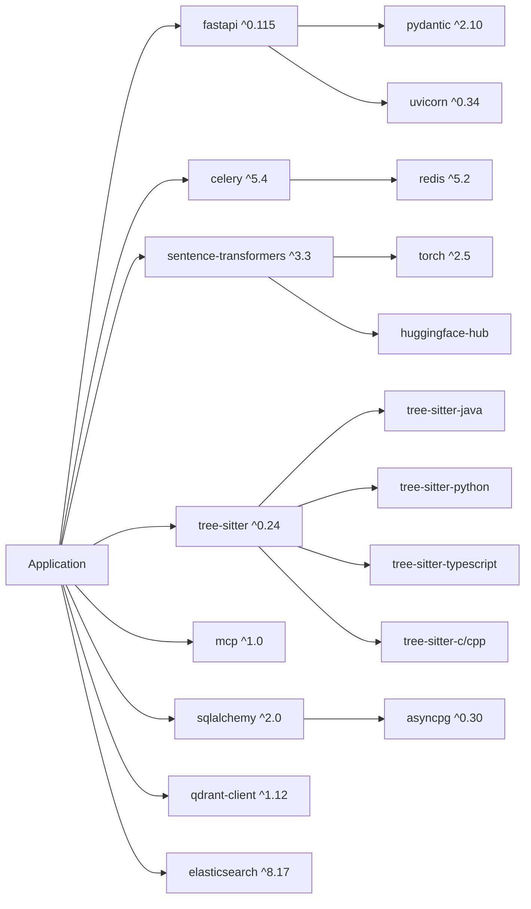

**License audit**: All MIT/BSD/Apache-2.0. No GPL/AGPL risk.

## 9. Testing Strategy

| Test Type | Scope | Tooling | Coverage Target |
|-----------|-------|---------|----------------|
| Unit | Individual module logic | pytest + pytest-asyncio | ≥80% line coverage |
| Integration | Module interactions (API→Handler→ES/Qdrant) | pytest + testcontainers | All FR acceptance criteria |
| Load | NFR-001/002 performance verification | k6 | P95 ≤ 1000ms @ 1000 QPS |
| E2E (MCP) | MCP protocol end-to-end | pytest + mcp SDK | FR-013 acceptance criteria |
| E2E (Web UI) | Web UI end-to-end | Playwright | FR-014/015 acceptance criteria |
| Chaos | Single-node failure tolerance | Manual kill + verify | NFR-007 |
| Security | Authentication bypass attempts | pytest | FR-018 acceptance criteria |

**Test doubles**: Integration tests use testcontainers to spin up real ES/Qdrant/PG/Redis containers — no mocking of storage layer.

## 10. Deployment / Infrastructure

```
Load Balancer (Nginx/Traefik)
├── Query Service Node 1 (:8000) — Gunicorn + Uvicorn workers
├── Query Service Node 2 (:8000) — Gunicorn + Uvicorn workers
└── Query Service Node N (:8000)

Indexing Service (Celery Workers + Beat)
├── Worker 1
├── Worker 2
└── Worker N

Storage Layer
├── Qdrant Cluster
├── Elasticsearch Cluster (3 nodes)
├── PostgreSQL (HA)
└── Redis (HA)
```

- **Containerization**: Docker Compose (dev) / Kubernetes (prod)
- **Query Service**: Stateless, Deployment 2+ replicas, HPA based on CPU/QPS
- **Indexing Workers**: StatefulSet or Deployment, scale based on task queue length
- **Storage Layer**: Official Docker images or cloud-managed services

## 11. Development Plan

### 11.1 Milestones

| Milestone | Scope | Exit Criteria |
|-----------|-------|---------------|
| M1: Foundation | Project skeleton, CI, core abstractions, storage clients | Build passes, dev environment reproducible |
| M2: Indexing Pipeline | Repo management + clone + parse + chunk + embed + write index | Can index a Git repo and generate chunks |
| M3: Query Pipeline | Query handling + keyword + semantic + fusion + rerank + response | Can execute query and return Top-3 results |
| M4: Interfaces | MCP server + REST API + auth + Web UI + language filter | All interfaces functional |
| M5: Operations | Scheduled refresh + manual reindex + metrics + logging | Operational features complete |
| M6: Polish & Release | NFR verification, documentation, load/chaos testing | All quality gates met, release-ready |

### 11.2 Task Decomposition & Priority

| Priority | Feature | FR Trace | Dependencies | Milestone |
|----------|---------|----------|-------------|-----------|
| P0 | Project skeleton + CI + storage clients | — | None | M1 |
| P0 | Data model + migrations | — | Skeleton | M1 |
| P1 | Repository registration | FR-001 | Data model | M2 |
| P1 | Git clone/update | FR-002 | FR-001 | M2 |
| P1 | Content extraction | FR-003 | FR-002 | M2 |
| P1 | Code chunking (tree-sitter) | FR-004 | FR-003 | M2 |
| P1 | Embedding generation + index writing | FR-009 (partial) | FR-004 | M2 |
| P1 | Keyword retrieval | FR-008 | M2 indexed data | M3 |
| P1 | Semantic retrieval | FR-009 | M2 indexed data | M3 |
| P1 | Rank fusion | FR-010 | FR-008, FR-009 | M3 |
| P1 | Neural reranking | FR-011 | FR-010 | M3 |
| P1 | Context response builder | FR-012 | FR-011 | M3 |
| P1 | Query handler (NL + Symbol + Repo-scoped) | FR-005/006/007 | FR-012 | M3 |
| P1 | API key authentication | FR-018 | Data model | M4 |
| P1 | REST API endpoints | FR-005-012 | FR-018, Query pipeline | M4 |
| P1 | MCP server | FR-013 | REST API | M4 |
| P2 | Web UI search page | FR-014 | REST API, UCD | M4 |
| P2 | Language filter | FR-015 | Query pipeline | M4 |
| P2 | Web UI login page | FR-018 | FR-014 | M4 |
| P1 | Scheduled index refresh | FR-016 | Indexing pipeline | M5 |
| P1 | Manual reindex trigger | FR-017 | FR-016 | M5 |
| P1 | Metrics endpoint | NFR-008 | Query pipeline | M5 |
| P1 | Query logging | NFR-009 | Query pipeline | M5 |

### 11.3 Dependency Chain

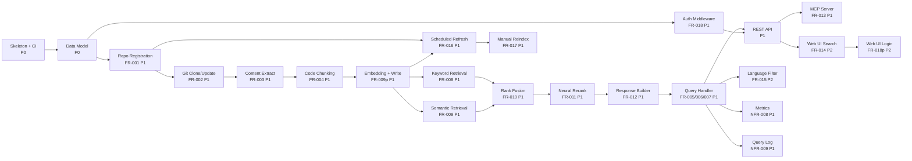

### 11.4 Risk & Mitigation

| Risk | Impact | Likelihood | Mitigation |
|------|--------|------------|------------|
| bge-code embedding quality insufficient (nDCG@3 < 0.7) | High | Med | Prepare fallback models (CodeBERT, UniXcoder); embedding layer decoupled for hot-swap |
| Qdrant/ES cluster latency exceeds target at 1000 QPS | High | Low | Early M3 benchmarking; shard + replica tuning; add read replicas if needed |
| tree-sitter edge cases in some language constructs | Med | Med | Degrade to file-level chunk (FR-004 AC2); progressive language support |
| PyTorch GPU inference too slow on CPU-only environments | High | Med | Early M3 CPU vs GPU benchmarking; consider ONNX Runtime as lightweight alternative |
| MCP SDK version instability | Med | Low | Pin verified version; thin MCP interface wrapper for easy SDK upgrade |

## 12. Open Questions / Risks

The following SRS Open Questions are resolved by this design:

1. **Rate limiting**: Deferred to M5. Initial implementation uses global capacity limit only. Per-key rate limiting can be added via middleware (token bucket in Redis).
2. **Multi-tenancy**: V1 — all authenticated users see all repos. Repo-level ACL is a V2 feature requiring API key → repo mapping table.
3. **Index retention**: V1 — replace immediately (delete old chunks, write new). Rollback requires versioned collection naming in Qdrant/ES (V2 feature).
4. **Embedding model**: Resolved — BAAI/bge-code-v1 for embeddings, BAAI/bge-reranker-v2-m3 for reranking.
5. **Web UI depth**: Resolved — Web UI is search-only (FR-014/015). Admin operations (repo registration, reindex) via REST API only.
