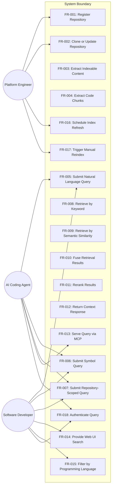
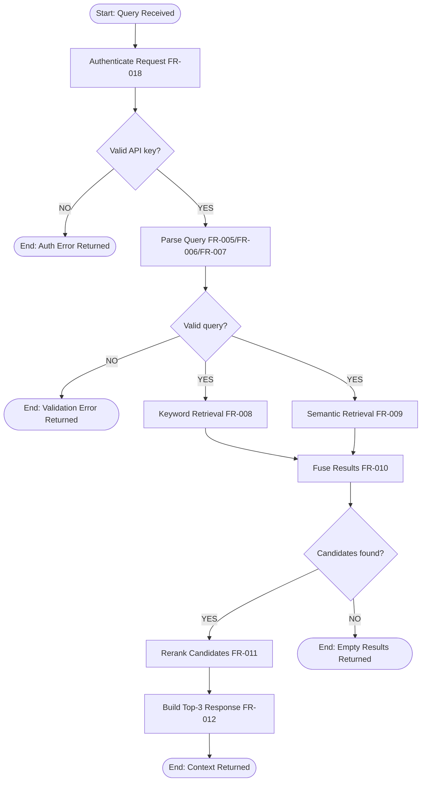
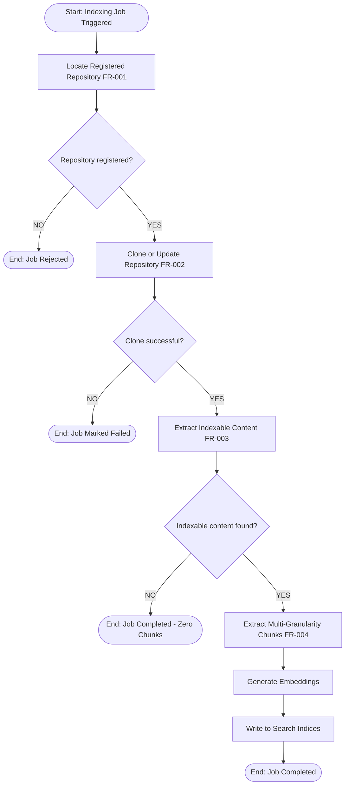

# Code Context Retrieval System — Software Requirements Specification

<!-- SRS Review: PASS after 2 cycle(s) — 2026-03-14 -->

**Date**: 2026-03-14
**Status**: Approved
**Standard**: Aligned with ISO/IEC/IEEE 29148
**Template**: docs/templates/srs-template.md

## 1. Purpose & Scope

This system provides a **Code Context Retrieval Service** that indexes arbitrary Git repositories and returns relevant documentation, example code, source snippets, and release notes in response to queries. The system serves AI coding agents (via Model Context Protocol) and human developers (via Web UI), reducing LLM hallucinations by injecting accurate, up-to-date code context into prompts.

### 1.1 In Scope

- Offline distributed indexing of arbitrary Git repositories
- Multi-granularity code chunk extraction (file, class, function, symbol levels)
- Hybrid context retrieval combining keyword search and semantic search
- Neural reranking of retrieval results for improved precision
- Query service exposed via MCP (Model Context Protocol)
- Web-based interactive search UI for human developers
- Scheduled (default weekly) and manual index refresh
- Support for Java, Python, TypeScript, JavaScript, C, and C++ source code
- Authentication via API key for query access
- Structured context responses with metadata (repository, file path, symbol, relevance score)

### 1.2 Out of Scope

| ID | Exclusion | Rationale |
|----|-----------|-----------|
| EXC-001 | IDE plugin development | Separate product; system provides API/MCP for integration |
| EXC-002 | AI code generation or automatic code modification | System is read-only context retrieval |
| EXC-003 | Repository permission management beyond credential-based cloning | Auth delegation; repos accessed via provided credentials |
| EXC-004 | CI/CD pipeline integration | Out of MVP scope |
| EXC-005 | Code Knowledge Graph / call graph / dependency graph | Deferred to V2; high complexity |
| EXC-006 | Cross-repository reasoning | Deferred to V2; depends on EXC-005 |
| EXC-007 | Real-time webhook-based incremental indexing | Deferred; V1 uses scheduled full scans and manual triggers only |
| EXC-008 | StackOverflow, blog, or external documentation indexing | V1 indexes Git repositories only |

## 2. Glossary & Definitions

| Term | Definition | Do NOT confuse with |
|------|-----------|---------------------|
| Context Retrieval | Returning relevant documentation, example code, or source snippets from indexed repositories in response to a query | Code generation (producing new code) |
| MCP (Model Context Protocol) | A standardized protocol for AI agents to request tools and context from external systems via structured messages | Generic REST API (MCP has specific tool-calling semantics) |
| Code Chunk | The smallest indexable unit of code, extracted at a defined granularity level (file, class, function, or symbol) | Code block (an informal grouping of lines) |
| Hybrid Search | A retrieval method combining lexical keyword search with semantic embedding-based search to achieve both precision and recall | Full-text search (keyword-only) |
| Rank Fusion | A technique merging ranked result lists from multiple retrieval methods into a single unified ranking without requiring comparable score scales | Re-sorting (simple score-based ordering) |
| Reranking | A second-pass scoring step using a neural model to re-evaluate query-document pairs and reorder candidate results for higher relevance | Initial retrieval (first-pass candidate generation) |
| Symbol | A named programming construct: class, method, function, variable, interface, or type definition | Token (a lexical unit in text processing or authentication) |
| Index Refresh | The process of re-scanning repositories and rebuilding the search index to reflect current repository content | Cache invalidation (clearing query result caches) |
| Indexing Cluster | The offline compute cluster that clones repositories, parses code, generates embeddings, and builds search indices | Query service (the online system serving user queries) |
| Query Service | The online system that accepts search queries and returns ranked context results in real time | Indexing cluster (the offline batch processing system) |
| QPS (Queries Per Second) | A throughput metric indicating the number of query requests the system processes per second | Latency (the time to process a single query) |
| P95 (95th Percentile) | A statistical measure where 95% of observed values fall at or below this threshold; used for latency targets | Average (the arithmetic mean, which can be skewed by outliers) |
| EARS (Easy Approach to Requirements Syntax) | A structured template for writing unambiguous requirements using patterns: ubiquitous, event-driven, state-driven, unwanted behavior, and optional | User story (informal format; EARS is more formal and testable) |

## 3. Stakeholders & User Personas

| Persona | Technical Level | Key Needs | Access Level |
|---------|----------------|-----------|--------------|
| AI Coding Agent | Automated system (Claude Code, Cursor, Copilot) | Retrieve up-to-date API usage, examples, and source snippets to reduce hallucinations | MCP API (API key) |
| Software Developer | Intermediate to expert | Search code examples, API usage patterns, and official documentation interactively | Web UI and MCP API (API key) |
| Platform Engineer | Expert | Register repositories, manage indexing jobs, monitor system health | Admin operations via API |

### 3.1 Use Case View

## 4. Functional Requirements

### FR-001: Register Repository

**Priority**: Must
**EARS**: When an administrator provides a Git repository URL, the system shall register the repository for indexing and store its metadata including URL, name, and target languages.
**Acceptance Criteria**:
- Given a valid, reachable Git repository URL, when the administrator submits it for registration, then the repository appears in the repository list with status "registered"
- Given an invalid or unreachable Git URL, when the administrator submits it for registration, then the system returns an error indicating the URL is invalid or unreachable and does not add the repository

### FR-002: Clone or Update Repository

**Priority**: Must
**EARS**: When an indexing job is triggered for a registered repository, the system shall clone the repository if not previously cloned, or fetch the latest changes if already cloned.
**Acceptance Criteria**:
- Given a registered repository with valid credentials that has not been previously cloned, when an indexing job starts, then the system performs a full clone of the repository
- Given a previously cloned repository, when an indexing job starts, then the system fetches only the latest changes
- Given a repository that cannot be cloned due to network or authentication failure, when the clone step executes, then the system marks the job as "failed" with the error reason and does not overwrite any existing index data for that repository

### FR-003: Extract Indexable Content

**Priority**: Must
**EARS**: When a repository has been successfully cloned or updated, the system shall identify and extract indexable content including documentation files, example code, source code files, and release notes.
**Acceptance Criteria**:
- Given a cloned repository containing README.md, source files, and a CHANGELOG.md, when content extraction runs, then all three content types are identified and queued for chunk extraction
- Given a cloned repository containing only binary files and no supported content types, when content extraction runs, then the system logs a warning that no indexable content was found and marks the job as completed with zero chunks

### FR-004: Extract Code Chunks

**Priority**: Must
**EARS**: When indexable source code is processed, the system shall segment it into chunks at file level, class level, function level, and symbol level.
**Acceptance Criteria**:
- Given a Java source file containing two classes with three methods each, when chunk extraction executes, then the system generates one file-level chunk, two class-level chunks, and six method-level chunks
- Given a source file in an unsupported programming language, when chunk extraction executes, then the system indexes the file as a single file-level text chunk without symbol-level decomposition

### FR-005: Submit Natural Language Query

**Priority**: Must
**EARS**: When a user or AI agent submits a natural language query, the system shall accept the query text and initiate the retrieval pipeline.
**Acceptance Criteria**:
- Given a natural language query "how to use spring WebClient timeout", when submitted, then the system accepts the query and initiates the retrieval pipeline
- Given an empty query string, when submitted, then the system returns a validation error indicating the query must not be empty

### FR-006: Submit Symbol Query

**Priority**: Must
**EARS**: When a user or AI agent submits a code symbol identifier as a query, the system shall accept the symbol and initiate the retrieval pipeline.
**Acceptance Criteria**:
- Given a symbol query "org.springframework.web.client.RestTemplate", when submitted, then the system accepts the query and initiates the retrieval pipeline
- Given a symbol query containing only whitespace, when submitted, then the system returns a validation error

### FR-007: Submit Repository-Scoped Query

**Priority**: Must
**EARS**: When a user or AI agent submits a query specifying a target repository, the system shall restrict retrieval to chunks from that repository only.
**Acceptance Criteria**:
- Given a query "timeout" scoped to repository "spring-framework", when submitted, then the retrieval pipeline processes only chunks from the spring-framework repository
- Given a query scoped to a repository name that does not exist in the index, when submitted, then the system returns an empty result set with no error

### FR-008: Retrieve by Keyword

**Priority**: Must
**EARS**: When a context query is executed, the system shall retrieve candidate chunks whose content matches the query's keywords using lexical search.
**Acceptance Criteria**:
- Given query "WebClient timeout" and an index containing a chunk with text "WebClient.builder().responseTimeout()", when keyword retrieval executes, then that chunk appears in the candidate list
- Given a query whose keywords match no indexed content, when keyword retrieval executes, then an empty candidate list is returned for this retrieval method

### FR-009: Retrieve by Semantic Similarity

**Priority**: Must
**EARS**: When a context query is executed, the system shall retrieve candidate chunks that are semantically similar to the query's meaning using embedding-based search, excluding results below a configurable similarity threshold (default: 0.6).
**Acceptance Criteria**:
- Given query "how to configure spring http client timeout" and an index containing chunks about WebClient timeout configuration, when semantic retrieval executes, then those chunks appear in the candidate list even though the exact keywords differ
- Given a query with no semantic matches scoring at or above the configured similarity threshold (default 0.6), when semantic retrieval executes, then an empty candidate list is returned for this retrieval method
- Given the similarity threshold is configured to 0.8, when semantic retrieval executes, then only chunks with similarity score >= 0.8 are returned

### FR-010: Fuse Retrieval Results

**Priority**: Must
**EARS**: When candidate results are produced by both keyword retrieval and semantic retrieval, the system shall merge them into a single ranked candidate list using rank-based fusion.
**Acceptance Criteria**:
- Given keyword results [A, B, C] and semantic results [B, D, E], when fusion executes, then the merged list contains all five unique chunks (A, B, C, D, E) in a unified ranking where B benefits from appearing in both lists
- Given one retrieval method returns empty results, when fusion executes, then the fused list contains only the results from the non-empty method

### FR-011: Rerank Results

**Priority**: Must
**EARS**: When a fused candidate list is produced, the system shall reorder candidates using neural query-document relevance scoring, achieving nDCG@3 >= 0.7 on the evaluation dataset.
**Acceptance Criteria**:
- Given a fused candidate list and a query from the evaluation dataset, when reranking executes, then the reranked results achieve nDCG@3 >= 0.7 as measured on the held-out evaluation set
- Given a fused candidate list with fewer than 2 items, when reranking executes, then the items are returned in their current order without applying the reranking model

### FR-012: Return Context Response

**Priority**: Must
**EARS**: The system shall return the top-3 most relevant context results, each including the repository name, file path, code symbol, relevance score, and content snippet.
**Acceptance Criteria**:
- Given a completed retrieval pipeline with 50 ranked candidates, when the response is built, then exactly 3 results are returned, each containing fields: repository, path, symbol, score, and content
- Given a query producing zero candidates after the full pipeline, when the response is built, then the system returns an empty results array with no error

### FR-013: Serve Query via MCP

**Priority**: Must
**EARS**: When an MCP client submits a context query request, the system shall process the query through the retrieval pipeline and return structured context results via the MCP protocol.
**Acceptance Criteria**:
- Given a valid MCP tool-call request with query parameter and valid API key, when the system processes it, then structured context results are returned as an MCP tool response
- Given a malformed MCP request missing required parameters, when received, then the system returns an MCP-compliant error response indicating the missing fields

### FR-014: Provide Web UI Search

**Priority**: Should
**EARS**: When an authenticated user accesses the Web UI, the system shall provide an interactive search interface for querying code context with syntax-highlighted result display.
**Acceptance Criteria**:
- Given an authenticated user on the Web UI, when they enter query "WebClient timeout" and submit, then results are displayed with syntax-highlighted code snippets and metadata (repository, path, symbol, score)
- Given the Web UI is accessed without a valid session, when a search is attempted, then the system redirects to a login/authentication page

### FR-015: Filter Results by Programming Language

**Priority**: Should
**EARS**: Where a programming language filter is specified in a query, the system shall restrict retrieval results to chunks written in the specified language.
**Acceptance Criteria**:
- Given a query "timeout" with language filter "Java", when retrieval executes, then only Java-language chunks are included in the results
- Given a query with a language filter specifying an unsupported language, when submitted, then the system returns a validation error listing supported languages

### FR-016: Schedule Index Refresh

**Priority**: Must
**EARS**: While the system is running, the system shall automatically trigger repository re-indexing on a configurable schedule, defaulting to weekly.
**Acceptance Criteria**:
- Given the default configuration with no custom schedule, when one week has elapsed since the last indexing run, then the system automatically triggers re-indexing for all registered repositories
- Given a custom schedule configured to daily, when one day has elapsed since the last indexing run, then the system triggers re-indexing for all registered repositories
- Given a scheduled re-indexing run where some repositories are indexed successfully and others fail to clone, then the system completes indexing for successful repositories, logs errors with reasons for failed repositories, and sends an alert notification to the administrator

### FR-017: Trigger Manual Reindex

**Priority**: Must
**EARS**: When an administrator requests a manual reindex for a specific repository, the system shall immediately queue an indexing job for that repository.
**Acceptance Criteria**:
- Given a registered repository with no active indexing job, when the administrator triggers manual reindex, then a new indexing job is queued and begins processing
- Given a repository with an indexing job already in progress, when manual reindex is triggered, then the system rejects the request with a message indicating an active job exists

### FR-018: Authenticate Query

**Priority**: Must
**EARS**: When a query request is received via MCP or Web UI, the system shall verify that the request carries a valid API key before processing.
**Acceptance Criteria**:
- Given a request with a valid API key, when authentication is checked, then the request proceeds to the retrieval pipeline
- Given a request with an invalid or missing API key, when authentication is checked, then the system returns an authentication error and does not execute the query

### 4.1 Process Flows

#### Flow: Context Query Retrieval

#### Flow: Repository Indexing

## 5. Non-Functional Requirements

| ID | Priority | Category (ISO 25010) | Requirement | Measurable Criterion | Measurement Method |
|----|----------|---------------------|-------------|---------------------|-------------------|
| NFR-001 | Must | Performance | Query response time shall meet latency target for the 95th percentile | P95 ≤ 1000 ms | Load test with k6 or equivalent tool under 1000 concurrent queries |
| NFR-002 | Must | Performance | Query service shall sustain target throughput | ≥ 1000 QPS sustained; ≥ 2000 QPS peak burst | Load test measuring sustained throughput over 10-minute window |
| NFR-003 | Must | Scalability | System shall support target repository count | 100 to 1000 repositories indexed simultaneously | Capacity test with progressive repository addition |
| NFR-004 | Must | Scalability | System shall handle repositories up to size limit | Single repository ≤ 1 GB | Size validation during registration; indexing test with 1 GB repository |
| NFR-005 | Must | Reliability | Query service availability shall meet uptime target | 99.9% uptime (≤ 8.76 hours downtime per year) | Availability monitoring with 1-minute health check intervals |
| NFR-006 | Must | Scalability | Indexing workers and query nodes shall scale independently | Adding a node increases throughput linearly (±20%) | Scaling test comparing throughput at N vs N+1 nodes |
| NFR-007 | Must | Reliability | Query service shall tolerate single-node failure | No query failures during single-node outage; failover ≤ 30 seconds | Chaos test: kill one query node, verify zero failed queries |
| NFR-008 | Must | Maintainability | System shall expose operational metrics | Latency, throughput, index size, and error rate metrics available via metrics endpoint | Metric endpoint verification returning all four metric categories |
| NFR-009 | Must | Maintainability | System shall log all query activity | Every query request and error logged with timestamp and correlation ID | Log audit: submit 100 queries, verify 100 log entries with correlation IDs |

## 6. Interface Requirements

| ID | External System | Direction | Protocol | Data Format |
|----|----------------|-----------|----------|-------------|
| IFR-001 | AI Coding Agents (Claude Code, Cursor, Copilot) | Inbound | MCP over stdio or HTTP | JSON (MCP tool-call schema) |
| IFR-002 | Web Browser (Developer) | Inbound | HTTPS | JSON (REST API) + HTML/JS (UI) |
| IFR-003 | Git Repositories | Outbound | Git over HTTPS or SSH | Git objects |
| IFR-004 | Embedding Model Service | Internal | HTTP or local inference | JSON (vector arrays) |

## 7. Constraints

| ID | Constraint | Rationale |
|----|-----------|-----------|
| CON-001 | The system shall parse source code in Java, Python, TypeScript, JavaScript, C, and C++ | These are the target languages identified during elicitation; other languages are deferred |
| CON-002 | The primary query interface shall conform to the MCP protocol specification | MCP is the standard for AI agent tool integration; required for agent compatibility |
| CON-003 | All repository indexing shall execute offline in a dedicated cluster; query-time operations shall not trigger repository cloning or source parsing | Offline indexing ensures query latency is not affected by indexing workload |
| CON-004 | The system shall accept any Git repository accessible via URL as a data source | No restriction to specific hosting platforms (GitHub, GitLab, Bitbucket, self-hosted) |

## 8. Assumptions & Dependencies

| ID | Assumption | Impact if Invalid |
|----|-----------|------------------|
| ASM-001 | Git repositories are accessible from the indexing cluster via HTTPS or SSH using provided credentials | Indexing jobs will fail for inaccessible repositories; system must report clear error messages |
| ASM-002 | Programming language of source files can be reliably identified by file extension and parser heuristics | Misidentified files will be indexed at file-level only without symbol extraction |
| ASM-003 | The majority of query traffic originates from AI coding agents rather than human users | Web UI scalability requirements may need revision if human traffic dominates |
| ASM-004 | Embedding model inference is available as a service or can run locally on the indexing cluster | Embedding generation pipeline depends on model availability; indexing will fail without it |

## 9. Acceptance Criteria Summary

| Requirement | Pass Criteria | Fail Criteria |
|-------------|--------------|---------------|
| FR-001 | Valid Git URL → repo registered; invalid URL → error returned | Repo registered with invalid URL; no error on invalid URL |
| FR-002 | New repo → full clone; existing → fetch changes; failure → job marked failed | Clone failure causes data corruption or silent failure |
| FR-003 | README, source, changelog identified; empty repo → warning logged, zero chunks | Indexable content missed; no warning on empty repo |
| FR-004 | Java file with 2 classes, 6 methods → 1+2+6 chunks; unsupported lang → file-level only | Chunks missing or incorrect granularity |
| FR-005 | NL query accepted and pipeline initiated; empty → validation error | Empty query accepted; valid NL query rejected |
| FR-006 | Symbol query accepted and pipeline initiated; whitespace-only → validation error | Whitespace query accepted; valid symbol rejected |
| FR-007 | Repo-scoped query restricts to named repo; non-existent repo → empty results | Results from other repos leak in; error on non-existent repo |
| FR-008 | Keyword match returns matching chunks; no match → empty list | Keyword results miss exact-match content |
| FR-009 | Semantically related chunks found despite keyword mismatch; below threshold → excluded; configurable threshold works | Paraphrased queries return zero results; below-threshold results returned |
| FR-010 | Results from both methods merged; duplicates unified; single-source → pass-through | Results from one method lost during fusion |
| FR-011 | nDCG@3 >= 0.7 on evaluation set; <2 items → pass-through | nDCG@3 < 0.7; reranking degrades quality |
| FR-012 | Top-3 results with all metadata fields; zero results → empty array | Missing metadata; error on empty results |
| FR-013 | Valid MCP request → results; malformed → MCP error response | MCP request causes crash; non-MCP response |
| FR-014 | Authenticated user → search with highlighted results; unauthenticated → login redirect | No auth check; results without syntax highlighting |
| FR-015 | Language filter restricts results to specified language; unsupported language → validation error | Filter ignored; unsupported language accepted silently |
| FR-016 | Weekly default trigger works; custom schedule respected; partial failure → alert + successful repos indexed | Scheduled indexing does not trigger; partial failure silently lost |
| FR-017 | Manual reindex queues job; duplicate rejected with message | Duplicate jobs allowed; no feedback on rejection |
| FR-018 | Valid key → proceed; invalid/missing key → auth error | Invalid key allows query; valid key rejected |
| NFR-001 | P95 latency ≤ 1000 ms under 1000 QPS load | P95 > 1000 ms |
| NFR-002 | Sustained 1000 QPS for 10 minutes | Throughput drops below 1000 QPS |
| NFR-003 | 1000 repositories indexed without degradation | Indexing fails or latency degrades before 1000 repos |
| NFR-004 | 1 GB repository indexed successfully | Indexing fails on 1 GB repository |
| NFR-005 | 99.9% uptime over measurement period | Downtime exceeds 8.76 hours per year |
| NFR-006 | Adding 1 node increases throughput by 80-120% of per-node capacity | Adding nodes provides < 80% throughput gain |
| NFR-007 | Zero failed queries during single-node outage | Any query fails during failover |
| NFR-008 | Metrics endpoint returns latency, throughput, index size, error rate | Any metric category missing |
| NFR-009 | 100 queries produce 100 log entries with correlation IDs | Missing log entries or missing correlation IDs |

## 10. Traceability Matrix

| Requirement ID | Source (stakeholder need) | Verification Method |
|---------------|-------------------------|-------------------|
| FR-001 | Platform Engineer: manage which repositories are indexed | Integration test |
| FR-002 | Platform Engineer: keep local repository copies current | Integration test |
| FR-003 | Platform Engineer: extract all relevant content types from repos | Integration test |
| FR-004 | AI Agent / Developer: need fine-grained code context at symbol level | Unit test + integration test |
| FR-005 | AI Agent / Developer: query using natural language descriptions | Integration test |
| FR-006 | AI Agent / Developer: query using exact code symbol identifiers | Integration test |
| FR-007 | AI Agent / Developer: restrict search to a specific repository | Integration test |
| FR-008 | AI Agent / Developer: find exact keyword matches (API names, symbols) | Search accuracy test (precision measurement) |
| FR-009 | AI Agent / Developer: find semantically related code despite vocabulary mismatch | Search accuracy test (recall measurement) |
| FR-010 | AI Agent / Developer: get best results from combined retrieval methods | Search accuracy test (fusion quality measurement) |
| FR-011 | AI Agent / Developer: get most relevant results at top positions | Search accuracy test (nDCG@3 measurement on evaluation set) |
| FR-012 | AI Agent / Developer: receive structured, machine-readable context | Integration test (schema validation) |
| FR-013 | AI Agent: integrate code context retrieval into AI coding workflows | MCP protocol conformance test |
| FR-014 | Developer: search and explore code context interactively via browser | UI functional test |
| FR-015 | Developer: narrow results to a specific programming language | Integration test |
| FR-016 | Platform Engineer: automate index maintenance without manual intervention | Scheduled job execution test |
| FR-017 | Platform Engineer: on-demand index refresh for specific repositories | Integration test |
| FR-018 | All stakeholders: secure access; prevent unauthorized query usage | Security test (auth bypass attempt) |
| NFR-001 | All stakeholders: responsive query experience for interactive use | Load test (k6) |
| NFR-002 | All stakeholders: support concurrent usage at scale | Load test (k6) |
| NFR-003 | Platform Engineer: scale to organizational repository portfolio | Capacity test |
| NFR-004 | Platform Engineer: index large enterprise repositories | Capacity test |
| NFR-005 | All stakeholders: reliable, always-available service | Availability monitoring |
| NFR-006 | Platform Engineer: scale capacity with demand | Horizontal scaling test |
| NFR-007 | All stakeholders: uninterrupted service during infrastructure issues | Chaos / failover test |
| NFR-008 | Platform Engineer: monitor system health and performance | Metric endpoint test |
| NFR-009 | Platform Engineer: diagnose issues and audit query activity | Log audit test |
| CON-001 | Elicitation Q1-Q3: target language set | Code review |
| CON-002 | Elicitation Q1: AI agent integration requirement | Protocol conformance test |
| CON-003 | Elicitation Q4/Q24: offline indexing for performance isolation | Architecture review |
| CON-004 | Elicitation Q4: no platform vendor lock-in | Integration test with multiple Git hosts |

## 11. Open Questions

1. **Rate limiting policy**: Should the query API enforce per-key rate limits beyond the global 1000 QPS capacity? If so, what limit per key?
2. **Multi-tenancy**: Should different API keys have isolated repository visibility, or do all authenticated users see all indexed repositories?
3. **Index retention**: When a repository is re-indexed, should the system retain the previous index version for rollback, or replace it immediately?
4. **Embedding model selection**: The specific embedding model and reranking model will be selected during the design phase based on benchmark evaluation. The SRS requires embedding-based semantic retrieval (FR-009) and neural reranking (FR-011) as capabilities.
5. **Web UI feature depth**: Should the Web UI include repository management (registration, reindex triggers) or only search functionality? Current SRS assigns admin operations to Platform Engineer via API only.
