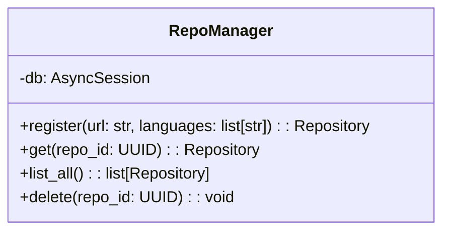

# Plan: Repository Registration (Feature #3)

**Date**: 2026-03-14
**Feature**: #3 — Repository Registration (FR-001)
**Priority**: high
**Dependencies**: #2 (Data Model and Migrations) — PASSING
**Design Reference**: docs/plans/2026-03-14-code-context-retrieval-design.md § 4.1

## Context

Admin API to register Git repositories with URL, name, and target languages; store metadata in PostgreSQL. This is the first step in the indexing pipeline (M2: Core Indexing).

## Design Alignment

### Class Diagram (from §4.1.2)



### Key Classes
- **RepoManager**: Service class managing repository CRUD operations
  - `register(url, languages)`: Validate URL, check uniqueness, create Repository record
  - `get(repo_id)`: Retrieve single repository by UUID
  - `list_all()`: Retrieve all registered repositories
  - `delete(repo_id)`: Remove repository and cascade delete related records

### Interaction Flow (from §4.1.3)
1. Admin → POST /api/v1/repos → FastAPI endpoint
2. Endpoint → RepoManager.register() → Validate URL
3. RepoManager → PostgreSQL INSERT → Repository record with status="registered"
4. Return 201 with Repository object

### Third-party Dependencies
- FastAPI (already installed)
- SQLAlchemy 2.0 async (already installed)
- Pydantic v2 (already installed)
- asyncpg (already installed)

### Deviations
- **None** — Implementation follows design exactly

## SRS Requirement

### FR-001: Register Repository

**Priority**: Must
**EARS**: When an administrator provides a Git repository URL, the system shall register the repository for indexing and store its metadata including URL, name, and target languages.

**Acceptance Criteria**:
- Given a valid, reachable Git repository URL, when the administrator submits it for registration, then the repository appears in the repository list with status "registered"
- Given an invalid or unreachable Git URL, when the administrator submits it for registration, then the system returns an error indicating the URL is invalid or unreachable and does not add the repository

## Verification Steps (from feature-list.json)

1. Given a valid Git repository URL https://github.com/example/repo.git, when POST /api/v1/repos with url, name, languages=[Java], then response 201 with repository object having status registered
2. Given an invalid Git URL (not reachable), when POST /api/v1/repos, then response 400 with error message indicating URL is invalid or unreachable
3. Given an existing repository URL, when POST /api/v1/repos with same URL, then response 409 Conflict
4. Given registered repositories exist, when GET /api/v1/repos, then response 200 with list of all repositories

## Tasks

### Task 1: Write failing tests for RepoManager

**Files**: `tests/test_repo_manager.py` (create)

**Steps**:
1. Create test file with imports:
   ```python
   import pytest
   from unittest.mock import AsyncMock, patch
   from uuid import UUID
   from src.shared.services.repo_manager import RepoManager
   from src.shared.models import Repository, RepoStatus
   ```

2. Write test cases covering each verification_step:

   **Test Case A: Register valid repository (happy path)**
   - Mock Git URL validation to return True
   - Call `repo_manager.register(url, name, languages)`
   - Assert: Repository returned with status=REGISTERED
   - Assert: Repository has correct url, name, languages
   - Assert: id is a valid UUID

   **Test Case B: Register invalid/unreachable URL (error handling)**
   - Mock Git URL validation to return False
   - Call `repo_manager.register(url, name, languages)`
   - Assert: Raises ValueError with message about unreachable URL

   **Test Case C: Register duplicate URL (error handling)**
   - Mock Git URL validation to return True
   - First call creates repository successfully
   - Second call with same URL
   - Assert: Raises ValueError with message about duplicate URL

   **Test Case D: List all repositories (happy path)**
   - Create 2 repositories
   - Call `repo_manager.list_all()`
   - Assert: Returns list with 2 repositories

   **Test Case E: List empty repositories (boundary)**
   - Call `repo_manager.list_all()` on empty database
   - Assert: Returns empty list

   **Test Case F: Get repository by ID (happy path)**
   - Create a repository
   - Call `repo_manager.get(repo_id)`
   - Assert: Returns correct repository

   **Test Case G: Get non-existent repository (error handling)**
   - Call `repo_manager.get(non_existent_id)`
   - Assert: Raises ValueError with message about not found

   **Test Case H: Delete repository (happy path)**
   - Create a repository
   - Call `repo_manager.delete(repo_id)`
   - Call `repo_manager.get(repo_id)` - should raise ValueError

   **Test Case I: URL validation with non-HTTP URL (boundary)**
   - Pass a local file path like `file:///tmp/repo`
   - Assert: Raises ValueError (only HTTP/HTTPS supported)

3. Run: `pytest tests/test_repo_manager.py -v`
4. **Expected**: All tests FAIL (no implementation yet)
5. **Expected**: Tests fail for the RIGHT REASON (ImportError for RepoManager)

### Task 2: Write failing tests for API endpoints

**Files**: `tests/test_repos_api.py` (create)

**Steps**:
1. Create test file with imports:
   ```python
   import pytest
   from httpx import AsyncClient
   from src.query.main import app
   ```

2. Write test cases:

   **Test Case A: POST /api/v1/repos with valid data returns 201**
   - Mock RepoManager.register to return a Repository
   - POST with valid url, name, languages
   - Assert: status 201
   - Assert: response contains repository object with status="registered"

   **Test Case B: POST /api/v1/repos with unreachable URL returns 400**
   - Mock RepoManager.register to raise ValueError("unreachable")
   - POST with unreachable URL
   - Assert: status 400
   - Assert: error message indicates URL is unreachable

   **Test Case C: POST /api/v1/repos with duplicate URL returns 409**
   - Mock RepoManager.register to raise ValueError("duplicate")
   - POST with duplicate URL
   - Assert: status 409

   **Test Case D: GET /api/v1/repos returns list of repositories**
   - Mock RepoManager.list_all to return list of repositories
   - GET /api/v1/repos
   - Assert: status 200
   - Assert: response is a list

   **Test Case E: POST /api/v1/repos with empty URL returns 422**
   - POST with url=""
   - Assert: status 422 (validation error)

   **Test Case F: POST /api/v1/repos with empty name returns 422**
   - POST with name=""
   - Assert: status 422 (validation error)

3. Run: `pytest tests/test_repos_api.py -v`
4. **Expected**: All tests FAIL (endpoints not implemented)
5. **Expected**: Tests fail for the RIGHT REASON (501 Not Implemented or import error)

### Task 3: Implement URL validation utility

**Files**: `src/shared/utils/git_validator.py` (create)

**Steps**:
1. Create the git_validator module:
   ```python
   import asyncio
   import aiohttp
   from urllib.parse import urlparse

   async def validate_git_url(url: str) -> tuple[bool, str]:
       """Validate that a Git repository URL is reachable.

       Args:
           url: Git repository URL (HTTPS only for now)

       Returns:
           Tuple of (is_valid, error_message)
       """
       parsed = urlparse(url)

       # Only support HTTPS for now
       if parsed.scheme not in ("https", "http"):
           return False, f"Unsupported URL scheme: {parsed.scheme}. Only HTTP/HTTPS are supported."

       # For GitHub URLs, use the API to check if repo exists
       if "github.com" in parsed.netloc:
           # Extract owner/repo from URL
           path = parsed.path.rstrip(".git").strip("/")
           if "/" in path:
               api_url = f"https://api.github.com/repos/{path}"
               try:
                   async with aiohttp.ClientSession() as session:
                       async with session.head(api_url, timeout=aiohttp.ClientTimeout(total=10)) as resp:
                           if resp.status == 200:
                               return True, ""
                           elif resp.status == 404:
                               return False, f"Repository not found: {path}"
                           else:
                               return False, f"GitHub API returned status {resp.status}"
               except asyncio.TimeoutError:
                   return False, "Connection timed out while validating URL"
               except Exception as e:
                   return False, f"Failed to validate URL: {str(e)}"

       # For other URLs, try a HEAD request to the raw URL
       # This is a best-effort check
       try:
           async with aiohttp.ClientSession() as session:
               async with session.head(url, timeout=aiohttp.ClientTimeout(total=10), allow_redirects=True) as resp:
                   if resp.status < 400:
                       return True, ""
                   return False, f"URL returned status {resp.status}"
       except asyncio.TimeoutError:
           return False, "Connection timed out while validating URL"
       except Exception as e:
           return False, f"Failed to validate URL: {str(e)}"
   ```

2. Also create `src/shared/utils/__init__.py`:
   ```python
   from .git_validator import validate_git_url

   __all__ = ["validate_git_url"]
   ```

3. Run: `pytest tests/test_repo_manager.py -v`
4. **Expected**: Tests still fail (RepoManager not implemented yet)

### Task 4: Implement RepoManager service

**Files**: `src/shared/services/repo_manager.py` (create), `src/shared/services/__init__.py` (create)

**Steps**:
1. Create `src/shared/services/__init__.py`:
   ```python
   from .repo_manager import RepoManager

   __all__ = ["RepoManager"]
   ```

2. Create `src/shared/services/repo_manager.py`:
   ```python
   from uuid import UUID
   from typing import List, Optional
   from sqlalchemy import select
   from sqlalchemy.ext.asyncio import AsyncSession
   from sqlalchemy.exc import IntegrityError

   from src.shared.models import Repository, RepoStatus
   from src.shared.utils.git_validator import validate_git_url


   class RepoManager:
       """Service class for managing repository records."""

       def __init__(self, db: AsyncSession):
           self.db = db

       async def register(
           self,
           url: str,
           name: str,
           languages: List[str],
           validate_url: bool = True,
       ) -> Repository:
           """Register a new repository for indexing.

           Args:
               url: Git repository URL
               name: Display name for the repository
               languages: List of target programming languages
               validate_url: Whether to validate URL reachability (default True)

           Returns:
               Created Repository object

           Raises:
               ValueError: If URL is invalid, unreachable, or already registered
           """
           # Validate URL format and reachability
           if validate_url:
               is_valid, error_msg = await validate_git_url(url)
               if not is_valid:
                   raise ValueError(f"Invalid or unreachable Git URL: {error_msg}")

           # Check for duplicate URL
           existing = await self.get_by_url(url)
           if existing:
               raise ValueError(f"Repository with URL '{url}' already registered")

           # Create repository record
           repo = Repository(
               url=url,
               name=name,
               languages=languages,
               status=RepoStatus.REGISTERED,
           )
           self.db.add(repo)
           await self.db.flush()
           await self.db.refresh(repo)
           return repo

       async def get(self, repo_id: UUID) -> Repository:
           """Get a repository by ID.

           Args:
               repo_id: Repository UUID

           Returns:
               Repository object

           Raises:
               ValueError: If repository not found
           """
           result = await self.db.execute(
               select(Repository).where(Repository.id == repo_id)
           )
           repo = result.scalar_one_or_none()
           if repo is None:
               raise ValueError(f"Repository with ID '{repo_id}' not found")
           return repo

       async def get_by_url(self, url: str) -> Optional[Repository]:
           """Get a repository by URL.

           Args:
               url: Git repository URL

           Returns:
               Repository object or None if not found
           """
           result = await self.db.execute(
               select(Repository).where(Repository.url == url)
           )
           return result.scalar_one_or_none()

       async def list_all(self) -> List[Repository]:
           """List all registered repositories.

           Returns:
               List of all Repository objects
           """
           result = await self.db.execute(
               select(Repository).order_by(Repository.created_at.desc())
           )
           return list(result.scalars().all())

       async def delete(self, repo_id: UUID) -> None:
           """Delete a repository by ID.

           Args:
               repo_id: Repository UUID

           Raises:
               ValueError: If repository not found
           """
           repo = await self.get(repo_id)
           await self.db.delete(repo)
   ```

3. Run: `pytest tests/test_repo_manager.py -v`
4. **Expected**: All RepoManager tests PASS

### Task 5: Implement API endpoints

**Files**: `src/query/api/v1/endpoints/repos.py` (modify)

**Steps**:
1. Update imports:
   ```python
   from typing import List, Optional
   from uuid import UUID

   from fastapi import APIRouter, Depends, HTTPException, Header
   from pydantic import BaseModel, Field, field_validator
   from datetime import datetime
   from sqlalchemy.ext.asyncio import AsyncSession

   from src.shared.db.session import get_db
   from src.shared.services.repo_manager import RepoManager
   from src.shared.models import RepoStatus
   ```

2. Update RepositoryCreate model with validation:
   ```python
   class RepositoryCreate(BaseModel):
       """Repository creation request model."""

       url: str = Field(..., min_length=1, max_length=2048)
       name: str = Field(..., min_length=1, max_length=255)
       languages: List[str] = Field(default_factory=lambda: ["Java", "Python"])

       @field_validator("url")
       @classmethod
       def validate_url_format(cls, v: str) -> str:
           if not v.startswith(("http://", "https://")):
               raise ValueError("URL must start with http:// or https://")
           return v
   ```

3. Implement `create_repo` endpoint:
   ```python
   @router.post("", response_model=RepositoryResponse, status_code=201)
   async def create_repo(
       request: RepositoryCreate,
       db: AsyncSession = Depends(get_db),
   ) -> RepositoryResponse:
       """Register a new repository for indexing."""
       repo_manager = RepoManager(db)
       try:
           repo = await repo_manager.register(
               url=request.url,
               name=request.name,
               languages=request.languages,
           )
           return RepositoryResponse(
               id=repo.id,
               url=repo.url,
               name=repo.name,
               languages=repo.languages,
               status=repo.status.value,
               created_at=repo.created_at,
               last_indexed_at=repo.last_indexed_at,
           )
       except ValueError as e:
           error_msg = str(e)
           if "already registered" in error_msg:
               raise HTTPException(status_code=409, detail=error_msg)
           raise HTTPException(status_code=400, detail=error_msg)
   ```

4. Implement `list_repos` endpoint:
   ```python
   @router.get("", response_model=List[RepositoryResponse])
   async def list_repos(
       db: AsyncSession = Depends(get_db),
   ) -> List[RepositoryResponse]:
       """List all registered repositories."""
       repo_manager = RepoManager(db)
       repos = await repo_manager.list_all()
       return [
           RepositoryResponse(
               id=repo.id,
               url=repo.url,
               name=repo.name,
               languages=repo.languages,
               status=repo.status.value,
               created_at=repo.created_at,
               last_indexed_at=repo.last_indexed_at,
           )
           for repo in repos
       ]
   ```

5. Remove X-API-Key requirement for now (auth is Feature #16)

6. Run: `pytest tests/test_repos_api.py -v`
7. **Expected**: All API tests PASS

### Task 6: Coverage Gate

**Steps**:
1. Run coverage tool: `pytest --cov=src --cov-branch --cov-report=term-missing tests/test_repo_manager.py tests/test_repos_api.py`
2. Check: line coverage >= 90%
3. Check: branch coverage >= 80%
4. **If BELOW threshold**: write additional tests for uncovered lines
5. **Expected**: Coverage meets thresholds
6. Record coverage report output as evidence

### Task 7: Refactor

**Files**: As needed

**Steps**:
1. Review code for:
   - DRY violations
   - Clear naming
   - Proper error handling
   - Type hints completeness
2. Make targeted improvements
3. Run: `pytest` (full suite)
4. **Expected**: All tests still PASS (86+ new tests)

### Task 8: Mutation Gate

**Steps**:
1. Run mutation tool (incremental):
   ```bash
   mutmut run --paths-to-mutate=src/shared/services/repo_manager.py,src/shared/utils/git_validator.py,src/query/api/v1/endpoints/repos.py
   ```
2. Check: mutation score >= 80%
3. **If BELOW threshold**: improve test assertions to kill surviving mutants
4. **Expected**: Mutation score meets threshold (or skip on Windows due to known mutmut issue)
5. Record mutation report output as evidence

### Task 9: Create example

**Files**: `examples/03-repository-registration.py` (create)

**Steps**:
1. Create example demonstrating:
   - Registering a repository via API
   - Listing repositories
   - Error handling for duplicate URL
   - Error handling for invalid URL

2. Update `examples/README.md`

3. Run the example to verify it works (with services running)

## Verification Checklist

- [ ] All verification_steps from feature spec covered by tests
- [ ] All tests pass
- [ ] Coverage meets thresholds (line >= 90%, branch >= 80%)
- [ ] Mutation score meets threshold (>= 80%) or documented Windows limitation
- [ ] No regressions on existing features (all 86 existing tests still pass)
- [ ] Example is runnable
