# Code Context Retrieval MCP System — Design Document

**Date**: 2026-03-21
**Status**: Approved
**SRS Reference**: docs/plans/2026-03-21-code-context-retrieval-srs.md
**UCD Reference**: docs/plans/2026-03-21-code-context-retrieval-ucd.md
**Template**: docs/templates/design-template.md

---

## 1. Design Drivers

| Driver | Source | Impact on Design |
|--------|--------|-----------------|
| p95 < 1000 ms query latency | NFR-001 | Parallel BM25+vector retrieval, query cache, stateless query nodes |
| ≥ 1000 QPS sustained | NFR-002 | Horizontal scaling of query nodes, Redis cache, connection pooling |
| 99.9% availability | NFR-007 | Stateless query service, replicated storage backends |
| ≥ 70% linear scaling | NFR-006 | Stateless design, no shared mutable state in query path |
| Elasticsearch for BM25 | CON-007 | elasticsearch-py client, BM25 index mapping |
| Qdrant for vectors | CON-008 | qdrant-client, 1024-dim cosine collection |
| tree-sitter for parsing | CON-009 | py-tree-sitter + language grammars |
| Code embedding (CodeSage-large, 1024-dim) | CON-010 | sentence-transformers model loading |
| Neural Reranker (bge-reranker-v2-m3) | CON-011 | Cross-encoder model loading |
| MCP protocol | CON-004 | mcp Python SDK |
| Python 3.11+ | Section 1.4 | asyncio, type hints, modern stdlib |
| 3 Docker images | NFR-012 | query-api, mcp-server, index-worker |
| Developer Dark UI | UCD | Jinja2 templates, static CSS with UCD tokens |

---

## 2. Approach Selection

**Selected**: Modular Monolith

Single Python project with three internal packages (`src/indexing`, `src/query`, `src/shared`). Deployed as 3 independent Docker images sharing the same codebase:

- **query-api** — FastAPI serving REST endpoints + Web UI (Jinja2 SSR)
- **mcp-server** — Standalone MCP server process
- **index-worker** — Celery worker for offline indexing tasks

**Why not Microservices**: Adds 50-100ms per inter-service hop (threatens NFR-001), requires 6+ Docker images and service mesh. Over-engineered for 100-1000 repo scale.

**Why not Serverless**: Embedding + reranker models (~1.5GB) exceed Lambda limits. Cold starts (2-5s) violate NFR-001. Vendor lock-in conflicts with self-hosted ES/Qdrant clusters.

---

## 3. Architecture

### 3.1 Architecture Overview

The system has two runtime paths:

1. **Offline Index Path**: Celery workers clone repos, parse code, generate chunks + embeddings, write to ES + Qdrant. Triggered by schedule (cron) or manual API call.
2. **Online Query Path**: FastAPI receives queries, checks cache, runs parallel BM25 + vector retrieval, fuses with RRF, reranks with neural reranker, returns top-3 results.

The MCP server wraps the same query logic but speaks MCP protocol instead of HTTP.

### 3.2 Logical View

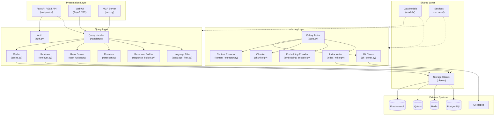

### 3.3 Component Diagram

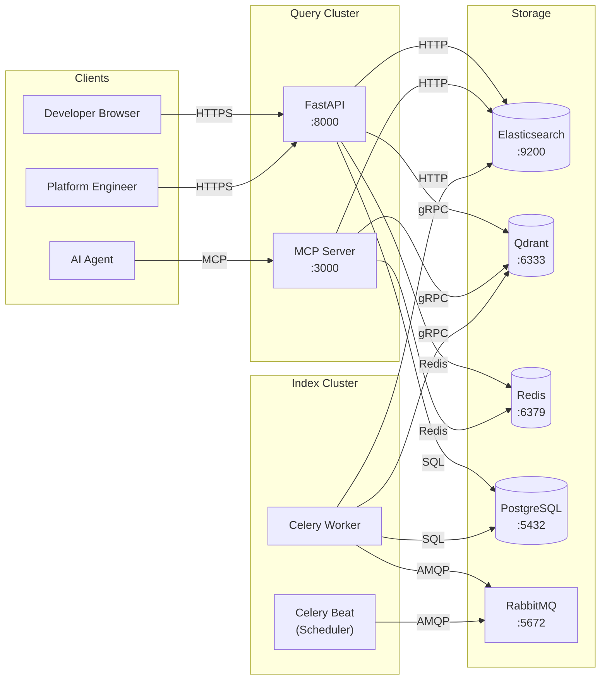

### 3.4 Tech Stack Decisions

| Layer | Technology | Version | Justification |
|-------|-----------|---------|---------------|
| Language | Python | 3.11+ | SRS constraint; async support, type hints |
| Web Framework | FastAPI | 0.115.x | Async, OpenAPI auto-docs, high performance |
| ASGI Server | Uvicorn | 0.34.x | Production ASGI server for FastAPI |
| Task Queue | Celery | 5.4.x | Distributed task execution for indexing |
| Message Broker | RabbitMQ | 3.13.x | Reliable message delivery for Celery |
| Scheduler | Celery Beat | (bundled) | Cron-based periodic task scheduling |
| Database | PostgreSQL | 16.x | Repository metadata, API keys, job tracking |
| ORM | SQLAlchemy | 2.0.x | Async ORM for PostgreSQL |
| Migration | Alembic | 1.14.x | Database schema migrations |
| Search Engine | Elasticsearch | 8.17.x | BM25 keyword search (CON-007) |
| Vector DB | Qdrant | 1.13.x | HNSW ANN search (CON-008) |
| Cache | Redis | 7.4.x | Query result caching |
| Code Parser | tree-sitter | 0.24.x | Multi-language AST parsing (CON-009) |
| Code Embedding | sentence-transformers | 3.4.x | CodeSage-large model loading (CON-010) |
| Reranker | sentence-transformers | 3.4.x | bge-reranker-v2-m3 cross-encoder (CON-011) |
| MCP SDK | mcp | 1.9.x | MCP protocol implementation (CON-004) |
| Template Engine | Jinja2 | 3.1.x | Server-side rendered Web UI |
| Auth | Custom middleware | — | API key validation against PostgreSQL |
| Metrics | prometheus-client | 0.21.x | Prometheus-compatible /metrics endpoint |

**NFR compliance path**:
- **p95 < 1s**: Parallel ES + Qdrant queries (~50ms each), single unified RRF fusion (~5ms), bge-reranker-v2-m3 on top-50 candidates (~260ms CPU), total ~400ms. Cache hits: ~5ms. See Section 4.2.7 for detailed latency budget.
- **≥ 1000 QPS**: Stateless FastAPI + Uvicorn workers (N workers × 1 event loop). With 20% cache hit rate, effective backend load ≈ 800 QPS distributed across ES + Qdrant clusters.
- **99.9% uptime**: Stateless query nodes behind load balancer. ES/Qdrant have built-in replication.

---

## 4. Key Feature Designs

### 4.1 Feature Group: Repository Indexing Pipeline (FR-001 to FR-005)

#### 4.1.1 Overview
The indexing pipeline clones a Git repository, extracts **four types of content** — source code, documentation, examples, and repository rules — parses them into searchable chunks, generates embeddings, and writes to ES + Qdrant. Runs as Celery tasks (offline, async).

**Four Content Types**:

| Type | Sources | Chunk Strategy | ES Index | Qdrant Collection |
|------|---------|---------------|----------|-------------------|
| **Code** | `*.py`, `*.java`, `*.js`, `*.ts`, `*.c`, `*.cpp` (source files) | Three-level: file → class → function (tree-sitter AST) | `code_chunks` | `code_embeddings` |
| **Documentation** | `README.md`, `docs/**/*.md`, `*.rst`, `CHANGELOG.md`, module docstrings | Section-level: split by markdown headings (## / ###) with breadcrumb | `doc_chunks` | `doc_embeddings` |
| **Examples** | `examples/**/*`, `*_example.*`, `*_demo.*`, test files with `test_*` / `*_test.*` | File-level or function-level (if parseable) with usage description | `code_chunks` (tagged `chunk_type=example`) | `code_embeddings` |
| **Rules** | `CLAUDE.md`, `.cursor/rules/**`, `CONTRIBUTING.md`, `.editorconfig`, `pyproject.toml [tool.*]` | File-level (rules files are typically small) | `rule_chunks` | — (keyword search only, no vector) |

#### 4.1.2 Class Diagram

```mermaid
classDiagram
    class GitCloner {
        -storage_path: str
        +clone_or_update(repo_id: str, url: str, branch: str | None): str
        +detect_default_branch(repo_path: str): str
        +list_remote_branches(repo_path: str): list~str~
        +cleanup_partial(repo_path: str): void
    }

    class ContentExtractor {
        -supported_extensions: set
        -max_file_size: int
        -doc_patterns: list~str~
        -example_patterns: list~str~
        -rule_patterns: list~str~
        +extract(repo_path: str): list~ExtractedFile~
        -classify_file(path: str): ContentType
        -is_binary(path: str): bool
    }

    class DocChunker {
        +chunk_markdown(file: ExtractedFile): list~DocChunk~
        -split_by_headings(content: str): list~Section~
        -build_breadcrumb(headings: list~str~): str
        -extract_code_blocks(section: str): list~CodeBlock~
    }

    class RuleExtractor {
        +extract_rules(file: ExtractedFile): list~RuleChunk~
        -parse_claude_md(content: str): list~str~
        -parse_contributing(content: str): list~str~
        -parse_cursor_rules(content: str): list~str~
    }

    class Chunker {
        -parsers: dict~str, TreeSitterParser~
        -node_mappings: dict~str, LanguageNodeMap~
        +chunk(file: ExtractedFile): list~CodeChunk~
        -parse_ast(content: str, language: str): Tree
        -extract_file_chunk(tree: Tree, file: ExtractedFile): CodeChunk
        -extract_class_chunks(tree: Tree, file: ExtractedFile): list~CodeChunk~
        -extract_function_chunks(tree: Tree, file: ExtractedFile): list~CodeChunk~
        -extract_signature(node: Node): str
        -extract_doc_comment(node: Node): str
        -extract_imports(tree: Tree): list~str~
        -fallback_file_chunk(file: ExtractedFile): CodeChunk
    }

    class EmbeddingEncoder {
        -model: SentenceTransformer
        -model_name: str
        -batch_size: int
        -query_prefix: str
        -doc_prefix: str
        +encode_batch(chunks: list~CodeChunk~, is_query: bool): list~ndarray~
        +encode_query(query: str): ndarray
    }

    class IndexWriter {
        -es_client: ElasticsearchClient
        -qdrant_client: QdrantClient
        +write_code_chunks(chunks: list~CodeChunk~, embeddings: list~ndarray~): void
        +write_doc_chunks(chunks: list~DocChunk~, embeddings: list~ndarray~): void
        +write_rule_chunks(chunks: list~RuleChunk~): void
        +delete_repo_index(repo_id: str): void
        -write_elasticsearch(index: str, chunks: list): void
        -write_qdrant(collection: str, chunks: list, embeddings: list~ndarray~): void
    }

    class IndexTask {
        +run_index_job(repo_id: str): void
        +run_reindex_job(repo_id: str): void
    }

    IndexTask --> GitCloner : uses
    IndexTask --> ContentExtractor : uses
    IndexTask --> Chunker : uses
    IndexTask --> DocChunker : uses
    IndexTask --> RuleExtractor : uses
    IndexTask --> EmbeddingEncoder : uses
    IndexTask --> IndexWriter : uses
    ContentExtractor --> ExtractedFile : produces
    Chunker --> CodeChunk : produces
    DocChunker --> DocChunk : produces
    RuleExtractor --> RuleChunk : produces
```

#### 4.1.3 Sequence Diagram

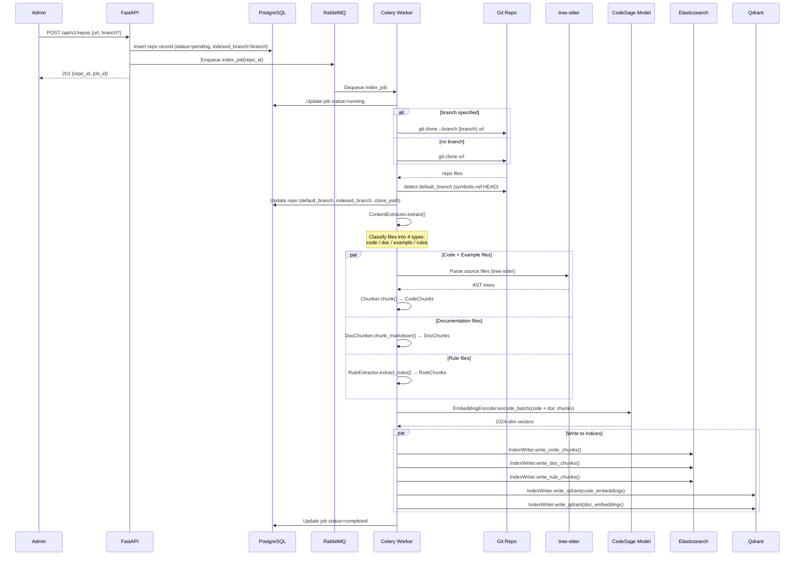

#### 4.1.4 Three-Level Chunking Rules

The Chunker uses tree-sitter AST to split source code into three granularity levels:

| Level | Chunk Type | AST Node Types | Content | Metadata Extracted |
|-------|-----------|----------------|---------|-------------------|
| **L1: File** | `file` | root node | File-level summary: import list + top-level symbol list (no function bodies) | `file_path`, `language`, `imports[]`, `top_level_symbols[]` |
| **L2: Class** | `class` | `class_definition`, `class_declaration`, `interface_declaration` | Class signature + method signatures list + class docstring (no method bodies) | `symbol` (class name), `signature`, `doc_comment`, `methods[]` (names + signatures) |
| **L3: Function** | `function` | `function_definition`, `function_declaration`, `method_definition`, `arrow_function` | Complete function body including signature + docstring | `symbol` (function/method name), `signature`, `doc_comment`, `parent_class` (if method) |

**Chunking algorithm**:

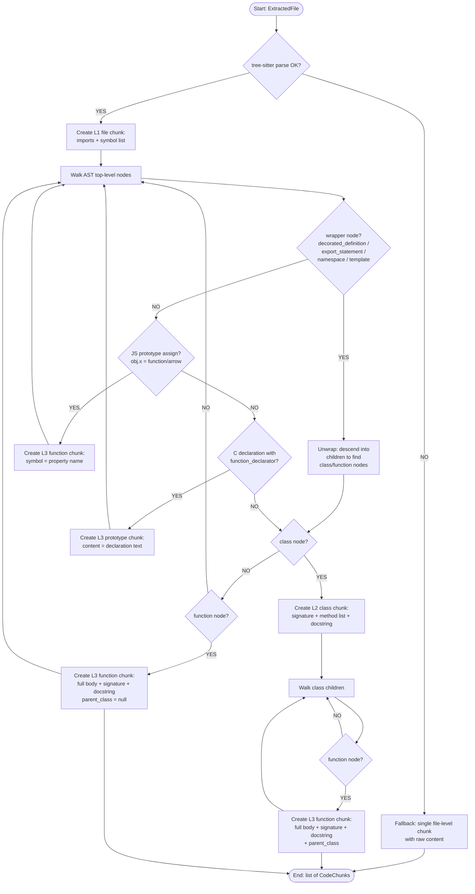

**Language-specific AST node mappings**:

<!-- Wave 2: Modified 2026-03-21 — expanded node mappings for competitive accuracy -->

| Language | Class Nodes | Function Nodes | Import Nodes |
|----------|------------|----------------|-------------|
| Python | `class_definition` | `function_definition` | `import_statement`, `import_from_statement` |
| Java | `class_declaration`, `interface_declaration`, `enum_declaration`, `record_declaration` | `method_declaration`, `constructor_declaration`, `static_initializer` | `import_declaration` |
| JavaScript | `class_declaration` | `function_declaration`, `arrow_function`, `method_definition` | `import_statement` |
| TypeScript | `class_declaration`, `interface_declaration`, `enum_declaration` | `function_declaration`, `arrow_function`, `method_definition` | `import_statement` |
| C | `enum_specifier` | `function_definition` | `preproc_include` |
| C++ | `class_specifier`, `struct_specifier` | `function_definition` | `preproc_include`, `using_declaration` |

**AST wrapper node unwrapping rules** (Wave 2):

The walker must recursively unwrap the following wrapper nodes before matching class/function nodes:

| Wrapper Node | Languages | Unwrap Strategy | Rationale |
|-------------|-----------|-----------------|-----------|
| `decorated_definition` | Python, TS/JS | Descend into children to find inner `class_definition` / `function_definition` | `@property`, `@dataclass`, `@app.route`, `@Component` wrap the target node |
| `export_statement` | JS, TS | Descend into children to find inner class/function/enum node | `export function`, `export class`, `export enum` |
| `namespace_definition` | C++ | Recurse into `declaration_list` body to find all class/function nodes | `namespace foo { class X {} }` — recursive for nested namespaces |
| `internal_module` / `module` | TS | Recurse into `statement_block` body | `namespace Foo { class Bar {} }` |
| `template_declaration` | C++ | Single-level unwrap: check immediate children for class_specifier / function_definition | `template<typename T> class Foo {}` |
| `preproc_ifdef` / `preproc_if` | C, C++ | Recurse into children for import nodes | `#ifndef HEADER_H` wrapping `#include` directives |
| `type_definition` | C | Check for inner `struct_specifier` → create L2 chunk | `typedef struct { ... } name;` pattern |

**Prototype-assigned function detection** (JS):

When an `expression_statement` contains an `assignment_expression` where:
- Left side is a `member_expression` (e.g., `res.status`)
- Right side is a `function_expression` or `arrow_function`

→ Create an L3 function chunk with `symbol = property_name` (e.g., `"status"`).

**C function prototype detection**:

When a `declaration` node contains a `function_declarator` child but has no body (`;`-terminated):
→ Create an L3 function chunk with `content = declaration text` (the signature IS the content).

**CommonJS require() import detection** (JS):

When a `variable_declaration` contains a `call_expression` where the function is `require`:
→ Extract the argument string as an import (e.g., `require('express')` → `"express"`).

**Signature extraction**: For each function/class node, extract the first line(s) up to the body delimiter (`:` in Python, `{` in C-family). For docstrings, extract the first child string literal or comment block.

**Import extraction**: Collect all import nodes from file root, recursively descending into `preproc_ifdef`/`preproc_if` for C/C++ header guards. Store as a flat list of imported names (e.g., `["jwt", "datetime", "typing.Optional"]`).

**Size limits**: If a single function body exceeds 500 lines, split into 500-line windows with 50-line overlap. Each window becomes a separate L3 chunk with `_part_N` suffix on chunk_id.

#### 4.1.5 Documentation Chunking Rules

The `DocChunker` splits markdown/rst files by heading structure, producing section-level chunks with breadcrumb navigation:

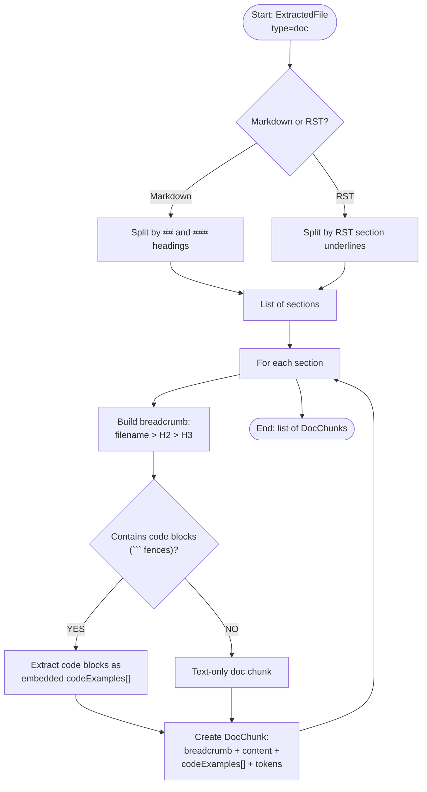

**DocChunk fields**:

| Field | Type | Description |
|-------|------|-------------|
| `chunk_id` | string | `{repo_id}:{file_path}:{heading_slug}` |
| `repo_id` | string | Repository ID |
| `file_path` | string | e.g., `docs/auth.md` |
| `breadcrumb` | string | `docs/auth.md > Authentication > JWT Validation` |
| `content` | text | Section text content (markdown stripped to plain text) |
| `code_examples` | list | Code blocks extracted from the section: `[{language, code}]` |
| `content_tokens` | int | Approximate token count for content |
| `heading_level` | int | 1, 2, or 3 |

**Section splitting rules**:
- Split on `##` (H2) and `###` (H3) headings. H4 headings are treated as optional split points within H3 sections (split only if the H3 section exceeds 1000 tokens)
- H1 (`#`) is treated as the document title, not a split point
- Each section includes all content until the next heading of same or higher level
- If a section exceeds 2000 tokens, split at paragraph boundaries (double newline)
- Code blocks within a section are extracted into `code_examples[]` and also kept inline in `content`

**No-heading file fallback**: If a file contains no H2/H3 headings (e.g., a plain README with only prose):
1. Split by paragraph boundaries (double newline `\n\n`)
2. Merge consecutive short paragraphs (< 200 tokens) into a single chunk
3. Breadcrumb: `{file_path} > [section N]` (1-based index)
4. If the entire file is < 500 tokens, index as a single DocChunk

**Oversized single paragraph fallback**: If a paragraph exceeds 2000 tokens with no double-newline breaks:
1. Split at sentence boundaries (`. ` followed by uppercase letter)
2. If no sentence boundaries found, split at fixed 1500-token windows with 100-token overlap

**Breadcrumb construction**: `{file_path} > {H2 title} > {H3 title}` — mirrors Context7's breadcrumb for hierarchical navigation.

**Files treated as documentation**:
- `README.md`, `README.rst` (any case, at any directory level)
- `docs/**/*.md`, `docs/**/*.rst`
- `CHANGELOG.md`, `HISTORY.md`
- `*.md` files in repo root (e.g., `ARCHITECTURE.md`, `DESIGN.md`)

#### 4.1.6 Example Chunking Rules

Files classified as examples are indexed as code chunks tagged with `chunk_type=example`:

**Example file detection patterns**:
- Path contains `examples/` or `example/` directory
- Filename matches `*_example.*`, `*_demo.*`, `example_*.*`, `demo_*.*`
- Test files: `test_*.*`, `*_test.*`, `*_spec.*` (tagged `chunk_type=test`)

**Chunking strategy**: Same three-level code chunking (tree-sitter) when the language is supported. For non-parseable files (e.g., shell scripts, config examples), use file-level chunking.

**Extra metadata for examples**: `example_title` extracted from the first comment block or docstring; `example_description` from the first paragraph of the file.

#### 4.1.7 Repository Rules Extraction

Rules files provide behavioral guidance for Code Agents. They are indexed as keyword-searchable chunks (no vector embedding — rules are short and should be returned in full or not at all).

**Rule file detection patterns**:
- `CLAUDE.md`, `.claude/settings.json`
- `.cursor/rules/**`
- `CONTRIBUTING.md`, `CONTRIBUTING.rst`
- `.editorconfig`
- `pyproject.toml` (extract `[tool.ruff]`, `[tool.mypy]`, `[tool.pytest]` sections)
- `.eslintrc.*`, `.prettierrc.*`, `tsconfig.json`

**RuleChunk fields**:

| Field | Type | Description |
|-------|------|-------------|
| `chunk_id` | string | `{repo_id}:{file_path}` |
| `repo_id` | string | Repository ID |
| `file_path` | string | e.g., `CLAUDE.md` |
| `rule_type` | string | `agent_rules` / `contribution_guide` / `linter_config` / `editor_config` |
| `content` | text | Full file content (rules files are typically < 500 lines) |

**Rules are always returned in full** when the repository is queried — they are not scored by relevance. The MCP response includes a `rules` section separate from code/doc results (see Section 4.3.3).

#### 4.1.8 Design Notes
- **Idempotent reindex**: `IndexWriter.delete_repo_index()` removes all existing chunks for a repo (filtered by `branch`) before writing new ones. This ensures clean state on re-index.
- **Failure handling**: Any step failure marks the job as "failed" in PostgreSQL. Partial writes to ES/Qdrant are cleaned up by `delete_repo_index()` on the next attempt.
- **Chunk ID formats** (deterministic, enables idempotent writes):
  - CodeChunk: `{repo_id}:{branch}:{file_path}:{symbol_name}:{chunk_type}:{line_start}` — line_start disambiguates overloaded functions, inner classes, and same-name methods
  - DocChunk: `{repo_id}:{branch}:{file_path}:{heading_slug}:{section_index}` — section_index (0-based) disambiguates duplicate headings within the same file
  - RuleChunk: `{repo_id}:{branch}:{file_path}`
  - L1 file chunk: `{repo_id}:{branch}:{file_path}::file:0`
- **Embedding model**: CodeSage-large (Salesforce, 1024-dim) — trained specifically on code search tasks with instruction-tuned query encoding. Outperforms generic text models (BGE, E5) on CodeSearchNet benchmarks by 8-15% nDCG@10.
- **Embedding batch size**: 64 chunks per GPU/CPU batch to balance throughput vs. memory.
- **Embedding input strategy**:
  - L3 function chunks: embed `signature + doc_comment + content` (full function body provides maximum semantic signal)
  - L2 class chunks: embed `signature + method_signatures + doc_comment` (method list captures class purpose without body noise)
  - L1 file chunks: embed `file_path + imports + top_level_symbols` (structural overview for file-level matching)
  - Doc chunks: embed `breadcrumb + content` (heading context anchors section semantics)
- **Instruction prefixes** (asymmetric encoding for better retrieval):
  - Query: `"Represent this code search query: "` + query text → biases toward search intent
  - Document: no prefix (raw code/doc content) → preserves natural code semantics
  - This asymmetric encoding is standard practice for retrieval-optimized models and improves recall by ~5-10%.

---

### 4.2 Feature Group: Hybrid Retrieval Pipeline (FR-006 to FR-010)

#### 4.2.1 Overview
The retrieval pipeline receives a parsed query, runs parallel BM25 + vector searches, fuses results with RRF, reranks with neural reranker, and builds the structured response. This is the hot path — every design decision here targets the 1s latency budget.

#### 4.2.2 Class Diagram

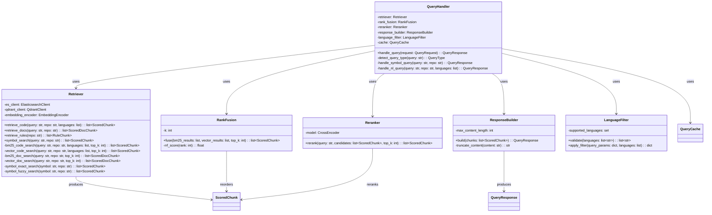

#### 4.2.3 Sequence Diagram

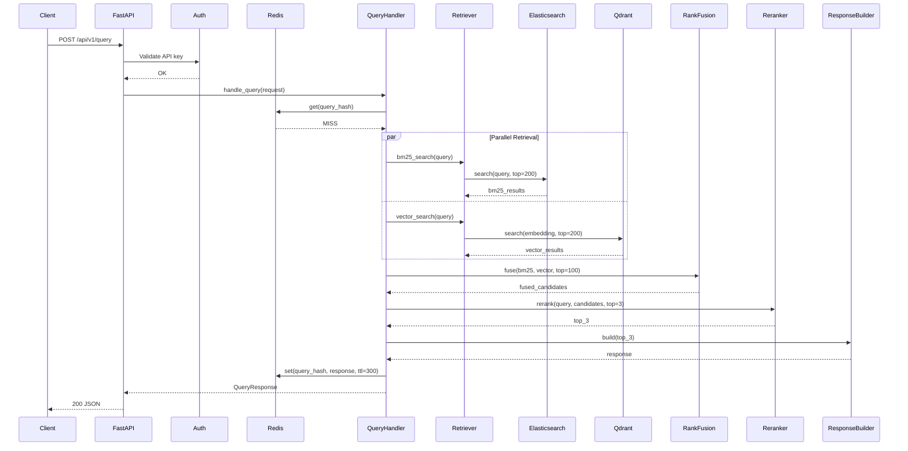

#### 4.2.4 Query Routing: Symbol vs Natural Language

The `QueryHandler` auto-detects query type and routes to different retrieval paths:

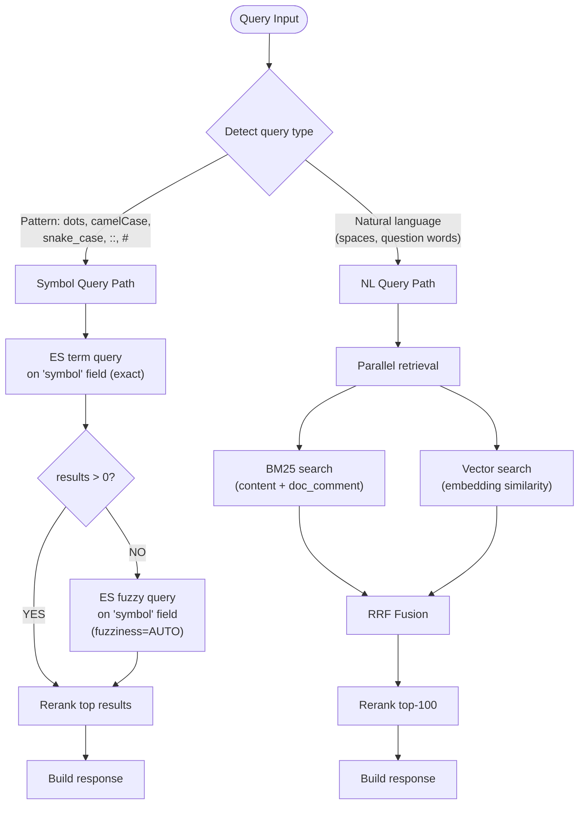

**Symbol detection heuristic**:
- Contains `.` (e.g., `UserService.getById`) → symbol
- Contains `::` (e.g., `std::vector`) → symbol
- Contains `#` (e.g., `Array#map`) → symbol
- Matches `camelCase` or `PascalCase` pattern with no spaces → symbol
- Matches `snake_case` pattern with no spaces → symbol
- Otherwise → natural language

**Symbol query ES behavior**:
1. First: `term` query on `symbol` field (exact match, case-sensitive)
2. If 0 results: `fuzzy` query on `symbol` field with `fuzziness=AUTO` (handles typos)
3. If still 0 results: fall back to full NL pipeline with the query as-is

**NL query expansion** (improves recall for queries containing code identifiers):

When a natural language query is detected, the `QueryHandler` runs a lightweight identifier extraction step before retrieval:

1. **Extract embedded identifiers**: scan the NL query for tokens matching `camelCase`, `snake_case`, `PascalCase`, or dot-separated patterns (e.g., "how does getUserName handle errors" → extract `getUserName`)
2. **Parallel symbol boost**: if identifiers are found, fire an additional `term` query on `symbol.raw` for each extracted identifier in parallel with the standard NL pipeline
3. **Merge into RRF**: the symbol boost results are added as a 5th input list to the RRF fusion (with weight 0.3 vs 1.0 for the 4 primary lists), ensuring exact symbol matches are promoted without replacing NL relevance

This handles the common pattern where developers write queries like "how does the AuthService validate tokens" — the NL pipeline captures semantic intent while the symbol boost ensures `AuthService` and `validate` symbol matches surface.

#### 4.2.5 Cross-Content-Type Retrieval (Unified Pipeline)

Code and documentation results are retrieved in parallel but fused and reranked in a **single unified pipeline** — avoiding the latency penalty of double reranking.

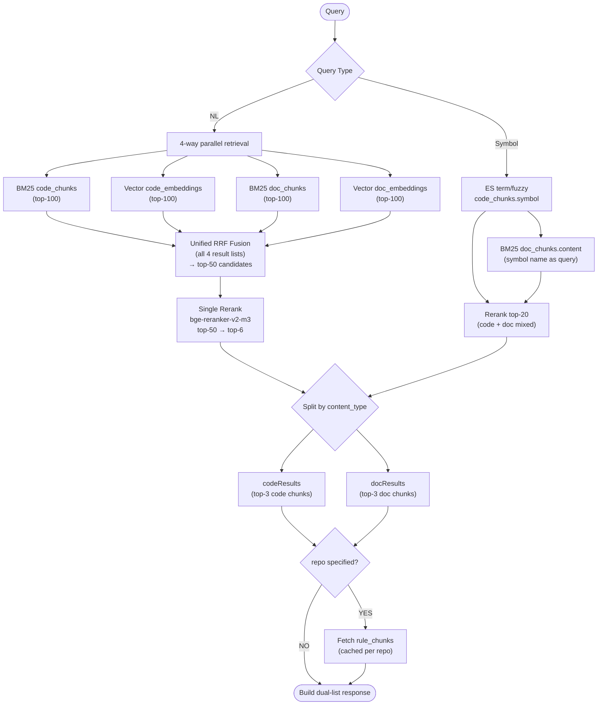

**Unified RRF fusion**: All 4 retrieval lists are merged into a single RRF ranking. Each candidate carries a `content_type` tag (`code` or `doc`). The RRF formula treats all candidates equally: `score(d) = Σ 1/(k + rank_i(d))` where `i` ranges over whichever lists returned `d`. This naturally interleaves code and doc results by relevance.

**Single rerank pass**: The top-50 RRF candidates (mixed code + doc) are reranked by a single bge-reranker-v2-m3 pass. After reranking, results are split by `content_type` into `codeResults` (top-3 code) and `docResults` (top-3 doc). This halves the reranker latency compared to two independent rerank passes.

**Symbol queries**: Primary search on `code_chunks.symbol` (exact → fuzzy), plus BM25 on `doc_chunks.content` for the symbol name. Combined candidates (≤20) go through a single rerank pass, then split into code/doc results.

**Rules**: Fetched unconditionally when `repo` is specified. Cached per repo in Redis (TTL = 5 min). Rules total content capped at **10,000 tokens** — if exceeded, truncate by priority: `agent_rules` > `contribution_guide` > `linter_config`.

**Result budget**: Default `top_k=3` per content type (3 code + 3 doc). Agent can adjust via `top_k` parameter. Agent can also set `max_tokens` to cap total response size for context window budget management.

#### 4.2.6 Design Notes
- **Parallel retrieval** (NL path): 4-way search via `asyncio.gather()`. Independent timeouts: 200ms per search. If any search times out, remaining results proceed to RRF. At least 1 successful search required; if all 4 fail, return 504.
- **RRF k=60**: Standard RRF constant. `score(d) = Σ 1/(60 + rank_i(d))`.
- **Reranker model**: `bge-reranker-v2-m3` (278M MiniLM architecture). Faster than bge-reranker-large (335M) with comparable accuracy. Fallback chain: bge-reranker-v2-m3 (CPU) → bge-reranker-base (CPU, lighter) → skip rerank (RRF-only) if latency budget exhausted.
- **Reranker batch**: Top-50 candidates batched in groups of 32 for cross-encoder inference. Single pass.
- **Cache key**: SHA256 of `{query}:{repo}:{languages}:{top_k}:{max_tokens}`. TTL = 5 minutes (300s).
- **Query embedding**: The query vector is computed inline using `EmbeddingEncoder.encode_query()` with instruction prefix `"Represent this code search query: "` prepended to the query text. Uses the same CodeSage-large model loaded in the query service. This adds ~10ms but avoids a separate embedding service.
- **Symbol query latency**: Symbol path skips vector search + 4-way parallel, typical latency ~50ms (ES term query + doc BM25 + rerank ≤20 candidates). Well within 1s budget.

#### 4.2.7 Latency Budget Analysis

| Stage | CPU Estimate | Notes |
|-------|-------------|-------|
| Query embedding (CodeSage) | ~10ms | Single query, 1024-dim, with instruction prefix |
| 4-way parallel retrieval | ~80ms (p95) | Bounded by slowest of 4 searches (timeout 200ms each) |
| RRF fusion (top-50) | ~2ms | In-memory sort |
| bge-reranker-v2-m3 (50 candidates) | ~260ms (p95) | 2 batches × ~130ms on CPU (FP32). MiniLM-based, faster than bge-reranker-large |
| Response builder | ~5ms | JSON serialization |
| Rules fetch (Redis) | ~3ms | Cached, single key lookup |
| **Total (cache miss)** | **~360ms (p50), ~500ms (p95)** | **500ms headroom for network + serialization** |
| **Total (cache hit)** | **~5ms** | Redis get |

**Degradation strategy** (if p95 approaches 800ms):
1. Reduce rerank candidates from 50 to 30 (~156ms rerank)
2. Switch to bge-reranker-base (~200ms for 50 candidates)
3. Skip rerank entirely, use RRF scores only (~0ms rerank, ~10% relevance drop)
4. Add GPU inference (rerank ~30ms for 50 candidates on T4)

---

### 4.3 Feature: MCP Server (FR-016)

#### 4.3.1 Overview
Standalone MCP server process exposing `search_code_context` tool via the MCP protocol. Internally uses the same `QueryHandler` as the REST API.

#### 4.3.2 Class Diagram

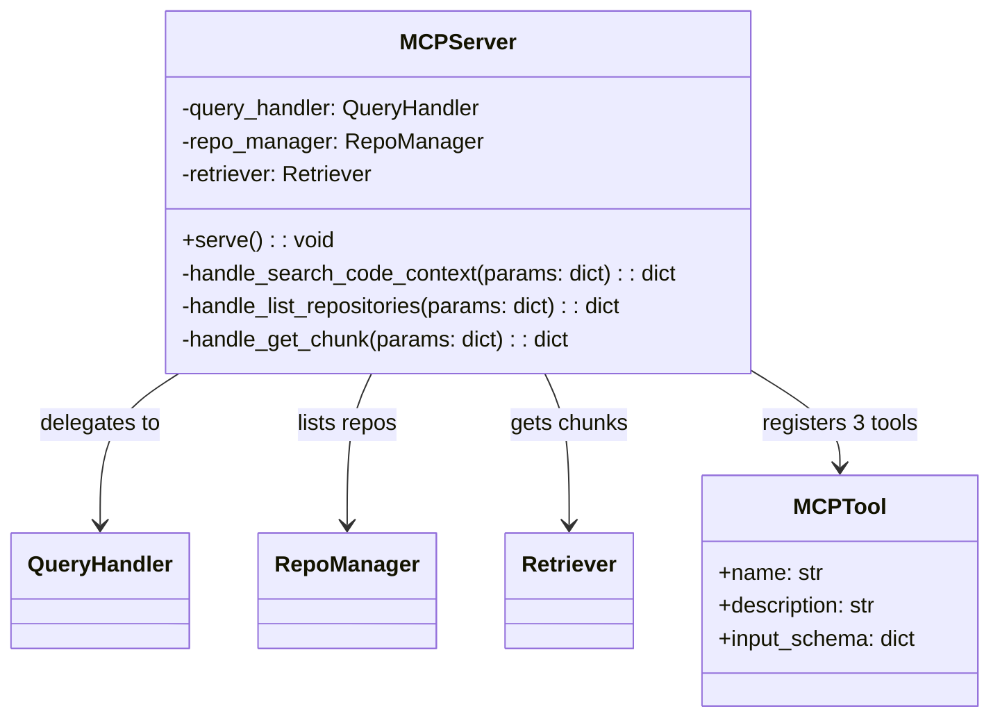

#### 4.3.3 Code Agent Context Response Structure

The MCP tool and REST API return a **dual-list response** (modeled after Context7), separating code results, documentation results, and repository rules. This allows Code Agents to distinguish between "this is code" and "this is documentation" and consume each type appropriately.

```json
{
  "query": "how to authenticate users",
  "query_type": "nl",
  "repo": "my-org/my-app",
  "codeResults": [
    {
      "file_path": "src/auth/jwt.py",
      "lines": [45, 82],
      "symbol": "validate_token",
      "chunk_type": "function",
      "language": "python",
      "signature": "def validate_token(token: str, secret: str) -> Claims",
      "doc_comment": "Validate JWT and return decoded claims.\n\nArgs:\n    token: JWT string\n    secret: HMAC secret key\nReturns: Claims object\nRaises: AuthError if invalid",
      "content": "def validate_token(token: str, secret: str) -> Claims:\n    try:\n        payload = jwt.decode(token, secret, algorithms=['HS256'])\n        return Claims.from_dict(payload)\n    except jwt.ExpiredSignatureError:\n        raise AuthError('Token expired')",
      "imports": ["jwt", "Claims", "AuthError"],
      "relevance_score": 0.95
    }
  ],
  "docResults": [
    {
      "file_path": "docs/auth.md",
      "breadcrumb": "docs/auth.md > Authentication > JWT Validation",
      "content": "JWT tokens are validated on every API request. The token must include `user_id` and `roles` claims. Tokens expire after 24 hours. Use the `validate_token()` function from `src/auth/jwt.py` for validation.",
      "code_examples": [
        {
          "language": "python",
          "code": "from src.auth.jwt import validate_token\nclaims = validate_token(request.headers['Authorization'], SECRET)"
        }
      ],
      "content_tokens": 85,
      "relevance_score": 0.88
    }
  ],
  "rules": {
    "agent_rules": ["Always use async database sessions", "Prefer composition over inheritance"],
    "contribution_guide": ["All PRs must include tests", "Follow Google Python Style Guide"],
    "linter_config": ["ruff: line-length=120, target-version=py311"]
  }
}
```

**codeResults fields by chunk type**:

| Field | L3 (function) | L2 (class) | L1 (file) | example |
|-------|:---:|:---:|:---:|:---:|
| `file_path` | ✓ | ✓ | ✓ | ✓ |
| `lines` [start, end] | ✓ | ✓ | ✓ | ✓ |
| `symbol` | function name | class name | file name | function/file name |
| `chunk_type` | `function` | `class` | `file` | `example` or `test` |
| `language` | ✓ | ✓ | ✓ | ✓ |
| `signature` | function signature | class signature | — | function signature |
| `doc_comment` | function docstring | class docstring | module docstring | example description |
| `content` | full function body | signature + method list | import list + symbol list | full example code |
| `imports` | file-level imports | file-level imports | file-level imports | file-level imports |
| `relevance_score` | 0.0–1.0 | 0.0–1.0 | 0.0–1.0 | 0.0–1.0 |

**docResults fields**:

| Field | Type | Description |
|-------|------|-------------|
| `file_path` | string | Path to the documentation file |
| `breadcrumb` | string | Hierarchical path: `file > H2 > H3` |
| `content` | string | Section text (markdown stripped to plain text) |
| `code_examples` | list | Code blocks found in this section: `[{language, code}]` |
| `content_tokens` | int | Token count for budget management |
| `relevance_score` | float | 0.0–1.0 |

**rules fields**:

| Field | Type | Description |
|-------|------|-------------|
| `agent_rules` | list[str] | Rules from `CLAUDE.md`, `.cursor/rules/**` |
| `contribution_guide` | list[str] | Key rules from `CONTRIBUTING.md` |
| `linter_config` | list[str] | Summarized linter/formatter config |

**Design rationale for Code Agents**:
- **Dual-list separation** — Agent can prioritize code vs docs based on task (writing code → codeResults first; understanding design → docResults first)
- **`breadcrumb`** — Agent understands where the doc snippet lives in the documentation hierarchy
- **`code_examples` in docs** — Agent gets usage examples embedded in documentation (not just raw source)
- **`rules`** — Agent receives repository conventions upfront, reducing style/convention violations
- **`signature` + `imports`** — Agent can understand API contract and dependency scope without reading full body
- **`content_tokens`** — Agent can manage context window budget across multiple results

**Content truncation**: If `content` exceeds 2000 characters (FR-010 limit), truncate with `...` marker and set `truncated: true`. Agent can request full content via a follow-up symbol query on the specific chunk.

**Rules behavior**: Rules are **always included** when querying a specific repository (regardless of query content). They are fetched once and cached. Rules are **not included** in cross-repository queries (no `repo` filter).

#### 4.3.4 MCP Tool Definitions

The MCP server registers **three tools**:

| Tool | Parameters | Description |
|------|-----------|-------------|
| `search_code_context` | `query` (required), `repo` (optional), `top_k` (optional, default 3), `languages` (optional), `max_tokens` (optional, default 5000) | Search code + documentation context. Returns dual-list response (codeResults + docResults + rules). `max_tokens` caps total response size for context window budget management. |
| `list_repositories` | `query` (optional) | List indexed repositories. If `query` provided, filter by name/URL fuzzy match. Returns `[{id, name, url, default_branch, indexed_branch, last_indexed_at, status}]`. Enables Agent to discover available repos before querying. |
| `get_chunk` | `chunk_id` (required) | Get full content of a specific chunk by ID. Bypasses truncation limit. Useful when Agent needs complete content of a truncated result from `search_code_context`. Returns single chunk with all fields. |

#### 4.3.5 Design Notes
- Uses the `mcp` Python SDK to register three tools.
- Runs as a separate process (stdio transport for local, SSE for remote).
- Shares the same `QueryHandler` and `RepoManager` code but instantiates its own ES/Qdrant/Redis connections.
- MCP response wraps the same JSON structure above as the `content` field of the MCP tool result.
- `list_repositories` respects API key repo access control — only returns repos the key has access to.

---

### 4.4 Feature: Web UI (FR-017, FR-018)

#### 4.4.1 Overview
Server-side rendered search page using Jinja2 templates. Single page with search input, repository dropdown, language checkboxes, and syntax-highlighted result cards.

#### 4.4.2 Class Diagram

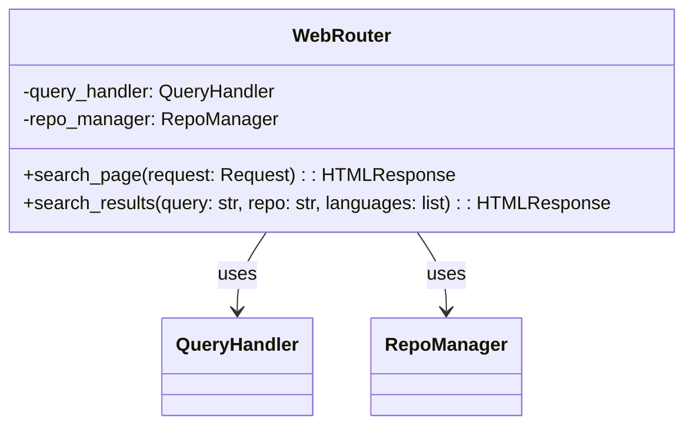

#### 4.4.3 Design Notes
- **SSR approach**: Jinja2 templates rendered server-side. No JavaScript framework needed — the UI is a single search form with results. HTMX for partial page updates (search without full reload).
- **UCD mapping**: CSS custom properties map directly to UCD style tokens (Section 2 of UCD). Code highlighting via Pygments with a custom Monokai-inspired formatter using UCD syntax tokens.
- **Component mapping**: UCD Component → Implementation:
  - Search Input → `<input>` + `<button>` styled with UCD tokens
  - Repository Dropdown → `<select>` populated from repo list API
  - Branch Selector → `<select>` populated via `GET /api/v1/repos/{id}/branches` after URL entry (HTMX partial update). Defaults to repo's default branch. Shown in repository registration form.
  - Language Checkboxes → `<input type="checkbox">` × 6 languages
  - Result Card → Jinja2 macro `result_card(chunk)` with Pygments highlighting
  - Empty State → Jinja2 conditional block
  - Header → Jinja2 base template `_base.html`
  - Loading Skeleton → CSS animation (shimmer), shown via HTMX indicator

---

### 4.5 Feature: Authentication & API (FR-014, FR-015)

#### 4.5.1 Overview
API key authentication middleware for FastAPI with two permission levels. Rate limiting via Redis. API Key CRUD for management. Web UI basic authentication. RESTful endpoints for query, repository management, and health.

#### 4.5.2 Class Diagram

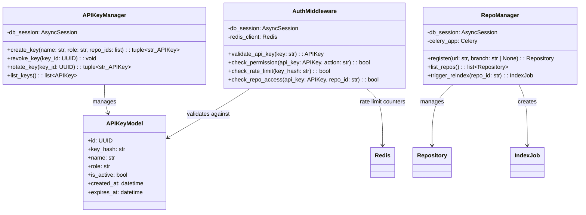

#### 4.5.3 Permission Model

| Role | Query | List Repos | Register Repo | Reindex | Manage Keys | Metrics |
|------|:-----:|:----------:|:-------------:|:-------:|:-----------:|:-------:|
| `read` | ✓ (scoped to allowed repos) | ✓ (only allowed repos) | ✗ | ✗ | ✗ | ✗ |
| `admin` | ✓ (all repos) | ✓ (all repos) | ✓ | ✓ | ✓ | ✓ |

**Repository access control**: `read` role keys are associated with specific repositories via `API_KEY_REPO_ACCESS` join table. Queries with a `repo` filter are checked against this ACL. Cross-repo queries (no `repo` filter) only return results from allowed repos. `admin` keys have unrestricted access.

**Web UI authentication**: Web UI routes (`/`, `/search`) require a valid API key passed via cookie or query parameter. Login page at `/login` accepts API key input and sets an HTTP-only session cookie.

#### 4.5.4 API Key CRUD Endpoints

| Method | Path | Auth | Description |
|--------|------|------|-------------|
| POST | `/api/v1/keys` | Admin | Create new API key (returns plaintext key once) |
| GET | `/api/v1/keys` | Admin | List all API keys (no plaintext) |
| DELETE | `/api/v1/keys/{id}` | Admin | Revoke API key |
| POST | `/api/v1/keys/{id}/rotate` | Admin | Rotate key (new key, old key invalidated) |

#### 4.5.5 Design Notes
- API keys stored as SHA256 hashes in PostgreSQL. Plaintext key returned only on creation.
- Rate limiting: **Redis-backed** counter per key hash, 10 failures/minute threshold → 429 response. Consistent across multi-node deployments.
- Health endpoint (`/api/v1/health`) is unauthenticated — checks ES, Qdrant, Redis, PostgreSQL connectivity.
- Metrics endpoint (`/metrics`) requires admin role.
- **Credential encryption**: Repository access tokens/SSH keys encrypted with AES-256-GCM. Encryption key sourced from environment variable `CREDENTIAL_ENCRYPTION_KEY`. Key rotation supported via re-encryption on read.

---

### 4.5b Feature: Branch Listing API (FR-023) [Wave 1]

#### 4.5b.1 Overview
REST endpoint to list remote branches for a registered (and cloned) repository. Used by the Web UI branch selector during repository registration, and available to API consumers.

#### 4.5b.2 Sequence Diagram

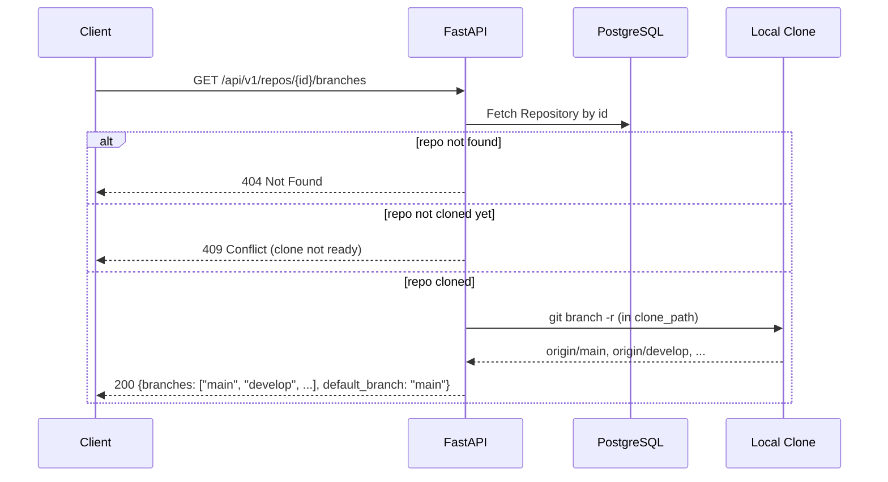

#### 4.5b.3 Design Notes
- Uses `GitCloner.list_remote_branches(repo_path)` which runs `git branch -r` in the clone directory and strips the `origin/` prefix.
- Returns branches sorted alphabetically, with `default_branch` indicated separately.
- Requires the repository to have been cloned at least once (status != "pending" with no clone_path).
- Auth: `read` or `admin` role (read-role keys must have access to the repo via ACL).

---

### 4.6 Feature: Observability (FR-021, FR-022)

#### 4.6.1 Overview
Prometheus metrics endpoint and structured JSON query logging to stdout.

#### 4.6.2 Design Notes

**Query-side metrics** (`prometheus-client` on `/metrics`):
- `query_latency_seconds` (histogram): Total query latency, labels: `query_type` (nl/symbol), `cache_hit` (true/false)
- `retrieval_latency_seconds` (histogram): Per-backend retrieval latency, labels: `backend` (es_code/es_doc/qdrant_code/qdrant_doc)
- `rerank_latency_seconds` (histogram): Reranker inference latency
- `query_total` (counter): Total queries, labels: `query_type`
- `cache_hit_ratio` (gauge): Rolling cache hit ratio
- `active_connections` (gauge): Current ES/Qdrant/Redis connection counts

**Indexing-side metrics**:
- `indexing_duration_seconds` (histogram): Total index job duration, labels: `phase` (clone/extract/chunk/embed/write)
- `indexing_error_total` (counter): Index job failures, labels: `phase`, `error_type`
- `indexing_queue_depth` (gauge): Pending index jobs in RabbitMQ
- `indexing_chunks_total` (counter): Chunks indexed, labels: `content_type` (code/doc/example/rule)
- `index_size_chunks` (gauge): Total chunks per repo, labels: `repo_id`, `content_type`

**Query logging**: Python `logging` with JSON formatter to stdout. Each query logs: `query`, `query_type`, `api_key_id`, `result_count`, `retrieval_ms`, `rerank_ms`, `total_ms`, `timestamp`. Non-fatal — wrapped in try/except.

**No tracing in MVP**: Distributed tracing (OpenTelemetry) deferred to V2.

---

### 4.7 Feature Group: Retrieval Quality Evaluation Pipeline (FR-024 to FR-026) [Wave 3]

#### 4.7.1 Overview

Offline evaluation subsystem that measures retrieval relevance quality using LLM-generated golden datasets. Not in the query hot path — runs as a CLI tool (`python -m src.eval`). Three stages: corpus building (clone + index representative repos), LLM annotation (generate queries + annotate relevance via MiniMax2.5 Code Plan API), and metric computation (MRR@10, NDCG@10, Recall@200, Precision@3).

#### 4.7.2 Class Diagram

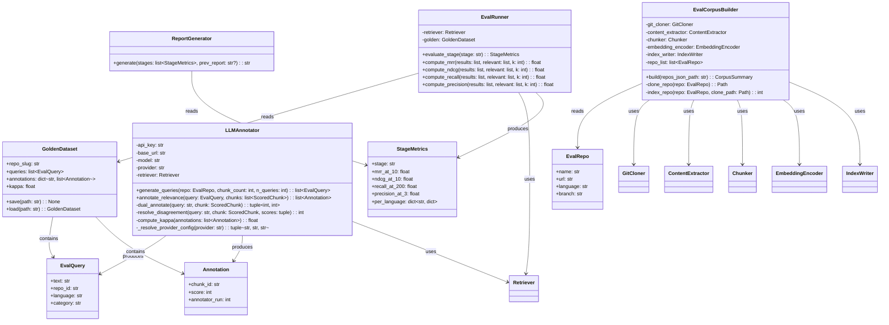

#### 4.7.3 Sequence Diagram

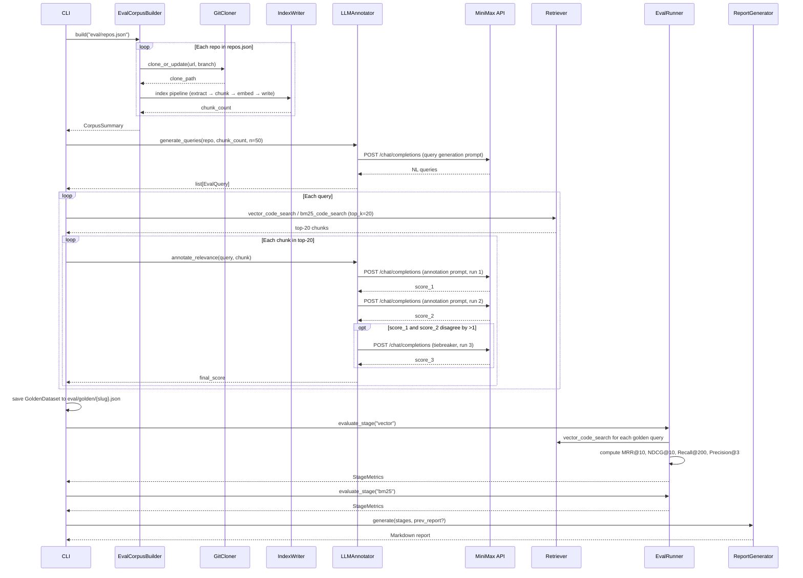

#### 4.7.4 Design Notes

- **Evaluation index namespace**: All eval data uses index prefix `eval_` (e.g., `eval_code_chunks`, `eval_code_embeddings`) to isolate from production data. `EvalCorpusBuilder` passes these collection/index names to `IndexWriter`.
- **MiniMax API integration**: OpenAI-compatible endpoint via `httpx`. Same proxy-clearing pattern as `EmbeddingEncoder`. Model: `MiniMax-M1-80k` (80K context window for long code chunks).
- **Dual annotation**: Two independent LLM calls with different temperature (0.1 vs 0.3) for diversity. If `|score_1 - score_2| > 1`, third call at temperature=0.2 breaks tie via majority. Cohen's Kappa computed across all annotations to measure consistency.
- **Query generation prompt**: Structured prompt requesting queries in 4 categories (API usage 30%, bug diagnosis 25%, configuration 25%, architecture 20%). Temperature=0.7 for diversity.
- **Relevance scale**: 0=irrelevant, 1=marginally relevant, 2=relevant, 3=highly relevant. Maps to standard TREC-style graded relevance for NDCG computation.
- **IR metrics implementation**: Standard formulas — MRR = 1/rank_of_first_relevant, NDCG = DCG/IDCG with log2 discounting, Recall@k = |relevant ∩ retrieved@k| / |relevant|, Precision@k = |relevant ∩ retrieved@k| / k. Relevance threshold: score >= 2.
- **Stage evaluation**: Each stage evaluated independently. Stages not yet implemented return `StageMetrics` with all values = None and `status = "N/A"`.
- **Report delta**: If a previous report exists at `eval/reports/`, the new report includes a delta table (Δ per metric per stage).
- **Multi-provider LLM**: LLMAnnotator supports multiple OpenAI-compatible providers selected via `EVAL_LLM_PROVIDER` env var (`minimax` or `zhipu`). Each provider has its own API key, base URL, and model name env vars. The annotator uses a single `httpx` client configured per provider — no provider-specific code paths. This enables cross-provider comparison of annotation quality.
- **Reproducibility**: `eval/repos.json` is version-controlled. LLM calls use `seed` parameter where supported. Golden datasets are cached — re-run only re-evaluates retrieval, not re-annotates.

#### 4.7.5 File Structure

```
eval/
├── repos.json                  # Repository list (version-controlled)
├── golden/                     # Golden datasets (generated, gitignored)
│   ├── flask.json
│   ├── spring-boot.json
│   └── ...
├── reports/                    # Evaluation reports (version-controlled)
│   └── 2026-03-21-eval-report.md
└── prompts/                    # LLM prompt templates (version-controlled)
    ├── query-generation.md
    └── relevance-annotation.md
src/eval/
├── __init__.py
├── __main__.py                 # CLI entry point
├── corpus_builder.py           # EvalCorpusBuilder
├── annotator.py                # LLMAnnotator
├── golden_dataset.py           # GoldenDataset model
├── runner.py                   # EvalRunner (IR metrics)
└── report.py                   # ReportGenerator
```

---

## 5. Data Model

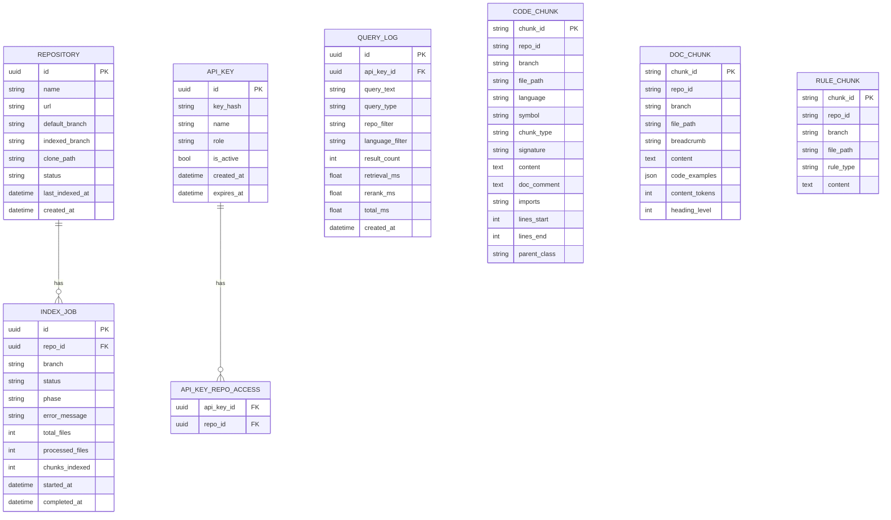

**Storage mapping**:

| Entity | Storage | Rationale |
|--------|---------|-----------|
| REPOSITORY | PostgreSQL | Relational metadata with status tracking |
| INDEX_JOB | PostgreSQL | Job lifecycle with foreign key to repository |
| API_KEY | PostgreSQL | Secure credential storage with expiry |
| QUERY_LOG | PostgreSQL | Structured audit trail (optional: stdout-only in MVP) |
| CODE_CHUNK (text) | Elasticsearch (`code_chunks`) | BM25 keyword search over content, symbol, doc fields |
| CODE_CHUNK (vector) | Qdrant (`code_embeddings`) | 1024-dim cosine similarity search with metadata payload |
| DOC_CHUNK (text) | Elasticsearch (`doc_chunks`) | BM25 search over documentation content with breadcrumb |
| DOC_CHUNK (vector) | Qdrant (`doc_embeddings`) | 1024-dim cosine similarity search for doc sections |
| RULE_CHUNK | Elasticsearch (`rule_chunks`) | Keyword-only search (no vector), returned in full per repo |

**Elasticsearch index mapping** (`code_chunks`):
```json
{
  "settings": {
    "analysis": {
      "analyzer": {
        "code_analyzer": {
          "tokenizer": "code_tokenizer",
          "filter": ["lowercase", "code_word_delimiter", "code_synonym", "code_stop", "english_stop", "english_stemmer"]
        }
      },
      "tokenizer": {
        "code_tokenizer": {
          "type": "pattern",
          "pattern": "[\\W_]+"
        }
      },
      "filter": {
        "code_word_delimiter": {
          "type": "word_delimiter_graph",
          "split_on_case_change": true,
          "split_on_numerics": true,
          "preserve_original": true,
          "stem_english_possessive": false
        },
        "code_synonym": {
          "type": "synonym",
          "synonyms": [
            "auth, authentication, authorization",
            "config, configuration, conf, cfg",
            "db, database",
            "repo, repository",
            "msg, message",
            "err, error, exception",
            "req, request",
            "res, resp, response",
            "init, initialize, initialise",
            "util, utility, utils, helpers",
            "param, parameter, arg, argument",
            "str, string",
            "int, integer",
            "bool, boolean",
            "fn, func, function"
          ]
        },
        "code_stop": {
          "type": "stop",
          "stopwords": ["public", "private", "protected", "static", "final", "abstract", "void", "return", "class", "def", "function", "var", "let", "const", "import", "from", "self", "this", "new", "null", "none", "true", "false", "async", "await", "override", "virtual", "interface", "struct", "enum", "throws", "extends", "implements"]
        },
        "english_stop": {
          "type": "stop",
          "stopwords": ["the", "is", "a", "an", "and", "or", "but", "in", "on", "for", "to", "of", "with"]
        },
        "english_stemmer": {
          "type": "stemmer",
          "language": "English"
        }
      }
    }
  },
  "mappings": {
    "properties": {
      "chunk_id": {"type": "keyword"},
      "repo_id": {"type": "keyword"},
      "branch": {"type": "keyword"},
      "file_path": {"type": "keyword"},
      "language": {"type": "keyword"},
      "symbol": {
        "type": "text",
        "analyzer": "code_analyzer",
        "fields": {
          "raw": {"type": "keyword"}
        }
      },
      "chunk_type": {"type": "keyword"},
      "signature": {"type": "text", "analyzer": "code_analyzer"},
      "content": {"type": "text", "analyzer": "code_analyzer"},
      "doc_comment": {"type": "text", "analyzer": "code_analyzer"},
      "imports": {"type": "keyword"},
      "lines_start": {"type": "integer"},
      "lines_end": {"type": "integer"},
      "parent_class": {"type": "keyword"}
    }
  }
}
```

**code_analyzer behavior examples**:

| Input | Tokens Generated |
|-------|-----------------|
| `getUserName` | `getUserName`, `get`, `user`, `name` |
| `get_user_name` | `get_user_name`, `get`, `user`, `name` |
| `HTTPSConnection` | `HTTPSConnection`, `https`, `connection` |
| `parseInt` | `parseInt`, `parse`, `int` |

The `symbol.raw` sub-field (keyword type) enables exact term queries for the symbol query path. The `symbol` text field with `code_analyzer` enables fuzzy/partial matching as fallback.

**Elasticsearch index mapping** (`doc_chunks`):
```json
{
  "settings": {
    "analysis": {
      "analyzer": {
        "doc_analyzer": {
          "tokenizer": "standard",
          "filter": ["lowercase", "english_stop", "english_stemmer"]
        }
      }
    }
  },
  "mappings": {
    "properties": {
      "chunk_id": {"type": "keyword"},
      "repo_id": {"type": "keyword"},
      "branch": {"type": "keyword"},
      "file_path": {"type": "keyword"},
      "breadcrumb": {"type": "text", "analyzer": "doc_analyzer"},
      "content": {"type": "text", "analyzer": "doc_analyzer"},
      "code_examples": {
        "type": "nested",
        "properties": {
          "language": {"type": "keyword"},
          "code": {"type": "text", "analyzer": "code_analyzer"}
        }
      },
      "content_tokens": {"type": "integer"},
      "heading_level": {"type": "integer"}
    }
  }
}
```

**Elasticsearch index mapping** (`rule_chunks`):
```json
{
  "mappings": {
    "properties": {
      "chunk_id": {"type": "keyword"},
      "repo_id": {"type": "keyword"},
      "branch": {"type": "keyword"},
      "file_path": {"type": "keyword"},
      "rule_type": {"type": "keyword"},
      "content": {"type": "text"}
    }
  }
}
```

**Qdrant collection** (`doc_embeddings`):
- Vector size: 1024, distance: Cosine
- Payload fields: `chunk_id`, `repo_id`, `branch`, `file_path`, `breadcrumb`, `heading_level`
- Payload indexes: `repo_id` (keyword), `branch` (keyword) — for filtered search
```

**Qdrant collection** (`code_embeddings`):
- Vector size: 1024, distance: Cosine
- Payload fields: `chunk_id`, `repo_id`, `branch`, `file_path`, `language`, `symbol`, `chunk_type`, `signature`, `lines_start`, `lines_end`, `parent_class`
- Payload indexes: `repo_id` (keyword), `branch` (keyword), `language` (keyword), `chunk_type` (keyword) — for filtered search

---

## 6. API / Interface Design

### 6.1 REST API (IFR-002)

| Method | Path | Auth | Description | SRS Trace |
|--------|------|------|-------------|-----------|
| POST | `/api/v1/query` | API Key (read/admin) | Submit query, return dual-list results | FR-011, FR-012, FR-013 |
| GET | `/api/v1/repos` | API Key (read: scoped; admin: all) | List registered repositories | FR-015 |
| POST | `/api/v1/repos` | API Key (admin) | Register new repository (optional `branch` param) | FR-001 |
| GET | `/api/v1/repos/{id}/branches` | API Key (read/admin) | List remote branches for a registered repository | FR-023 |
| POST | `/api/v1/repos/{id}/reindex` | API Key (admin) | Trigger manual reindex | FR-020 |
| GET | `/api/v1/chunks/{chunk_id}` | API Key (read/admin) | Get full content of a specific chunk | FR-010 |
| POST | `/api/v1/keys` | API Key (admin) | Create new API key | FR-014 |
| GET | `/api/v1/keys` | API Key (admin) | List API keys | FR-014 |
| DELETE | `/api/v1/keys/{id}` | API Key (admin) | Revoke API key | FR-014 |
| POST | `/api/v1/keys/{id}/rotate` | API Key (admin) | Rotate API key | FR-014 |
| GET | `/api/v1/health` | None | Service health check | FR-015 |
| GET | `/metrics` | API Key (admin) | Prometheus metrics | FR-021 |

### 6.2 MCP Tools (IFR-001)

| Tool Name | Parameters | Description | SRS Trace |
|-----------|-----------|-------------|-----------|
| `search_code_context` | `query` (required), `repo` (optional), `top_k` (optional, default 3), `languages` (optional), `max_tokens` (optional, default 5000) | Search code + documentation context. Returns dual-list: `codeResults` + `docResults` + `rules` | FR-016 |
| `list_repositories` | `query` (optional) | List indexed repositories, optionally filtered by name/URL | FR-015 |
| `get_chunk` | `chunk_id` (required) | Get full content of a specific chunk (no truncation) | FR-010 |

### 6.3 Web UI Routes

| Method | Path | Auth | Description | SRS Trace |
|--------|------|------|-------------|-----------|
| GET | `/login` | None | API key login page | FR-014 |
| GET | `/` | API Key (cookie) | Search page (SSR) | FR-017 |
| GET | `/search` | API Key (cookie) | Search results (HTMX partial) | FR-017, FR-018 |

---

## 7. UI/UX Approach

**Strategy**: Server-side rendering (Jinja2) with HTMX for partial updates. No JavaScript framework.

**UCD integration**:
- CSS custom properties file (`static/css/tokens.css`) maps 1:1 to UCD Section 2 tokens
- Base template (`_base.html`) implements UCD Header component (Section 3.6)
- Search page template implements all UCD Section 4.1 layout specifications
- Pygments custom formatter implements UCD syntax highlighting tokens (Section 2.1)

**Responsive**: CSS media queries at 768px and 1024px breakpoints per UCD Section 4.1.

---

## 8. Third-Party Dependencies

| Library / Framework | Version | Purpose | License | Compatibility Notes |
|---|---|---|---|---|
| fastapi | 0.115.6 | REST API framework | MIT | Python >= 3.8 |
| uvicorn | 0.34.0 | ASGI server | BSD-3 | Works with FastAPI |
| celery | 5.4.0 | Distributed task queue | BSD-3 | Python >= 3.8 |
| sqlalchemy | 2.0.36 | Async ORM | MIT | Python >= 3.7 |
| alembic | 1.14.1 | DB migrations | MIT | SQLAlchemy 2.0 compatible |
| asyncpg | 0.30.0 | PostgreSQL async driver | Apache-2.0 | Python >= 3.8 |
| elasticsearch | 8.17.0 | ES Python client | Apache-2.0 | ES 8.x compatible |
| qdrant-client | 1.13.3 | Qdrant Python client | Apache-2.0 | Qdrant 1.x compatible |
| redis | 5.2.1 | Redis Python client | MIT | Redis 7.x compatible |
| sentence-transformers | 3.4.1 | CodeSage-large embedding + bge-reranker-v2-m3 | Apache-2.0 | PyTorch >= 2.0 |
| torch | 2.5.1 | ML framework (CPU) | BSD-3 | Python >= 3.8 |
| tree-sitter | 0.24.0 | Code parser | MIT | Python >= 3.9 |
| tree-sitter-java | 0.23.5 | Java grammar | MIT | tree-sitter 0.24.x |
| tree-sitter-python | 0.23.6 | Python grammar | MIT | tree-sitter 0.24.x |
| tree-sitter-javascript | 0.23.1 | JS grammar | MIT | tree-sitter 0.24.x |
| tree-sitter-typescript | 0.23.2 | TS grammar | MIT | tree-sitter 0.24.x |
| tree-sitter-c | 0.23.4 | C grammar | MIT | tree-sitter 0.24.x |
| tree-sitter-cpp | 0.23.4 | C++ grammar | MIT | tree-sitter 0.24.x |
| mcp | 1.9.0 | MCP SDK | MIT | Python >= 3.10 |
| jinja2 | 3.1.5 | Template engine | BSD-3 | Python >= 3.7 |
| pygments | 2.19.1 | Syntax highlighting | BSD-2 | Python >= 3.8 |
| prometheus-client | 0.21.1 | Metrics | Apache-2.0 | Python >= 3.8 |
| httpx | 0.28.1 | HTTP client (testing) | BSD-3 | Python >= 3.8 |
| pydantic | 2.10.5 | Data validation | MIT | FastAPI 0.115.x |
| python-multipart | 0.0.20 | Form parsing | Apache-2.0 | FastAPI form support |
| htmx | 2.0.4 | Frontend partial updates | BSD-0 | No Python dep (JS via CDN) |
| pytest | 8.3.4 | Testing | MIT | Python >= 3.8 |
| pytest-cov | 6.0.0 | Coverage | MIT | pytest >= 7.0 |
| pytest-asyncio | 0.25.0 | Async test support | Apache-2.0 | Python >= 3.8 |
| mutmut | 3.2.0 | Mutation testing | ISC | Python >= 3.8 |

### 8.1 Version Constraints
- **PyTorch CPU-only**: Install `torch` with `--index-url https://download.pytorch.org/whl/cpu` to avoid 2GB+ CUDA download.
- **tree-sitter 0.24.x**: Breaking API changes from 0.23.x. All grammars must be 0.23.x series (compatible with tree-sitter 0.24.x bindings).
- **sentence-transformers 3.4.x**: Requires torch >= 2.0. CodeSage-large (~1.3GB) and bge-reranker-v2-m3 (~1.1GB) are downloaded on first run. Pre-download during Docker build to avoid cold-start latency.

### 8.2 Dependency Graph

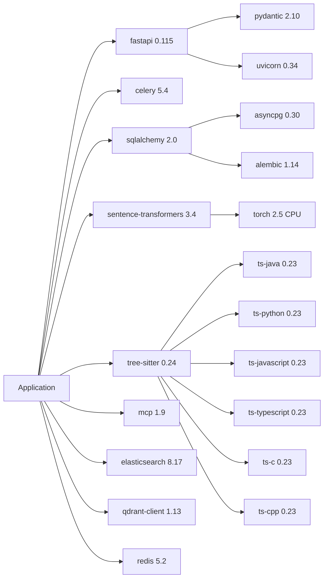

---

## 9. Testing Strategy

| Test Type | Scope | Tool | Coverage Target |
|-----------|-------|------|----------------|
| Unit tests | Individual functions, classes | pytest | ≥ 80% line coverage |
| Integration tests | ES/Qdrant/Redis/PG interactions | pytest + testcontainers | Key paths |
| Component tests | Full retrieval pipeline | pytest | Main + error paths |
| API tests | REST endpoint behavior | pytest + httpx | All FR acceptance criteria |
| MCP tests | MCP tool execution | pytest + mcp test client | FR-016 criteria |
| Load tests | NFR-001, NFR-002 | Locust | p95 < 1s, ≥ 1000 QPS |
| Mutation tests | Code quality | mutmut | Surviving mutants < 20% |

**SRS acceptance criteria mapping**: Each FR's acceptance criteria becomes at least one test case. NFR tests run as dedicated performance/scale test suites.

---

## 10. Deployment / Infrastructure

**Docker images** (3):

| Image | Entrypoint | Ports | Scaling |
|-------|-----------|-------|---------|
| `codecontext-api` | `uvicorn src.query.main:app` | 8000 | Horizontal (N replicas) |
| `codecontext-mcp` | `python -m src.query.mcp` | 3000 | Horizontal (N replicas) |
| `codecontext-worker` | `celery -A src.indexing.celery_app worker` | — | Horizontal (N workers) |

**External services** (provisioned separately):
- Elasticsearch 8.17.x cluster (≥ 3 nodes for HA)
- Qdrant 1.13.x cluster (≥ 3 nodes for HA)
- PostgreSQL 16.x (primary + replica)
- Redis 7.4.x (sentinel or cluster)
- RabbitMQ 3.13.x (cluster or single node)

---

## 11. Development Plan

### 11.1 Milestones

| Milestone | Scope | Exit Criteria |
|-----------|-------|---------------|
| M1: Foundation | Project skeleton, CI, DB schema, storage clients | Build passes, dev environment reproducible, migrations run |
| M2: Index Pipeline | Git clone, content extraction, chunking, embedding, index writing | Can index a real repo end-to-end |
| M3: Query Pipeline | BM25 retrieval, vector retrieval, RRF fusion, reranking, response builder | Can query and get relevant results |
| M4: API & Integration | REST endpoints, MCP server, authentication, query handlers | Full API functional |
| M5: UI & Operations | Web UI, language filter, scheduled refresh, manual reindex, metrics, logging | All FRs implemented |
| M6: NFR & Release | Load testing, availability testing, scale testing, documentation | All NFRs verified |
| M7: Evaluation | Retrieval quality evaluation pipeline — corpus, annotation, metrics | Golden dataset built, baseline metrics established |

### 11.2 Task Decomposition & Priority

| # | Priority | Feature | FR(s) | Dependencies | Milestone |
|---|----------|---------|-------|-------------|-----------|
| 1 | P0 | Project Skeleton & CI | — | None | M1 |
| 2 | P0 | Data Model & Migrations | — | #1 | M1 |
| 3 | P1 | Repository Registration | FR-001 | #2 | M2 |
| 4 | P1 | Git Clone & Update | FR-002 | #3 | M2 |
| 5 | P1 | Content Extraction | FR-003 | #4 | M2 |
| 6 | P1 | Code Chunking | FR-004 | #5 | M2 |
| 7 | P1 | Embedding Generation | FR-005 | #6 | M2 |
| 8 | P1 | Keyword Retrieval (BM25) | FR-006 | #7 | M3 |
| 9 | P1 | Semantic Retrieval (Vector) | FR-007 | #7 | M3 |
| 10 | P1 | Rank Fusion (RRF) | FR-008 | #8, #9 | M3 |
| 11 | P1 | Neural Reranking | FR-009 | #10 | M3 |
| 12 | P1 | Context Response Builder | FR-010 | #11 | M3 |
| 13 | P1 | Natural Language Query Handler | FR-011 | #12 | M4 |
| 14 | P1 | Symbol Query Handler | FR-012 | #12 | M4 |
| 15 | P1 | Repository-Scoped Query | FR-013 | #12 | M4 |
| 16 | P1 | API Key Authentication | FR-014 | #2 | M4 |
| 17 | P1 | REST API Endpoints | FR-015 | #13, #14, #15, #16 | M4 |
| 18 | P1 | MCP Server | FR-016 | #13 | M4 |
| 19 | P2 | Web UI Search Page | FR-017 | #17 | M5 |
| 20 | P2 | Language Filter | FR-018 | #8, #9 | M5 |
| 21 | P1 | Scheduled Index Refresh | FR-019 | #4 | M5 |
| 22 | P1 | Manual Reindex Trigger | FR-020 | #17 | M5 |
| 23 | P2 | Metrics Endpoint | FR-021 | #17 | M5 |
| 24 | P2 | Query Logging | FR-022 | #13 | M5 |
| 25 | P2 | Query Cache | NFR-001 | #13 | M5 |
| 26 | P3 | NFR-001: Query Latency | — | #25 | M6 |
| 27 | P3 | NFR-002: Query Throughput | — | #26 | M6 |
| 28 | P3 | NFR-003: Repository Capacity | — | #3 | M6 |
| 29 | P3 | NFR-004: Single Repo Size | — | #4 | M6 |
| 30 | P3 | NFR-005: Service Availability | — | #17 | M6 |
| 31 | P3 | NFR-006: Linear Scalability | — | #27 | M6 |
| 32 | P3 | NFR-007: Single-Node Failure | — | #30 | M6 |
| 33 | P1 | Branch Listing API | FR-023 | #4, #17 | M4 |
| 34 | P1 | Python: decorated_definition 展开 | FR-004 (Wave 2) | #6 | M2 |
| 35 | P1 | Java: enum + record + static initializer | FR-004 (Wave 2) | #6 | M2 |
| 36 | P1 | JavaScript: prototype函数 + require() imports | FR-004 (Wave 2) | #6 | M2 |
| 37 | P1 | TypeScript: enum + namespace + decorator | FR-004 (Wave 2) | #6 | M2 |
| 38 | P1 | C: typedef struct + 函数原型 + enum | FR-004 (Wave 2) | #6 | M2 |
| 39 | P1 | C++: namespace + template | FR-004 (Wave 2) | #6 | M2 |
| 40 | P2 | Evaluation Corpus Management | FR-024 (Wave 3) | #4, #5, #6, #7 | M7 |
| 41 | P2 | LLM Query Generation & Relevance Annotation | FR-025 (Wave 3) | #40 | M7 |
| 42 | P2 | Retrieval Quality Evaluation & Reporting | FR-026 (Wave 3) | #41, #8, #9 | M7 |

### 11.3 Dependency Chain

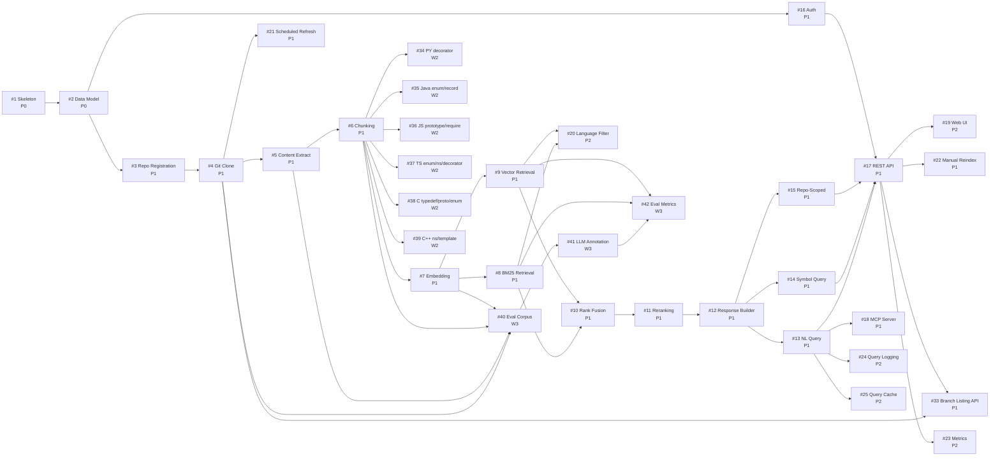

### 11.4 Risk & Mitigation

| Risk | Impact | Likelihood | Mitigation |
|------|--------|------------|------------|
| BGE Reranker CPU latency exceeds budget | High | Medium | Use bge-reranker-v2-m3 (MiniLM, 278M); unified single rerank pass; degradation chain: reduce candidates → lighter model → skip rerank → add GPU. Benchmark in M3 week 1. See Section 4.2.7. |
| tree-sitter grammar breaks on edge-case code | Medium | Medium | Fallback to file-level chunking; expanded node mappings for decorators/exports/inner classes; test with 10+ real repos in M2 |
| Full reindex resource consumption at scale | High | Medium | Stream-process files (not batch-load); ES bulk with refresh_interval=-1; concurrent repo limit in scheduler; V2: incremental indexing via git diff |
| Query-side PyTorch memory footprint (>4GB/node) | Medium | Medium | Evaluate ONNX Runtime for query embedding + reranker; reduces memory to ~1GB. Profile in M3. |
| Elasticsearch cluster performance at 1000 QPS | Medium | Low | Connection pooling, query cache reduces effective load to ~800 QPS; define shard strategy for 10K+ repos |

---

## 12. Open Questions / Risks

None — all design decisions are resolved. Technology stack, architecture, and development plan are fully defined based on the approved SRS constraints.
