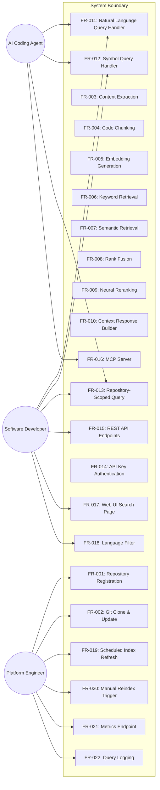
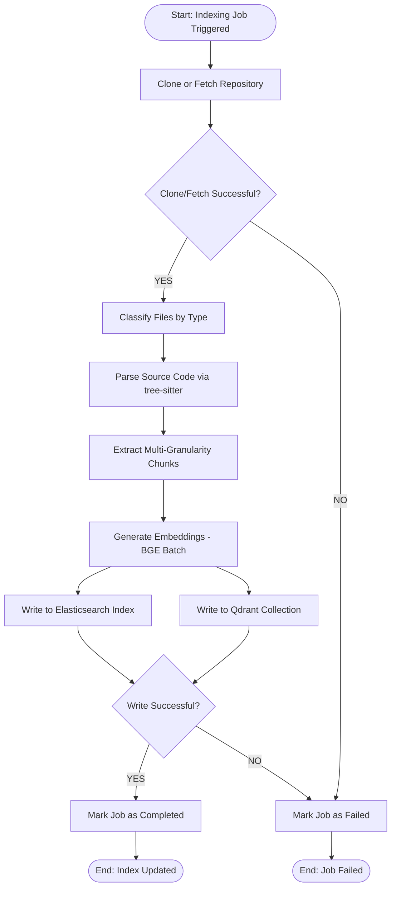
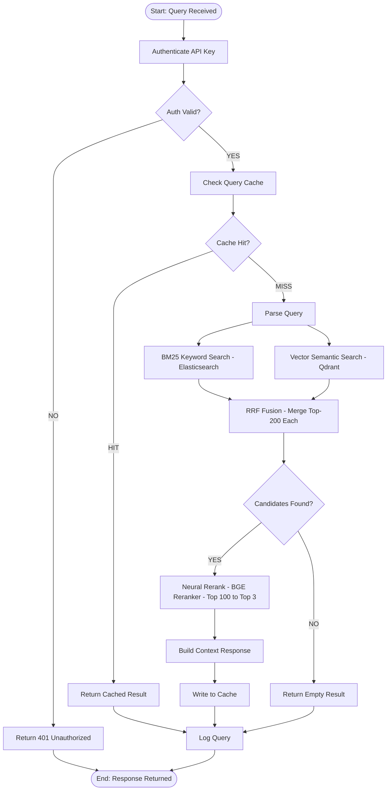
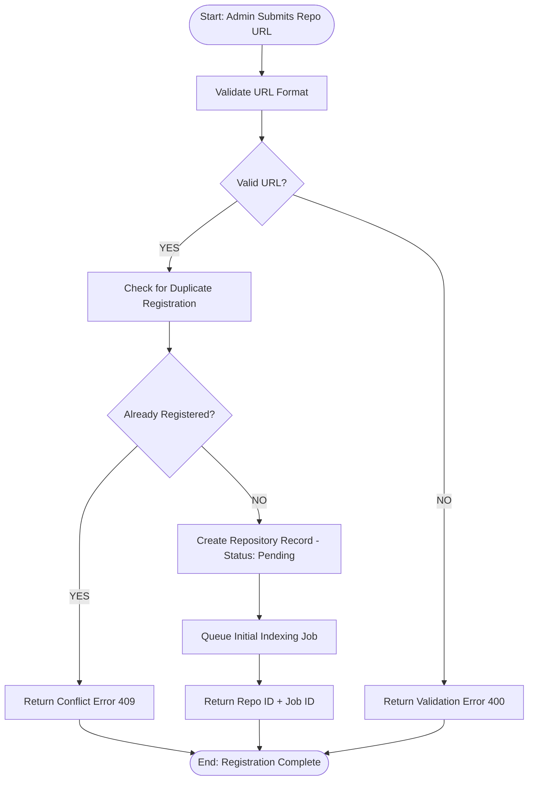

# Code Context Retrieval MCP System — Software Requirements Specification

<!-- SRS Review: PASS after 2 cycle(s) — 2026-03-21 -->

**Date**: 2026-03-21
**Status**: Approved
**Standard**: Aligned with ISO/IEC/IEEE 29148
**Template**: docs/templates/srs-template.md

---

## 1. Purpose & Scope

This system is a **Code Context Retrieval Engine** that provides AI coding assistants and human developers with accurate, up-to-date code context from source repositories. It solves the problem of LLMs generating code with hallucinated APIs, outdated usage patterns, and incorrect examples by retrieving real code snippets, documentation, and examples directly from source repositories.

The system operates as two independent clusters:
- **Offline Index Cluster** — clones Git repositories, parses source code via tree-sitter, extracts multi-granularity code chunks, generates embeddings, and writes to Elasticsearch (BM25) and Qdrant (vector) indexes.
- **Online Query Cluster** — serves real-time hybrid retrieval queries via MCP protocol, REST API, and Web UI, combining lexical search, semantic search, rank fusion, and neural reranking to return the top-3 most relevant code contexts.

The system is analogous to Context7 MCP, which fetches current documentation and code examples from source repositories and provides them to AI through MCP.

### 1.1 In Scope

1. **Repository indexing** — clone/fetch any Git repository and extract indexable artifacts (documentation, example code, source code, release notes)
2. **Multi-language code parsing** — Java, Python, TypeScript, JavaScript, C, C++ via tree-sitter
3. **Multi-granularity code chunking** — file, class, function, symbol levels
4. **Embedding generation** — offline batch embedding via BGE code model
5. **Hybrid retrieval** — BM25 keyword search (Elasticsearch) + dense vector search (Qdrant)
6. **Rank fusion** — Reciprocal Rank Fusion (RRF) to merge lexical and semantic results
7. **Neural reranking** — BGE Reranker cross-encoder for precision improvement
8. **Context response** — structured results with metadata (repo, path, symbol, score, content)
9. **MCP server** — Model Context Protocol interface for AI agent integration
10. **REST API** — HTTP endpoints for programmatic access
11. **Web UI** — interactive search interface for human developers
12. **Index management** — scheduled (weekly default) and manual reindex triggers
13. **API key authentication** — access control for MCP API and Web UI
14. **Query caching** — Redis + in-memory cache for latency reduction
15. **Observability** — metrics, query logging

### 1.2 Out of Scope

| ID | Exclusion | Rationale |
|----|-----------|-----------|
| EXC-001 | IDE plugin development | Client-side tooling is outside system boundary |
| EXC-002 | AI code generation | System provides context only, not code synthesis |
| EXC-003 | Automated code modification | Read-only retrieval system |
| EXC-004 | CI/CD integration | Not part of retrieval workflow |
| EXC-005 | Code Knowledge Graph (GraphRAG) | Deferred to V2; MVP uses hybrid retrieval without graph traversal |
| EXC-006 | Cross-repo dependency reasoning | Deferred to V3 |
| EXC-007 | Query intent classification | Optimization deferred to V2 |

### 1.3 Product Perspective

The system is a component of an AI programming infrastructure. It sits between Git source repositories (upstream) and AI coding agents / human developers (downstream). It does not generate code — it retrieves and ranks existing code context.

```
Git Repositories → [Index Cluster] → Elasticsearch + Qdrant
                                            ↓
AI Agent / Developer → [Query Cluster] → MCP / REST / Web UI
```

### 1.4 Operating Environment

- **Container runtime**: Docker / Kubernetes
- **OS**: Linux (amd64)
- **Python**: 3.11+
- **External dependencies**: Elasticsearch cluster, Qdrant cluster, Redis instance (all provisioned externally)

---

## 2. Glossary & Definitions

| Term | Definition | Do NOT confuse with |
|------|-----------|---------------------|
| **AST (Abstract Syntax Tree)** | A tree representation of the syntactic structure of source code, produced by a parser | Raw text tokenization; AST preserves language grammar structure |
| **BGE (BAAI General Embedding)** | A family of embedding and reranking models from BAAI, used for encoding text/code into dense vectors and cross-encoder reranking | Other embedding models like OpenAI ada; BGE is specifically selected for code-aware encoding |
| **BM25** | Best Matching 25 — a probabilistic information retrieval function using term frequency and inverse document frequency | TF-IDF; BM25 adds length normalization and saturation |
| **Code Chunk** | The minimum indexable unit of code — a function, class, file, or documentation section extracted by the parser using AST analysis | A raw text split; chunks here are AST-aware |
| **Context Retrieval** | The process of returning relevant documentation, example code, and source snippets in response to a query | Code generation; this system does not generate code |
| **Cross-encoder** | A neural model that jointly encodes a query-document pair to produce a relevance score, used in reranking | Bi-encoder (embedding model); cross-encoders are more accurate but slower |
| **HNSW** | Hierarchical Navigable Small World — an approximate nearest neighbor graph index used by Qdrant | Exact k-NN search; HNSW is approximate but sub-linear |
| **Hybrid Search** | Combining lexical search (BM25) and dense vector semantic search to retrieve candidates | Pure keyword search or pure embedding search |
| **Index Cluster** | The offline distributed compute cluster that clones repos, parses code, generates embeddings, and builds indexes | Query Cluster; the index cluster is offline/batch |
| **MCP (Model Context Protocol)** | A standard protocol for AI agents to request tools and context from external systems | REST API; MCP is a specific protocol for LLM tool calls |
| **QPS (Queries Per Second)** | The number of query requests the system can handle per second | Concurrent users; QPS measures throughput, not connection count |
| **Query Cluster** | The online service cluster that handles real-time retrieval queries | Index Cluster; the query cluster is online/real-time |
| **RRF (Reciprocal Rank Fusion)** | A rank fusion algorithm that merges multiple ranked lists using `score(d) = Σ 1/(k + rank_i(d))` with k ≈ 60 | Score-based fusion; RRF uses rank positions, not raw scores |
| **Reranking** | A second-pass scoring of retrieved candidates using a cross-encoder neural model to improve precision | Initial retrieval; reranking operates on already-retrieved candidates |
| **Symbol** | A named programming language identifier — class, method, function, variable, type | A string token; symbols have AST-derived structure |
| **tree-sitter** | An incremental parsing library that generates concrete syntax trees for source code, supporting multiple programming languages | A regex-based tokenizer; tree-sitter produces full grammar-aware parse trees |

---

## 3. Stakeholders & User Personas

| Persona | Technical Level | Key Needs | Access Level |
|---------|----------------|-----------|--------------|
| **AI Coding Agent** (Claude Code, Cursor, Copilot) | Automated system | Retrieve accurate, current code context to avoid hallucinated APIs | MCP API |
| **Software Developer** | Intermediate to expert | Search for API usage, code examples, documentation | Web UI, REST API |
| **Platform Engineer** | Expert | Manage repository indexing, monitor system health, configure refresh schedules | Admin API, Metrics, Query Logs |

### 3.1 Use Case View



---

## 4. Functional Requirements

### FR-001: Repository Registration

<!-- Wave 1: Modified 2026-03-21 — add optional branch parameter for branch-specific indexing -->

**Priority**: Must
**EARS**: When an administrator submits a repository URL with an optional branch name, the system shall validate the URL, create a repository record storing the selected branch, and queue an initial indexing job.
**Acceptance Criteria**:
- Given a valid Git repository URL, when the administrator submits it via the admin API, then the system shall create a repository record with status "pending" and return the repository ID.
- Given a valid Git repository URL with an optional `branch` parameter, when the administrator submits it, then the system shall store the branch in the `indexed_branch` field. If no branch is specified, `indexed_branch` shall be null (clone will detect default branch).
- Given an invalid or unreachable URL, when the administrator submits it, then the system shall return a validation error within 2 seconds without creating a record.
- Given a URL that is already registered, when the administrator submits it, then the system shall return a conflict error indicating the repository already exists.

---

### FR-002: Git Clone & Update

<!-- Wave 1: Modified 2026-03-21 — add branch parameter, detect default_branch, list_remote_branches -->

**Priority**: Must
**EARS**: When a repository indexing job is triggered, the system shall clone the repository (if first time) or fetch updates (if previously cloned), checking out the specified branch or the default branch if none is specified. The system shall detect and record the repository's default branch.
**Acceptance Criteria**:
- Given a newly registered repository with no branch specified, when the indexing job starts, then the system shall perform a full `git clone`, detect the default branch, store it in `default_branch`, and set `indexed_branch` to the default branch.
- Given a newly registered repository with branch "develop" specified, when the indexing job starts, then the system shall perform `git clone --branch develop` and set `indexed_branch` to "develop".
- Given a previously cloned repository with `indexed_branch` = "main", when a re-index job starts, then the system shall perform `git fetch` and `git reset --hard origin/main`.
- Given a repository that requires authentication, when credentials (SSH key or access token) are configured, then the system shall use them for clone/fetch operations.
- Given a clone/fetch operation that fails (network error, auth failure), then the system shall mark the indexing job as "failed" with the error message and not proceed to parsing.
- Given insufficient disk space during clone, then the system shall mark the job as "failed" with a disk-space error and clean up partial files.
- Given a cloned repository, when `list_remote_branches()` is called, then the system shall return a list of all remote branch names (stripped of `origin/` prefix).

---

### FR-003: Content Extraction

**Priority**: Must
**EARS**: When a repository working copy is available, the system shall classify files by type and extract textual content for supported file categories.
**Acceptance Criteria**:
- Given a cloned repository, when content extraction runs, then the system shall identify source files by extension (.java, .py, .ts, .js, .c, .cpp), documentation files (README.md, docs/**/*.md), example files (examples/**/*), and release notes (CHANGELOG.md, RELEASE*.md).
- Given a file type that is not in the supported set, when extraction runs, then the system shall skip the file without error.
- Given binary files or files larger than 1 MB, when extraction runs, then the system shall skip them.
- Given a file that cannot be read (permission denied, encoding error), when extraction runs, then the system shall log a warning and skip the file without failing the entire job.

---

### FR-004: Code Chunking

**Priority**: Must
**EARS**: When source code content is extracted, the system shall parse it using tree-sitter and segment it into multi-granularity chunks at file, class, function, and symbol levels.
**Acceptance Criteria**:
- Given a Java source file containing 2 classes and 5 methods, when chunking completes, then the system shall produce 1 file-level chunk, 2 class-level chunks, and 5 method-level chunks (8 total).
- Given a Python file with top-level functions and no classes, when chunking completes, then the system shall produce 1 file-level chunk and N function-level chunks.
- Given a documentation file (.md), when chunking completes, then the system shall produce 1 file-level chunk (no AST parsing).
- Given a file in an unsupported language, when chunking attempts parsing, then the system shall fall back to file-level chunking only.

---

### FR-005: Embedding Generation

**Priority**: Must
**EARS**: When code chunks are produced, the system shall generate dense vector embeddings for each chunk using the BGE code embedding model in offline batch mode and write them to the Qdrant collection.
**Acceptance Criteria**:
- Given a set of code chunks from a repository, when the embedding batch job completes, then each chunk shall have a 1024-dimensional float32 vector stored in Qdrant with the chunk's metadata as payload.
- Given embedding generation for a repository with 10,000 chunks, when the batch job completes, then all 10,000 vectors shall be present in the Qdrant collection.
- Given an embedding generation failure (model error, OOM), then the system shall mark the indexing job as "failed" and not write partial results.
- Given that Qdrant is unreachable during the write phase, then the system shall retry up to 3 times with exponential backoff, and mark the job as "failed" if all retries fail.

---

### FR-006: Keyword Retrieval

**Priority**: Must
**EARS**: When a query is received by the retrieval engine, the system shall execute a BM25 keyword search against the Elasticsearch index and return the top-200 candidate chunks.
**Acceptance Criteria**:
- Given the query "WebClient timeout", when BM25 retrieval runs, then the system shall return up to 200 chunks ranked by BM25 score, with chunks containing exact token matches ranked highest.
- Given a query with no matching terms in the index, when BM25 retrieval runs, then the system shall return an empty candidate list.
- Given that Elasticsearch is unreachable, then the retrieval engine shall proceed with vector-only results and log a degradation warning.

---

### FR-007: Semantic Retrieval

**Priority**: Must
**EARS**: When a query is received by the retrieval engine, the system shall encode the query into a dense vector and execute an approximate nearest neighbor search against the Qdrant index, returning the top-200 candidate chunks.
**Acceptance Criteria**:
- Given the query "how to configure spring http client timeout", when vector retrieval runs, then the system shall return up to 200 chunks ranked by cosine similarity, including semantically related chunks (e.g., WebClient.Builder, responseTimeout) even if exact terms do not match.
- Given a query with no semantically similar content in the index, when vector retrieval runs, then the system shall return an empty candidate list.
- Given that Qdrant is unreachable, then the retrieval engine shall proceed with BM25-only results and log a degradation warning.

---

### FR-008: Rank Fusion

**Priority**: Must
**EARS**: When BM25 and vector retrieval both produce candidate lists, the system shall merge them using Reciprocal Rank Fusion (RRF) with k=60 into a single ranked list of up to 100 candidates.
**Acceptance Criteria**:
- Given 200 BM25 candidates and 200 vector candidates with 50 overlapping chunks, when RRF fusion runs, then the system shall produce a merged list where overlapping chunks receive boosted scores from both rankings.
- Given that one retrieval pathway returns empty results, when fusion runs, then the system shall use the non-empty list as the sole source.
- Given fusion execution, then it shall complete within 10 ms.

---

### FR-009: Neural Reranking

**Priority**: Must
**EARS**: When the fused candidate list is produced, the system shall rerank the top-100 candidates using the BGE Reranker cross-encoder model and select the top-3 results.
**Acceptance Criteria**:
- Given 100 fused candidates for the query "spring webclient timeout", when reranking completes, then the top-3 results shall each have a cross-encoder relevance score above the model's default threshold.
- Given fewer than 3 candidates after fusion, when reranking runs, then the system shall return all available candidates without error.
- Given a reranker model failure, then the system shall fall back to the fusion-ranked order (skip reranking) and log a degradation warning.

---

### FR-010: Context Response Builder

**Priority**: Must
**EARS**: When the top-K reranked results are determined, the system shall assemble a structured JSON response containing, for each result: content snippet (max 2000 characters), repository name, file path, symbol name, chunk type, language, and relevance score.
**Acceptance Criteria**:
- Given 3 reranked results, when the response builder completes, then the response JSON shall contain an array of 3 objects each with fields: `content`, `repo`, `path`, `symbol`, `type`, `language`, `score`.
- Given a result where the symbol field is not applicable (e.g., documentation chunk), when the response is built, then the `symbol` field shall be `null`.
- Given a chunk with content exceeding 2000 characters, when the response is built, then the content shall be truncated to 2000 characters with a trailing `...` indicator.

---

### FR-011: Natural Language Query Handler

**Priority**: Must
**EARS**: When a user submits a natural language query (e.g., "how to configure spring http client timeout"), the system shall execute the full hybrid retrieval pipeline (BM25 + vector + fusion + rerank) and return structured context results.
**Acceptance Criteria**:
- Given the natural language query "how to use grpc java interceptor", when the query handler processes it, then the system shall return top-3 results containing relevant gRPC interceptor code, documentation, or examples.
- Given an empty query string, when submitted, then the system shall return a 400 error with a descriptive message.
- Given a query exceeding 500 characters, when submitted, then the system shall return a 400 error indicating the maximum query length.
- Given a retrieval pipeline that exceeds the 1-second timeout, then the system shall return partial results (from whichever stage completed) with a `degraded: true` flag.

---

### FR-012: Symbol Query Handler

**Priority**: Must
**EARS**: When a user submits a symbol query (e.g., "org.springframework.web.client.RestTemplate"), the system shall prioritize BM25 keyword retrieval for exact symbol matching and return results containing the specified symbol.
**Acceptance Criteria**:
- Given the symbol query "std::vector", when the symbol handler processes it, then the top results shall contain the std::vector class definition, methods, and usage examples.
- Given a symbol that does not exist in any indexed repository, when queried, then the system shall return an empty result set with a 200 status.
- Given a symbol query exceeding 200 characters, when submitted, then the system shall return a 400 error.

---

### FR-013: Repository-Scoped Query

**Priority**: Must
**EARS**: Where a repository filter is specified in the query, the system shall restrict retrieval to chunks from the specified repository only.
**Acceptance Criteria**:
- Given query "timeout" with repository filter "spring-framework", when retrieval runs, then all returned chunks shall belong to the spring-framework repository.
- Given a repository filter for a non-existent repository, when queried, then the system shall return an empty result set with a 200 status.

---

### FR-014: API Key Authentication

**Priority**: Must
**EARS**: When a client sends a request to the query API, the system shall validate the provided API key against the stored key records and reject unauthenticated requests with a 401 status.
**Acceptance Criteria**:
- Given a valid API key in the `X-API-Key` header, when a query request is made, then the system shall process the request normally.
- Given an invalid or missing API key, when a query request is made, then the system shall return 401 Unauthorized without executing the query.
- Given an expired API key, when a query request is made, then the system shall return 401 Unauthorized.
- Given more than 10 failed authentication attempts from the same IP within 1 minute, then the system shall return 429 Too Many Requests for subsequent attempts from that IP.

---

### FR-015: REST API Endpoints

**Priority**: Must
**EARS**: The system shall expose RESTful HTTP endpoints for query submission (`POST /api/v1/query`), repository listing (`GET /api/v1/repos`), repository registration (`POST /api/v1/repos`), manual reindex (`POST /api/v1/repos/{repo_id}/reindex`), and health check (`GET /api/v1/health`).
**Acceptance Criteria**:
- Given a POST request to `/api/v1/query` with a valid query body and API key, when processed, then the system shall return structured context results with a 200 status.
- Given a GET request to `/api/v1/repos`, when processed, then the system shall return the list of registered repositories with their indexing status.
- Given a GET request to `/api/v1/health`, when processed, then the system shall return the service health status without authentication.
- Given a malformed JSON request body, when submitted to any endpoint, then the system shall return 400 with a validation error message.
- Note: detailed request/response JSON schemas are deferred to the design document (OpenAPI specification).

---

### FR-016: MCP Server

**Priority**: Must
**EARS**: The system shall implement an MCP server that exposes a `search_code_context` tool, allowing AI agents to submit queries and receive structured context results via the Model Context Protocol.
**Acceptance Criteria**:
- Given an MCP client calling the `search_code_context` tool with parameters `{query: "spring webclient timeout", repo: "spring-framework", top_k: 3}`, when the tool executes, then the system shall return structured context results identical in content to the REST API response.
- Given an MCP client calling the tool without the optional `repo` parameter, when executed, then the system shall search across all indexed repositories.
- Given an MCP tool call with invalid parameters (missing required `query` field), then the system shall return an MCP error response with a descriptive message.
- Given an internal retrieval failure during MCP tool execution, then the system shall return an MCP error response rather than crashing the MCP connection.

---

### FR-017: Web UI Search Page

<!-- Wave 1: Modified 2026-03-21 — add branch selector to repository registration form -->

**Priority**: Should
**EARS**: When a developer accesses the Web UI, the system shall display a search interface supporting natural language search, symbol search, repository filtering, and language filtering, with results displayed as syntax-highlighted code snippets with metadata. The repository registration form shall include a branch selector.
**Acceptance Criteria**:
- Given a developer accessing the Web UI root URL, when the page loads, then it shall display a search input, repository filter dropdown, and language filter checkboxes.
- Given a search query submitted via the Web UI, when results are returned, then each result shall display: code snippet with syntax highlighting, repository name, file path, symbol name, and relevance score.
- Given no results for a query, when displayed, then the UI shall show a "No results found" message.
- Given the repository registration form, when the user enters a repository URL and the repo is already cloned, then the UI shall fetch available branches via the Branch Listing API and display a branch selector dropdown defaulting to the repo's default branch.

---

### FR-018: Language Filter

**Priority**: Should
**EARS**: Where a language filter is specified in the query, the system shall restrict retrieval to chunks matching the specified programming language(s).
**Acceptance Criteria**:
- Given query "timeout" with language filter ["java"], when retrieval runs, then all returned chunks shall have `language` = "java".
- Given multiple language filters ["java", "python"], when retrieval runs, then returned chunks shall be in either Java or Python.
- Given an unrecognized language value (e.g., "rust"), when submitted, then the system shall return a 400 error listing the supported languages.
- Given an empty language filter list, when submitted, then the system shall search across all languages (no filter applied).

---

### FR-019: Scheduled Index Refresh

**Priority**: Must
**EARS**: While the system is running, the system shall execute repository re-indexing jobs on a configurable cron schedule, defaulting to weekly (Sunday 02:00 UTC).
**Acceptance Criteria**:
- Given the default configuration, when a week has elapsed since the last index, then the scheduler shall automatically trigger re-indexing for all registered repositories.
- Given a custom cron expression configured for a specific repository, when the cron fires, then that repository shall be re-indexed.
- Given a scheduled job that fails, then the system shall log the failure and retry once after 1 hour; if the retry also fails, the system shall log an error and skip until the next scheduled window.
- Given a re-index already in progress for a repository when the schedule fires, then the system shall skip the duplicate and log an informational message.

---

### FR-020: Manual Reindex Trigger

**Priority**: Must
**EARS**: When an administrator sends a reindex request for a specific repository, the system shall queue an immediate re-indexing job for that repository.
**Acceptance Criteria**:
- Given a POST request to `/api/v1/repos/{repo_id}/reindex` with valid admin credentials, when processed, then the system shall queue an indexing job and return the job ID with status "queued".
- Given a reindex request for a non-existent repository, then the system shall return 404.

---

### FR-021: Metrics Endpoint

**Priority**: Should
**EARS**: The system shall expose a Prometheus-compatible metrics endpoint at `/metrics` reporting operational telemetry.
**Acceptance Criteria**:
- Given a GET request to `/metrics`, when processed, then the response shall contain Prometheus text format metrics including: `query_latency_seconds`, `retrieval_latency_seconds`, `rerank_latency_seconds`, `index_size_chunks`, `queries_per_second`, `cache_hit_ratio`.

---

### FR-022: Query Logging

**Priority**: Should
**EARS**: When the query service processes a query, the system shall write a structured JSON log entry to stdout containing the query text, result count, latency breakdown, and timestamp.
**Acceptance Criteria**:
- Given a completed query, when logging executes, then the system shall write a structured JSON log entry to stdout containing: `query`, `result_count`, `retrieval_ms`, `rerank_ms`, `total_ms`, `timestamp`.
- Given a logging failure (I/O error), then the system shall not block or delay the query response; logging failures are non-fatal.

---

### FR-023: Branch Listing API [Wave 1]

**Priority**: Must
**EARS**: When an API consumer requests the list of branches for a registered repository, the system shall return all remote branch names available in the repository's local clone.
**Acceptance Criteria**:
- Given a registered repository that has been cloned, when `GET /api/v1/repos/{id}/branches` is called, then the system shall return a JSON object with `branches` (sorted list of branch names) and `default_branch` (the repository's detected default branch).
- Given a repository ID that does not exist, when the endpoint is called, then the system shall return 404.
- Given a repository that has not been cloned yet (no clone_path), when the endpoint is called, then the system shall return 409 Conflict indicating the clone is not ready.

---

### 4.1 Process Flows

#### Flow: Repository Indexing Pipeline



#### Flow: Query Retrieval Pipeline



#### Flow: Repository Registration



---

## 5. Non-Functional Requirements

| ID | Category (ISO 25010) | Priority | Requirement | Measurable Criterion | Measurement Method |
|----|---------------------|----------|-------------|---------------------|-------------------|
| NFR-001 | Performance | Must | Query response latency | p95 < 1000 ms end-to-end | Load test with Locust at 100 concurrent users |
| NFR-002 | Performance | Must | Query throughput | ≥ 1000 QPS sustained, 2000 QPS burst | Load test with Locust for 5-minute sustained run |
| NFR-003 | Scalability | Must | Repository capacity | 100 – 1000 repositories indexed | Count registered repos in production |
| NFR-004 | Scalability | Must | Single repository size | ≤ 1 GB per repository | Verify clone size before indexing |
| NFR-005 | Scalability | Should | Index capacity | 10M – 50M code chunks, 10M – 50M embeddings | Monitor Elasticsearch doc count + Qdrant point count |
| NFR-006 | Scalability | Must | Horizontal scaling | Adding 1 node yields ≥ 70% of theoretical throughput increase for index workers, query nodes, and rerank nodes | Deploy N+1 nodes; measure throughput delta vs. N nodes |
| NFR-007 | Reliability | Must | Service availability | 99.9% uptime for query service | Uptime monitoring over 30-day window |
| NFR-008 | Reliability | Must | Single-node failure tolerance | Query service continues operating when any single node fails | Kill one node during load test; verify no request failures |
| NFR-009 | Security | Must | API authentication | All query endpoints require valid API key; unauthenticated requests rejected with 401 | Automated test: request without key returns 401 |
| NFR-010 | Security | Should | Repository credential storage | SSH keys and access tokens stored encrypted at rest using AES-256 | Verify ciphertext in storage; decrypt with correct key succeeds |
| NFR-011 | Maintainability | Should | Test coverage | ≥ 80% line coverage for all modules | pytest --cov report |
| NFR-012 | Maintainability | Should | Modular architecture | Indexing, retrieval, reranking, and API layers packaged as separate Docker images | Verify each image builds and runs independently |

---

## 6. Interface Requirements

| ID | External System | Direction | Protocol | Data Format |
|----|----------------|-----------|----------|-------------|
| IFR-001 | AI Coding Agent (Claude Code, Cursor, Copilot) | Inbound | MCP (Model Context Protocol) | JSON — MCP tool call/result schema |
| IFR-002 | Web Browser | Inbound | HTTPS | HTML + JSON (REST API) |
| IFR-003 | Git Repositories | Outbound | Git protocol (HTTPS/SSH) | Git objects |
| IFR-004 | Elasticsearch Cluster | Bidirectional | HTTP/REST | JSON |
| IFR-005 | Qdrant Cluster | Bidirectional | gRPC / HTTP | JSON / Protobuf |
| IFR-006 | Redis Cache | Bidirectional | Redis protocol | Serialized JSON |
| IFR-007 | BGE Embedding Model | Internal | Python API (in-process or HTTP) | Float32 vectors (1024-dim) |
| IFR-008 | BGE Reranker Model | Internal | Python API (in-process or HTTP) | Float32 relevance scores |

---

## 7. Constraints

| ID | Constraint | Rationale |
|----|-----------|-----------|
| CON-001 | Supported languages: Java, Python, TypeScript, JavaScript, C, C++ | tree-sitter parser availability and user priority |
| CON-002 | Query response time must be < 1 second (p95) | Interactive usability for IDE/AI agent integration |
| CON-003 | System must support ≥ 1000 QPS | Enterprise-scale concurrent AI agent usage |
| CON-004 | MCP protocol is the primary AI agent interface | Industry standard for LLM tool integration |
| CON-005 | Repository source is any Git repository | Must support public and private repos via SSH/token auth |
| CON-006 | Indexing must be performed offline in a distributed cluster | Avoid impacting query service latency |
| CON-007 | BM25 engine: Elasticsearch | Selected technology for keyword search |
| CON-008 | Vector engine: Qdrant | Selected technology for semantic search |
| CON-009 | Code parser: tree-sitter | Selected technology for multi-language AST parsing |
| CON-010 | Embedding model: BGE code embedding (1024-dim) | Selected model for code-aware semantic encoding |
| CON-011 | Reranker model: BGE Reranker | Selected model for neural cross-encoder reranking |
| CON-012 | Top-K results: 3 (default) | User-confirmed retrieval depth |
| CON-013 | Index refresh default: weekly, configurable via cron expression | Balances freshness vs. compute cost |

---

## 8. Assumptions & Dependencies

| ID | Assumption | Impact if Invalid |
|----|-----------|------------------|
| ASM-001 | Git repositories are accessible from the index cluster (network connectivity, credentials) | Indexing jobs will fail; must add VPN/proxy support |
| ASM-002 | tree-sitter grammars exist and are stable for all 6 supported languages | Must implement fallback to file-level chunking for broken grammars |
| ASM-003 | BGE embedding model produces consistent 1024-dim vectors across versions | Model version changes would require full re-indexing |
| ASM-004 | Elasticsearch and Qdrant clusters are provisioned and managed externally | System does not self-provision storage infrastructure |
| ASM-005 | Redis is available for caching | Degrade gracefully to no-cache mode if Redis unavailable |
| ASM-006 | Primary query traffic comes from AI agents (80%+), with human developer queries as secondary | UI design prioritizes API-friendly responses over visual richness |

---

## 9. Acceptance Criteria Summary

| Requirement | Pass Criterion |
|-------------|---------------|
| FR-001 | Repository registered with optional branch, initial indexing job queued; invalid/duplicate URLs rejected |
| FR-002 | Repository cloned/updated on specified or default branch; default_branch detected; remote branches listable; failure path marks job failed; disk-full handled |
| FR-003 | Files classified by type; unsupported/binary/unreadable files skipped gracefully |
| FR-004 | Multi-granularity chunks produced (file, class, function, symbol); fallback for unsupported languages |
| FR-005 | All chunks have 1024-dim vectors in Qdrant; Qdrant-unreachable retries and fails gracefully |
| FR-006 | BM25 returns up to 200 candidates; Elasticsearch-down degrades to vector-only |
| FR-007 | Vector search returns up to 200 candidates; Qdrant-down degrades to BM25-only |
| FR-008 | RRF fusion merges into ≤ 100 candidates within 10 ms; single-source fallback works |
| FR-009 | Reranking selects top-3; fallback to fusion order on model failure |
| FR-010 | Response JSON contains content (≤2000 chars), repo, path, symbol, type, language, score |
| FR-011 | Natural language query returns relevant results; empty/overlong queries return 400; timeout returns partial |
| FR-012 | Symbol query returns exact symbol matches; empty results return 200; overlong returns 400 |
| FR-013 | Repository filter restricts results to specified repo; non-existent repo returns empty 200 |
| FR-014 | Valid API key passes; invalid/missing returns 401; brute-force returns 429 |
| FR-015 | REST endpoints respond correctly for query, repos, health; malformed JSON returns 400 |
| FR-016 | MCP tool `search_code_context` returns structured results; invalid params return MCP error |
| FR-017 | Web UI displays search interface with syntax-highlighted results, filters, and branch selector for registration |
| FR-018 | Language filter restricts results; invalid language returns 400; empty filter = no filter |
| FR-019 | Cron-scheduled re-indexing triggers; failed jobs retry once; in-progress jobs not duplicated |
| FR-020 | Manual reindex queues job and returns job ID; non-existent repo returns 404 |
| FR-021 | Prometheus metrics endpoint returns all specified metrics |
| FR-022 | Query logs written to stdout as structured JSON; logging failure is non-fatal |
| FR-023 | Branch listing returns remote branches for cloned repo; 404 for unknown repo; 409 if not cloned |
| NFR-001 | p95 query latency < 1000 ms under load |
| NFR-002 | Sustained 1000 QPS throughput |
| NFR-003 | 100–1000 repos indexed without degradation |
| NFR-004 | Repos up to 1 GB indexed successfully |
| NFR-005 | 10M+ chunks indexed and searchable |
| NFR-006 | Adding 1 node yields ≥ 70% theoretical throughput increase |
| NFR-007 | 99.9% uptime over 30 days |
| NFR-008 | Single-node failure causes no request failures |
| NFR-009 | Unauthenticated requests return 401 |
| NFR-010 | Credentials encrypted at rest with AES-256 |
| NFR-011 | ≥ 80% line coverage |
| NFR-012 | Each module builds and runs as separate Docker image |

---

## 10. Traceability Matrix

| Requirement ID | Source (stakeholder need) | Verification Method |
|---------------|-------------------------|-------------------|
| FR-001 | Platform Engineer: register repositories for indexing | Automated integration test |
| FR-002 | System: acquire repository content for index building | Automated integration test |
| FR-003 | System: classify and extract indexable content | Automated unit test |
| FR-004 | Retrieval quality: AST-aware multi-granularity code chunks | Automated unit test |
| FR-005 | Semantic search: dense vector embeddings for all chunks | Automated integration test |
| FR-006 | Symbol/keyword precision: exact token matching via BM25 | Automated component test |
| FR-007 | Natural language recall: semantic similarity via vector search | Automated component test |
| FR-008 | Hybrid search: merge lexical and semantic results via RRF | Automated unit test |
| FR-009 | Precision improvement: neural cross-encoder reranking | Automated component test |
| FR-010 | Client integration: structured, metadata-rich responses | Automated unit test |
| FR-011 | AI Agent / Developer: natural language code context queries | End-to-end test |
| FR-012 | Developer: exact symbol name lookup | End-to-end test |
| FR-013 | User: scope search to specific repository | Automated integration test |
| FR-014 | Security: prevent unauthorized API access | Automated security test |
| FR-015 | Developer / Tool: programmatic HTTP access | Automated API test |
| FR-016 | AI Agent: MCP protocol integration | MCP client integration test |
| FR-017 | Developer: interactive browser-based search | Manual + automated UI test |
| FR-018 | User: filter results by programming language | Automated integration test |
| FR-019 | Platform Engineer: automated index freshness | Scheduled job verification |
| FR-020 | Platform Engineer: on-demand re-indexing | Automated API test |
| FR-021 | Platform Engineer: operational monitoring | Automated metrics scrape test |
| FR-022 | Platform Engineer: query audit trail | Log format verification test |
| FR-023 | Developer/UI: discover available branches for a repository | Automated API test |
| NFR-001 | Interactive latency for IDE/AI agent usage | Load test (Locust) |
| NFR-002 | Enterprise concurrent AI agent usage | Load test (Locust) |
| NFR-003 | Enterprise repository portfolio capacity | Scale test |
| NFR-004 | Large repository support | Size validation test |
| NFR-005 | Index scale for enterprise usage | Monitoring verification |
| NFR-006 | Operational scaling without downtime | Horizontal scale test |
| NFR-007 | Production reliability | Uptime monitoring |
| NFR-008 | Fault tolerance | Chaos test |
| NFR-009 | Security compliance | Automated security test |
| NFR-010 | Credential security | Encryption verification |
| NFR-011 | Code quality and maintainability | CI coverage gate |
| NFR-012 | Deployment flexibility | Docker build test |
| IFR-001 | AI Agent integration via MCP | MCP protocol conformance test |
| IFR-002 | Developer browser access | HTTPS endpoint test |
| IFR-003 | Repository data acquisition | Git clone/fetch test |
| IFR-004 | Keyword search storage | Elasticsearch connectivity test |
| IFR-005 | Vector search storage | Qdrant connectivity test |
| IFR-006 | Query caching | Redis connectivity test |
| IFR-007 | Embedding computation | Model inference test |
| IFR-008 | Reranking computation | Model inference test |
| CON-001 | User requirement: 6 languages | Parser grammar availability check |
| CON-002 | User requirement: < 1s latency | Load test |
| CON-003 | User requirement: ≥ 1000 QPS | Load test |
| CON-004 | User requirement: MCP interface | MCP conformance test |
| CON-005 | User requirement: any Git repo | Clone test with SSH/HTTPS/public |
| CON-006 | User requirement: offline indexing | Architecture review |
| CON-007–013 | User-confirmed technology selections | Implementation verification |

---

## 11. Open Questions

None — all requirements were elicited and confirmed through 24 rounds of structured questioning (documented in `需求澄清过程.md`).
