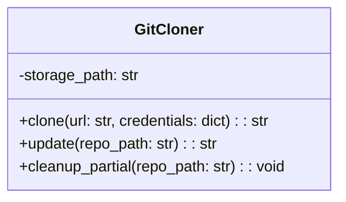
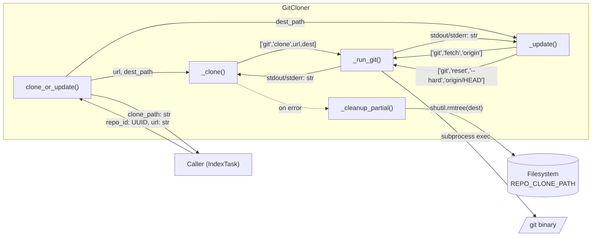
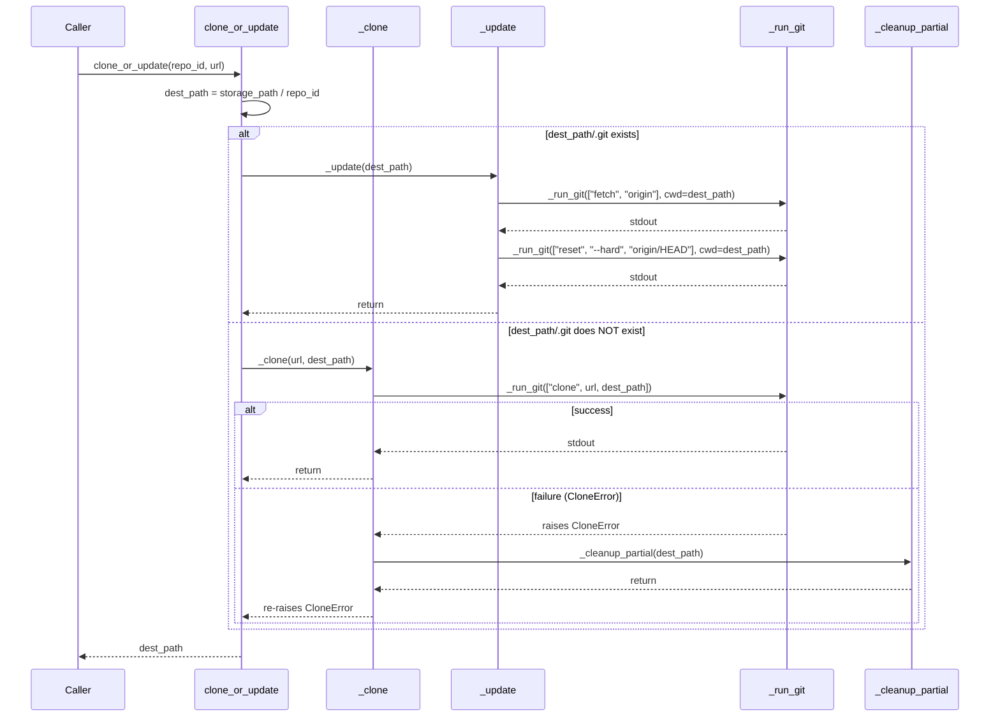
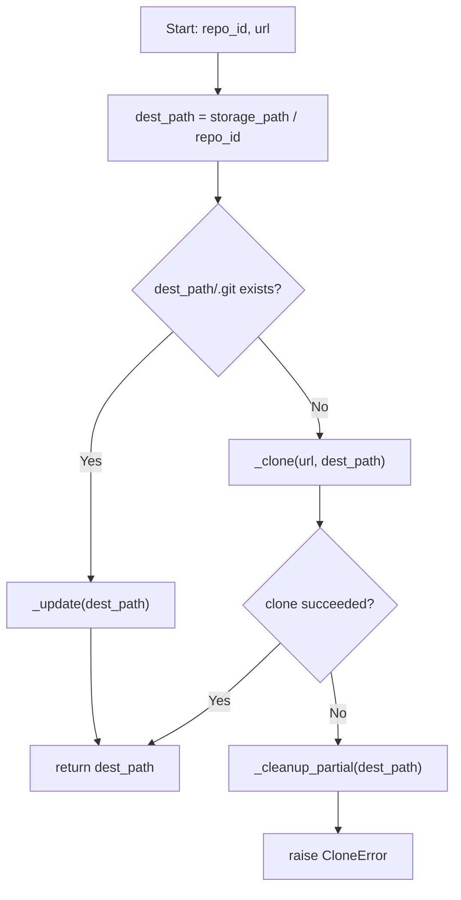

# Feature Detailed Design: Git Clone & Update (Feature #4)

**Date**: 2026-03-21
**Feature**: #4 — Git Clone & Update
**Priority**: high
**Dependencies**: [#3 — Repository Registration (passing)]
**Design Reference**: docs/plans/2026-03-21-code-context-retrieval-design.md § 4.1
**SRS Reference**: FR-002

## Context

GitCloner clones new repositories and fetches updates for existing ones as the first step of the indexing pipeline. It must handle network failures, auth errors, and disk issues gracefully, cleaning up partial files on failure.

## Design Alignment

**From § 4.1.2 Class Diagram — GitCloner**:



**From § 4.1.3 Sequence Diagram** (relevant fragment):
```
Worker->>Git: git clone url
Git-->>Worker: repo files
```

**From § 4.1.8 Design Notes**:
- Failure handling: Any step failure marks the job as "failed" in PostgreSQL. Partial writes cleaned up on next attempt.

- **Key classes**: `GitCloner` — `clone()`, `update()`, `cleanup_partial()`
- **Interaction flow**: IndexTask → GitCloner.clone()/update() → Git subprocess → local filesystem
- **Third-party deps**: `subprocess` (stdlib) for git commands; `pathlib` for path handling; `shutil` for cleanup
- **Deviations**: Design shows `clone(url, credentials)` and `update(repo_path)` as separate methods. We implement a unified `clone_or_update(repo_id, url)` entry point per the feature-list verification_steps, with internal delegation to `_clone()` and `_update()`. The `credentials` parameter is deferred (FR-002 AC3 mentions configured credentials — we read from environment). Adding `CloneError` to `src/shared/exceptions.py`.

## SRS Requirement

### FR-002: Git Clone & Update

**Priority**: Must
**EARS**: When a repository indexing job is triggered, the system shall clone the repository (if first time) or fetch updates (if previously cloned), checking out the default branch.
**Acceptance Criteria**:
- AC1: Given a newly registered repository, when the indexing job starts, then the system shall perform a full `git clone` and store the working copy in the configured storage path.
- AC2: Given a previously cloned repository, when a re-index job starts, then the system shall perform `git fetch` and `git reset` to the latest default branch HEAD.
- AC3: Given a repository that requires authentication, when credentials (SSH key or access token) are configured, then the system shall use them for clone/fetch operations.
- AC4: Given a clone/fetch operation that fails (network error, auth failure), then the system shall mark the indexing job as "failed" with the error message and not proceed to parsing.
- AC5: Given insufficient disk space during clone, then the system shall mark the job as "failed" with a disk-space error and clean up partial files.

**Verification Steps from feature-list.json**:
- VS-1: Given a newly registered repository, when clone_or_update() runs, then the repo is cloned to REPO_CLONE_PATH/{repo_id} and the working copy contains the default branch HEAD
- VS-2: Given a previously cloned repository, when clone_or_update() runs again, then it performs git fetch and resets to latest HEAD without re-cloning
- VS-3: Given a clone operation that fails (unreachable URL), when clone_or_update() runs, then it raises a CloneError with the error message and cleans up partial files

## Component Data-Flow Diagram



## Interface Contract

| Method | Signature | Preconditions | Postconditions | Raises |
|--------|-----------|---------------|----------------|--------|
| `clone_or_update` | `clone_or_update(repo_id: str, url: str) -> str` | `repo_id` is a non-empty string; `url` is a valid Git URL; `REPO_CLONE_PATH` is set and writable | Returns `dest_path` (str) = `{storage_path}/{repo_id}`; directory exists with default branch HEAD checked out | `CloneError` if git command fails (network, auth, disk) |
| `_clone` | `_clone(url: str, dest_path: str) -> None` | `dest_path` does not exist or is empty; `url` is reachable | `dest_path` contains a full git clone of the repo | `CloneError` if git clone fails; partial files cleaned up |
| `_update` | `_update(dest_path: str) -> None` | `dest_path` is an existing git repository | Repository at `dest_path` is updated to latest remote HEAD | `CloneError` if git fetch/reset fails |
| `_cleanup_partial` | `_cleanup_partial(dest_path: str) -> None` | `dest_path` is a filesystem path | Directory at `dest_path` is removed if it exists; no-op if it doesn't | Never raises (logs warning on failure) |
| `_run_git` | `_run_git(args: list[str], cwd: str | None = None) -> str` | `args` is a non-empty list of git subcommand args | Returns stdout as string; git command completed successfully | `CloneError` if exit code != 0, with stderr in message |

**Design rationale**:
- `clone_or_update` as unified entry point simplifies the caller (IndexTask) — it doesn't need to track clone state
- `_run_git` centralizes subprocess execution, timeout handling, and error wrapping
- `_cleanup_partial` is silent on failure because a cleanup failure should not mask the original clone error
- `repo_id` as string (not UUID) in the interface to avoid coupling to SQLAlchemy model type

## Internal Sequence Diagram



## Algorithm / Core Logic

### clone_or_update

#### Flow Diagram



#### Pseudocode

```
FUNCTION clone_or_update(repo_id: str, url: str) -> str
  dest_path = Path(self.storage_path) / repo_id
  IF (dest_path / ".git").is_dir():
    _update(str(dest_path))
  ELSE:
    _clone(url, str(dest_path))
  RETURN str(dest_path)
END

FUNCTION _clone(url: str, dest_path: str) -> None
  TRY:
    _run_git(["clone", url, dest_path])
  EXCEPT CloneError:
    _cleanup_partial(dest_path)
    RAISE  // re-raise original error
END

FUNCTION _update(dest_path: str) -> None
  _run_git(["fetch", "origin"], cwd=dest_path)
  _run_git(["reset", "--hard", "origin/HEAD"], cwd=dest_path)
END

FUNCTION _cleanup_partial(dest_path: str) -> None
  IF Path(dest_path).exists():
    TRY:
      shutil.rmtree(dest_path)
    EXCEPT OSError as e:
      log.warning("cleanup failed: %s", e)
END

FUNCTION _run_git(args: list[str], cwd: str | None = None) -> str
  cmd = ["git"] + args
  process = subprocess.run(cmd, capture_output=True, text=True, timeout=300, cwd=cwd)
  IF process.returncode != 0:
    RAISE CloneError(f"git {args[0]} failed: {process.stderr.strip()}")
  RETURN process.stdout
END
```

#### Boundary Decisions

| Parameter | Min | Max | Empty/Null | At boundary |
|-----------|-----|-----|------------|-------------|
| `repo_id` | 1-char string | no limit | raises CloneError (empty path) | single char → valid path segment |
| `url` | valid scheme + host + path | no limit | caller responsibility (RepoManager validates) | very long URL → passed through to git |
| `storage_path` | 1-char path | no limit | config validation catches | root "/" → clone to /{repo_id} |
| `dest_path` (existing clone) | valid git repo | N/A | .git check returns false → clone path | .git exists but corrupted → update fails → CloneError |
| `git timeout` | 0s | 300s | N/A | at 300s → subprocess.TimeoutExpired → CloneError |

#### Error Handling

| Condition | Detection | Response | Recovery |
|-----------|-----------|----------|----------|
| Git not installed | `FileNotFoundError` from subprocess | Wrap in `CloneError("git not found")` | Caller should ensure git is available |
| Network unreachable | git exit code != 0, stderr contains "Could not resolve" or "Connection refused" | `CloneError` with stderr | Caller retries or marks job failed |
| Auth failure | git exit code != 0, stderr contains "Authentication failed" | `CloneError` with stderr | User must configure credentials |
| Disk full | git exit code != 0 or `OSError` | `CloneError` with message | Caller marks job failed; partial cleaned up |
| Timeout (> 300s) | `subprocess.TimeoutExpired` | Wrap in `CloneError("clone timed out")` | Caller retries with increased timeout or marks failed |
| Corrupted .git dir | `_update` fails on fetch | `CloneError` with git stderr | Caller can delete dir and retry as fresh clone |
| Cleanup fails | `OSError` in `_cleanup_partial` | Log warning, do not raise | Stale dir remains; next clone_or_update will try update path |

## State Diagram

N/A — GitCloner is stateless. Repository entity state transitions (pending → cloning → cloned / failed) are managed by the caller (IndexTask), not by GitCloner itself.

## Test Inventory

| ID | Category | Traces To | Input / Setup | Expected | Kills Which Bug? |
|----|----------|-----------|---------------|----------|-----------------|
| T1 | happy path | VS-1, AC1 | url="https://github.com/octocat/Hello-World", repo_id="abc123", REPO_CLONE_PATH=/tmp/test | dest_path = "/tmp/test/abc123"; directory exists with .git | Missing clone call or wrong dest path |
| T2 | happy path | VS-2, AC2 | Previously cloned repo at dest_path (has .git dir) | git fetch + git reset called (not clone); dest_path returned | Always cloning instead of updating |
| T3 | error | VS-3, AC4 | url="https://invalid.example.com/no-repo", repo_id="def456" | CloneError raised with error message; dest_path cleaned up | Missing error handling on git failure |
| T4 | error | AC4 | git fetch fails during update (network error) | CloneError raised with stderr message | Missing error handling on update path |
| T5 | error | AC5, §Error Handling | git clone fails with disk-space error | CloneError raised; _cleanup_partial called | Missing cleanup on disk-full failure |
| T6 | boundary | §Boundary table | Timeout: git clone hangs > 300s | CloneError("clone timed out") | Missing timeout → process hangs forever |
| T7 | error | §Error Handling | git binary not found (FileNotFoundError) | CloneError("git not found") | Unhandled FileNotFoundError crashes caller |
| T8 | boundary | §Boundary table | dest_path has .git but corrupted (update fails) | CloneError raised from _update | Assumes .git dir always means valid repo |
| T9 | happy path | §Interface Contract _cleanup_partial | Call cleanup on non-existent path | No error (no-op) | Cleanup raises on missing dir |
| T10 | error | §Error Handling | Cleanup itself fails (OSError from rmtree) | Warning logged, no exception raised | Cleanup error masks original CloneError |
| T11 | happy path | §Interface Contract _run_git | Valid git command (e.g., git --version) | Returns stdout string | Broken subprocess invocation |
| T12 | error | §Interface Contract _run_git | Git command with non-zero exit | CloneError with stderr content | Missing returncode check |

**Negative ratio**: 7 negative (T3-T8, T10, T12) / 12 total = 58% ≥ 40% ✓

## Tasks

### Task 1: Write failing tests
**Files**: `tests/test_feature_4_git_cloner.py`, `src/shared/exceptions.py`
**Steps**:
1. Add `CloneError` to `src/shared/exceptions.py`
2. Create test file with imports and fixtures (tmp_path for storage_path, mock subprocess)
3. Write tests T1-T12 from Test Inventory:
   - T1: Mock subprocess.run to succeed; verify dest_path returned and clone args correct
   - T2: Create .git dir in dest_path; verify fetch+reset called (not clone)
   - T3: Mock subprocess.run to fail with returncode=128; verify CloneError raised and cleanup called
   - T4: Mock fetch to fail; verify CloneError raised
   - T5: Mock clone to fail with "No space left"; verify CloneError + cleanup
   - T6: Mock subprocess.run to raise TimeoutExpired; verify CloneError("timed out")
   - T7: Mock subprocess.run to raise FileNotFoundError; verify CloneError("git not found")
   - T8: Create .git dir; mock fetch to fail; verify CloneError
   - T9: Call _cleanup_partial on non-existent path; no error
   - T10: Mock shutil.rmtree to raise OSError; verify warning logged, no exception
   - T11: Mock subprocess.run success with stdout; verify returned string
   - T12: Mock subprocess.run with returncode=1 and stderr; verify CloneError with stderr
4. Run: `pytest tests/test_feature_4_git_cloner.py -v`
5. **Expected**: All tests FAIL (CloneError and GitCloner not yet implemented)

### Task 2: Implement minimal code
**Files**: `src/shared/exceptions.py`, `src/indexing/git_cloner.py`
**Steps**:
1. Add `CloneError` to `src/shared/exceptions.py`
2. Create `src/indexing/git_cloner.py` with `GitCloner` class implementing:
   - `__init__(self, storage_path: str)` — store storage_path
   - `clone_or_update(self, repo_id: str, url: str) -> str` — per Algorithm pseudocode
   - `_clone(self, url: str, dest_path: str) -> None` — per pseudocode
   - `_update(self, dest_path: str) -> None` — per pseudocode
   - `_cleanup_partial(self, dest_path: str) -> None` — per pseudocode
   - `_run_git(self, args: list[str], cwd: str | None = None) -> str` — per pseudocode
3. Run: `pytest tests/test_feature_4_git_cloner.py -v`
4. **Expected**: All tests PASS

### Task 3: Coverage Gate
1. Run: `pytest --cov=src --cov-branch --cov-report=term-missing tests/`
2. Check: line >= 90%, branch >= 80%. If below: add tests for uncovered lines.
3. Record coverage output as evidence.

### Task 4: Refactor
1. Review GitCloner for clarity — ensure method docstrings, consistent error messages
2. Run full test suite: `pytest tests/ -v`
3. All tests PASS.

### Task 5: Mutation Gate
1. Run: `mutmut run --paths-to-mutate=src/indexing/git_cloner.py`
2. Check: mutation score >= 80%. If below: strengthen assertions in tests.
3. Record mutation output as evidence.

### Task 6: Create example
1. Create `examples/04-git-clone-update.py`
2. Demonstrate GitCloner usage with a public repo URL
3. Run example to verify.

## Verification Checklist
- [x] All verification_steps traced to Interface Contract postconditions (VS-1→clone_or_update post, VS-2→clone_or_update post, VS-3→clone_or_update raises)
- [x] All verification_steps traced to Test Inventory rows (VS-1→T1, VS-2→T2, VS-3→T3)
- [x] Algorithm pseudocode covers all non-trivial methods (clone_or_update, _clone, _update, _cleanup_partial, _run_git)
- [x] Boundary table covers all algorithm parameters (repo_id, url, storage_path, dest_path, timeout)
- [x] Error handling table covers all Raises entries (7 conditions)
- [x] Test Inventory negative ratio >= 40% (58%)
- [x] Every skipped section has explicit "N/A — [reason]" (State Diagram)
