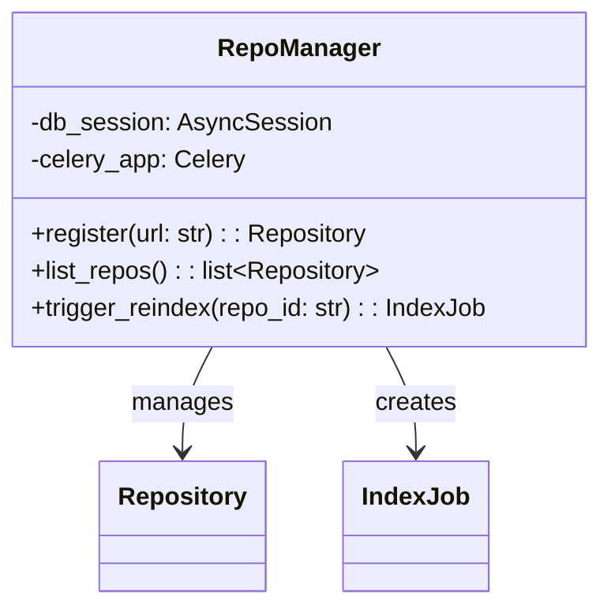
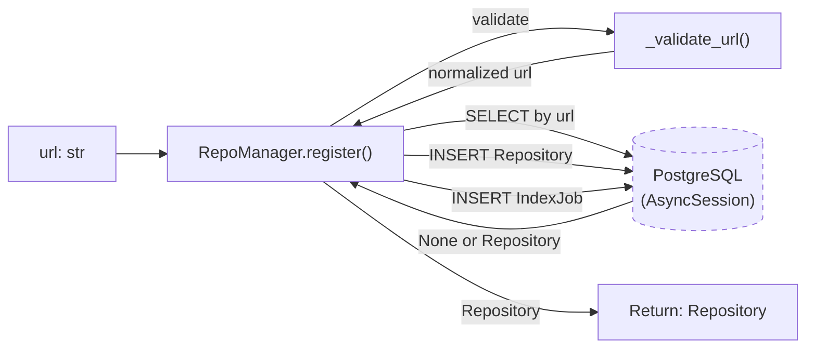
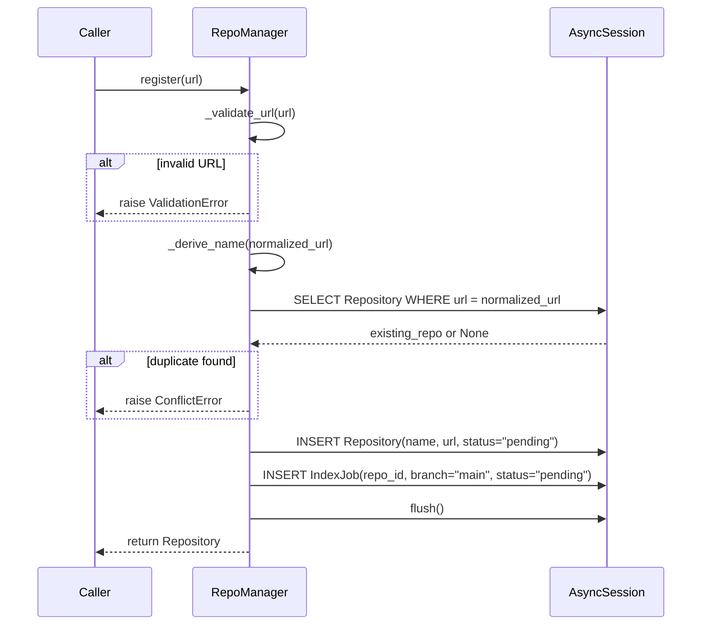
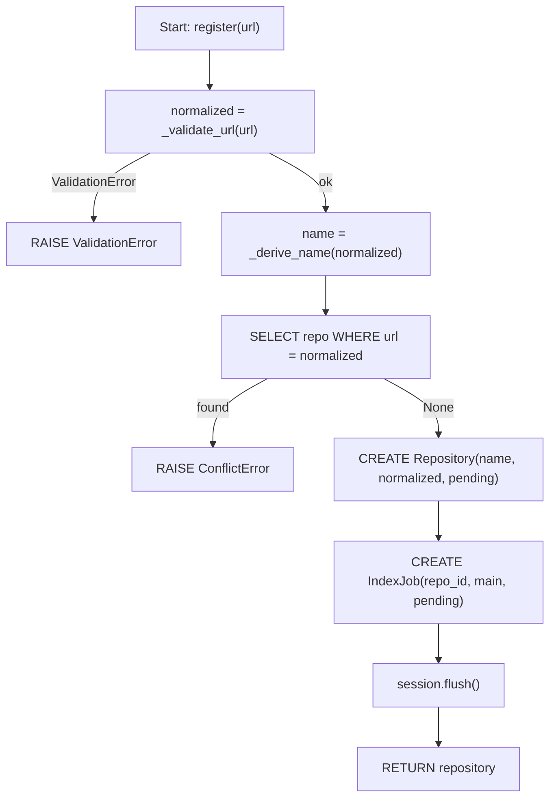
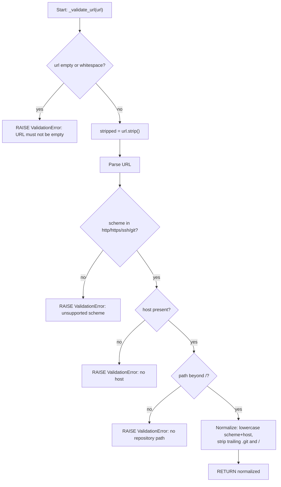
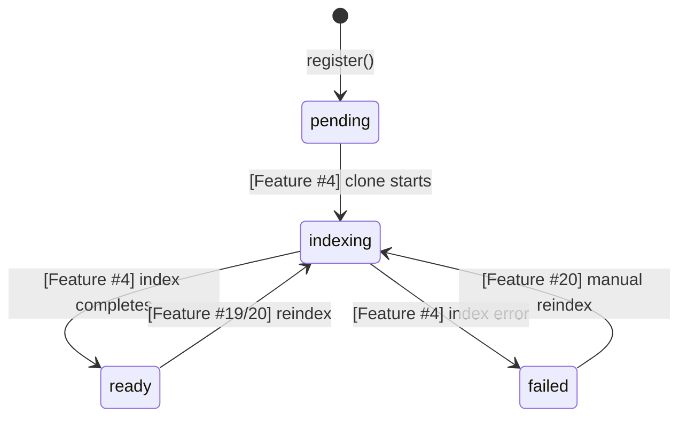

# Feature Detailed Design: Repository Registration (Feature #3)

**Date**: 2026-03-21
**Feature**: #3 — Repository Registration
**Priority**: high
**Dependencies**: [#2 Data Model & Migrations (passing)]
**Design Reference**: docs/plans/2026-03-21-code-context-retrieval-design.md § 4.5
**SRS Reference**: FR-001

## Context

RepoManager is a service that validates Git URLs, checks for duplicate registrations, creates Repository records in PostgreSQL, and queues initial indexing jobs. It is the entry point for adding repositories to the system.

## Design Alignment

From design doc §4.5:



From design doc §4.1.3 sequence:
```
Admin → API: POST /api/v1/repos {url}
API → DB: Insert repo record (status=pending)
API → RB: Enqueue index_job(repo_id)
API → Admin: 201 {repo_id, job_id}
```

- **Key classes**: `RepoManager` (new, in `src/shared/services/repo_manager.py`), uses existing `Repository` and `IndexJob` models
- **Interaction flow**: `register(url)` → validate URL → check duplicate → insert Repository → create IndexJob → return Repository
- **Third-party deps**: `sqlalchemy[asyncio]` (existing), `re`/`urllib.parse` (stdlib for URL validation)
- **Deviations**: Feature #3 scope is limited to `register_repo()` per feature-list.json description. `list_repos()` and `trigger_reindex()` will be implemented in later features (REST API endpoints). The `celery_app` dependency is referenced in design but Feature #3 does not depend on a running Celery/RabbitMQ — the IndexJob record is created in DB to represent the queued job; actual Celery dispatch is Feature #4's responsibility.

## SRS Requirement

### FR-001: Repository Registration

**Priority**: Must
**EARS**: When an administrator submits a repository URL, the system shall validate the URL, create a repository record, and queue an initial indexing job.
**Acceptance Criteria**:
- Given a valid Git repository URL, when the administrator submits it via the admin API, then the system shall create a repository record with status "pending" and return the repository ID.
- Given an invalid or unreachable URL, when the administrator submits it, then the system shall return a validation error within 2 seconds without creating a record.
- Given a URL that is already registered, when the administrator submits it, then the system shall return a conflict error indicating the repository already exists.

## Component Data-Flow Diagram



## Interface Contract

| Method | Signature | Preconditions | Postconditions | Raises |
|--------|-----------|---------------|----------------|--------|
| `register` | `async register(url: str) -> Repository` | `url` is a non-empty string; database session is open | Repository record created with `status="pending"`, `name` derived from URL, `url` stored as normalized form; IndexJob record created with `repo_id` set, `status="pending"`, `branch="main"` | `ValidationError` if URL is not a valid Git URL; `ConflictError` if URL already registered |
| `_validate_url` | `_validate_url(url: str) -> str` | `url` is a non-empty string | Returns normalized URL (stripped trailing `.git`, trailing `/`, lowercased scheme+host) | `ValidationError` if URL scheme is not `http`/`https`/`ssh`/`git`, or URL has no host, or URL has no path beyond `/` |
| `_derive_name` | `_derive_name(url: str) -> str` | `url` has been validated | Returns `"{owner}/{repo}"` extracted from URL path (last two segments) | (none — always produces a name or falls back to full path) |

**Design rationale**:
- URL normalization (strip `.git`, trailing `/`, lowercase scheme+host) ensures duplicate detection works regardless of cosmetic URL differences
- `branch="main"` is a sensible default for IndexJob; actual branch detection happens during Git Clone (Feature #4)
- `_validate_url` is a private method but contains non-trivial logic warranting its own contract

## Internal Sequence Diagram



## Algorithm / Core Logic

### register()

#### Flow Diagram



#### Pseudocode

```
FUNCTION register(url: str) -> Repository
  // Step 1: Validate and normalize URL
  normalized = _validate_url(url)

  // Step 2: Derive human-readable name
  name = _derive_name(normalized)

  // Step 3: Check for duplicate
  existing = await session.execute(SELECT Repository WHERE url == normalized)
  IF existing is not None THEN
    RAISE ConflictError("Repository already registered: {normalized}")

  // Step 4: Create repository record
  repo = Repository(name=name, url=normalized, status="pending")
  session.add(repo)

  // Step 5: Create initial index job
  job = IndexJob(repo_id=repo.id, branch="main", status="pending")
  session.add(job)

  // Step 6: Flush to get IDs assigned
  await session.flush()

  RETURN repo
END
```

### _validate_url()

#### Flow Diagram



#### Pseudocode

```
FUNCTION _validate_url(url: str) -> str
  IF url is empty or whitespace THEN
    RAISE ValidationError("URL must not be empty")

  stripped = url.strip()
  parsed = urlparse(stripped)

  IF parsed.scheme not in {"http", "https", "ssh", "git"} THEN
    RAISE ValidationError("Unsupported URL scheme: {parsed.scheme}")

  // Handle SSH-style URLs: git@github.com:owner/repo.git
  IF ":" in stripped AND "@" in stripped AND "//" not in stripped THEN
    // SSH shorthand — extract host and path
    host_part, path_part = split on first ":"
    host = host_part after "@"
    path = "/" + path_part
  ELSE
    host = parsed.hostname
    path = parsed.path

  IF host is None or empty THEN
    RAISE ValidationError("URL has no host")

  IF path is None or path == "/" or path == "" THEN
    RAISE ValidationError("URL has no repository path")

  // Normalize
  normalized_path = path.rstrip("/")
  IF normalized_path endswith ".git" THEN
    normalized_path = normalized_path[:-4]

  normalized = scheme + "://" + host.lower() + normalized_path

  RETURN normalized
END
```

#### Boundary Decisions

| Parameter | Min | Max | Empty/Null | At boundary |
|-----------|-----|-----|------------|-------------|
| `url` | 1 char (invalid — no scheme/host) | No limit | ValidationError("URL must not be empty") | Single-char → ValidationError |
| `url.scheme` | Must be one of 4 values | — | ValidationError("Unsupported URL scheme") | "ftp" → ValidationError |
| `url.host` | 1+ chars after scheme:// | — | ValidationError("no host") | "http://" → ValidationError |
| `url.path` | Must have segments beyond "/" | — | ValidationError("no repository path") | "http://github.com" → ValidationError, "http://github.com/" → ValidationError |

#### Error Handling

| Condition | Detection | Response | Recovery |
|-----------|-----------|----------|----------|
| Empty/whitespace URL | `not url or not url.strip()` | `ValidationError("URL must not be empty")` | Caller provides valid URL |
| Unsupported scheme | `parsed.scheme not in allowed` | `ValidationError("Unsupported URL scheme: ...")` | Caller uses http/https/ssh/git |
| No host in URL | `parsed.hostname is None` | `ValidationError("URL has no host")` | Caller provides full URL |
| No path in URL | `path in (None, "", "/")` | `ValidationError("URL has no repository path")` | Caller includes repo path |
| Duplicate URL | `SELECT` returns existing record | `ConflictError("Repository already registered: ...")` | Caller uses existing repo or different URL |

## State Diagram

The Repository entity has a lifecycle, but Feature #3 only creates it in `pending` state. Later features transition it through other states. Documenting the full lifecycle for context:



Feature #3 scope: `[*] → pending` transition only.

## Test Inventory

| ID | Category | Traces To | Input / Setup | Expected | Kills Which Bug? |
|----|----------|-----------|---------------|----------|-----------------|
| T1 | happy path | VS-1, FR-001 AC-1 | `url="https://github.com/pallets/flask"` | Repository created: name="pallets/flask", url normalized, status="pending", id is UUID; IndexJob created with repo_id matching | Missing Repository creation or wrong status |
| T2 | happy path | VS-1, FR-001 AC-1 | `url="https://github.com/owner/repo.git"` | URL normalized to strip `.git` suffix; repo.url == "https://github.com/owner/repo" | Normalization not stripping .git |
| T3 | happy path | VS-1, FR-001 AC-1 | `url="https://GitHub.COM/Owner/Repo/"` | Host lowercased, trailing slash stripped; repo.url == "https://github.com/Owner/Repo" | Case-sensitive duplicate detection |
| T4 | error | VS-2, FR-001 AC-2 | `url="not-a-url"` | `ValidationError` raised, no Repository created | Missing URL validation |
| T5 | error | VS-2, FR-001 AC-2 | `url=""` | `ValidationError("URL must not be empty")` | Missing empty-string guard |
| T6 | error | VS-2, FR-001 AC-2 | `url="ftp://example.com/repo"` | `ValidationError` with "Unsupported URL scheme" | Missing scheme whitelist |
| T7 | error | VS-3, FR-001 AC-3 | Register same URL twice | Second call raises `ConflictError` | Missing duplicate check |
| T8 | boundary | §Algorithm boundary | `url="http://github.com"` (no path) | `ValidationError("URL has no repository path")` | Missing path check |
| T9 | boundary | §Algorithm boundary | `url="   https://github.com/a/b   "` (whitespace) | Whitespace stripped, registration succeeds | Missing strip() |
| T10 | boundary | §Algorithm boundary | `url="http://"` (no host) | `ValidationError("URL has no host")` | Missing host check |
| T11 | happy path | VS-1, FR-001 AC-1 | `url="git@github.com:owner/repo.git"` (SSH shorthand) | Normalized to standard form, repo created | Missing SSH URL support |
| T12 | state | §State Diagram | After register() | repo.status == "pending" | Wrong initial status |

**Negative ratio**: 7 negative (T4-T10) / 12 total = 58% >= 40% ✓

## Tasks

### Task 1: Write failing tests
**Files**: `tests/test_repo_manager.py`
**Steps**:
1. Create test file with imports for `RepoManager`, `Repository`, `IndexJob`, `ValidationError`, `ConflictError`
2. Create an async test fixture providing an in-memory SQLite session (reuse pattern from Feature #2 tests)
3. Write tests T1-T12 from Test Inventory:
   - T1: `test_register_valid_url` — register flask URL, assert repo created with correct fields + IndexJob exists
   - T2: `test_register_strips_git_suffix` — register URL with `.git`, assert normalized
   - T3: `test_register_normalizes_case_and_trailing_slash` — mixed case + trailing slash
   - T4: `test_register_invalid_url_raises_validation_error` — "not-a-url"
   - T5: `test_register_empty_url_raises_validation_error` — empty string
   - T6: `test_register_unsupported_scheme_raises_validation_error` — ftp://
   - T7: `test_register_duplicate_url_raises_conflict_error` — register twice
   - T8: `test_register_no_path_raises_validation_error` — "http://github.com"
   - T9: `test_register_whitespace_stripped` — padded URL succeeds
   - T10: `test_register_no_host_raises_validation_error` — "http://"
   - T11: `test_register_ssh_url` — git@github.com:owner/repo.git
   - T12: `test_register_status_is_pending` — verify status field
4. Run: `pytest tests/test_repo_manager.py -v`
5. **Expected**: All tests FAIL (module not found or class not found)

### Task 2: Implement minimal code
**Files**: `src/shared/services/repo_manager.py`, `src/shared/services/__init__.py`
**Steps**:
1. Create `src/shared/services/repo_manager.py` with `RepoManager` class per Algorithm §5 pseudocode
2. Create `ValidationError` and `ConflictError` exception classes in `src/shared/exceptions.py`
3. Export `RepoManager` from `src/shared/services/__init__.py`
4. Run: `pytest tests/test_repo_manager.py -v`
5. **Expected**: All tests PASS

### Task 3: Coverage Gate
1. Run: `pytest --cov=src --cov-branch --cov-report=term-missing tests/`
2. Check: line >= 90%, branch >= 80%. If below: add tests.
3. Record coverage output.

### Task 4: Refactor
1. Review implementation for clarity, naming consistency, docstrings
2. Run full test suite: `pytest tests/ -v`
3. All tests PASS.

### Task 5: Mutation Gate
1. Run: `mutmut run --paths-to-mutate=src/shared/services/repo_manager.py,src/shared/exceptions.py`
2. Check: mutation score >= 80%. If below: strengthen assertions.
3. Record mutation output.

### Task 6: Create example
1. Create `examples/03-repository-registration.py`
2. Demonstrate: creating a RepoManager, registering a repo, handling duplicate and validation errors
3. Run example to verify.

## Verification Checklist
- [x] All verification_steps traced to Interface Contract postconditions (VS-1→register postcondition, VS-2→register Raises ValidationError, VS-3→register Raises ConflictError)
- [x] All verification_steps traced to Test Inventory rows (VS-1→T1/T2/T3, VS-2→T4/T5/T6, VS-3→T7)
- [x] Algorithm pseudocode covers all non-trivial methods (register, _validate_url)
- [x] Boundary table covers all algorithm parameters (url: empty, scheme, host, path)
- [x] Error handling table covers all Raises entries (ValidationError×4, ConflictError×1)
- [x] Test Inventory negative ratio >= 40% (58%)
- [x] Every skipped section has explicit "N/A — [reason]" (none skipped)
