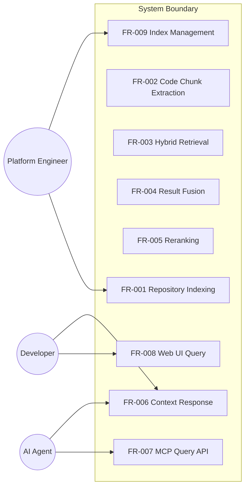
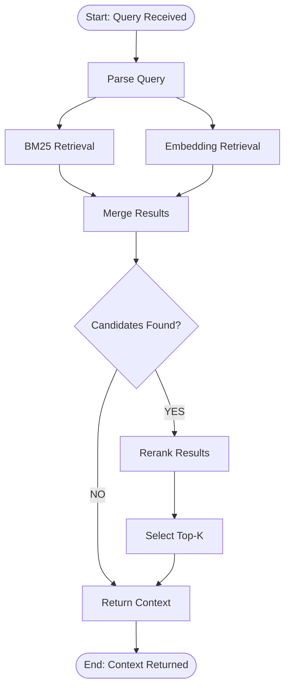
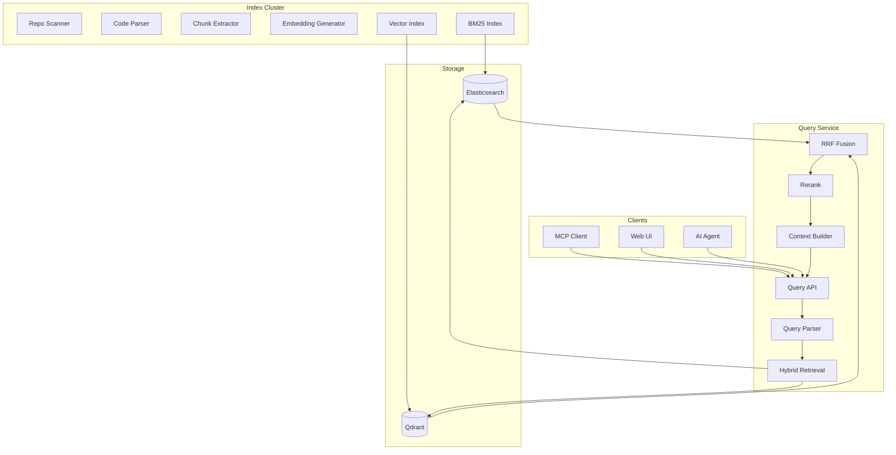
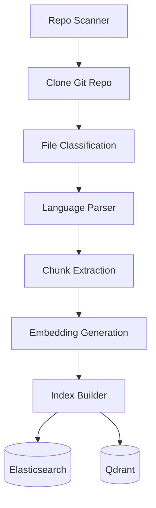
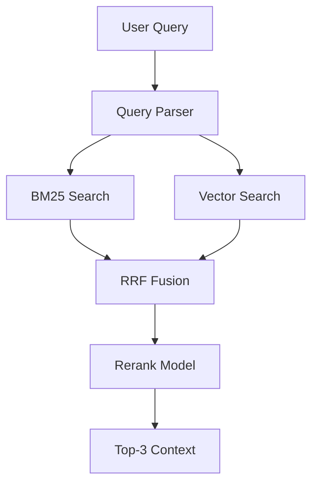
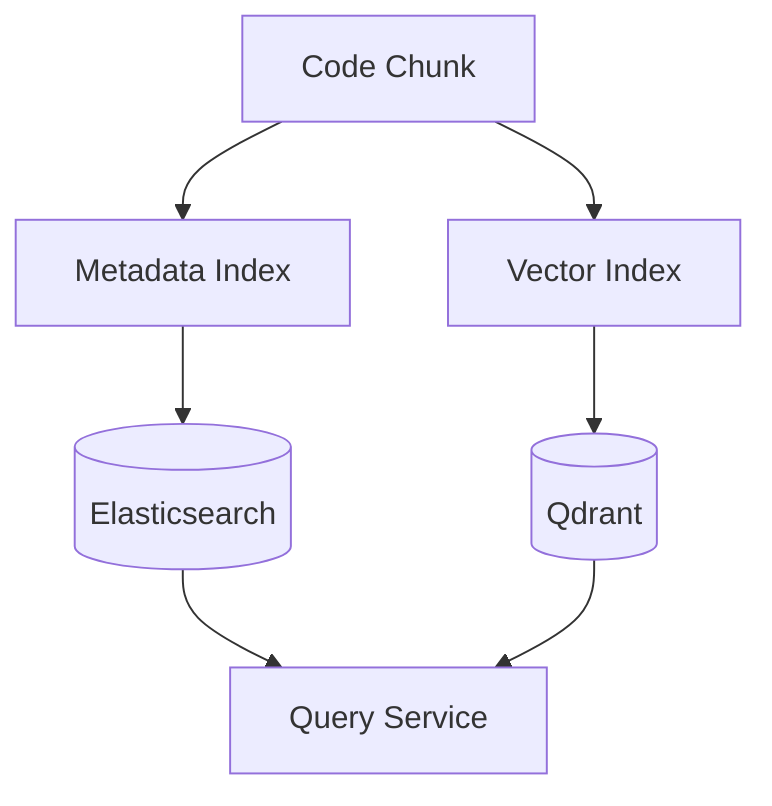
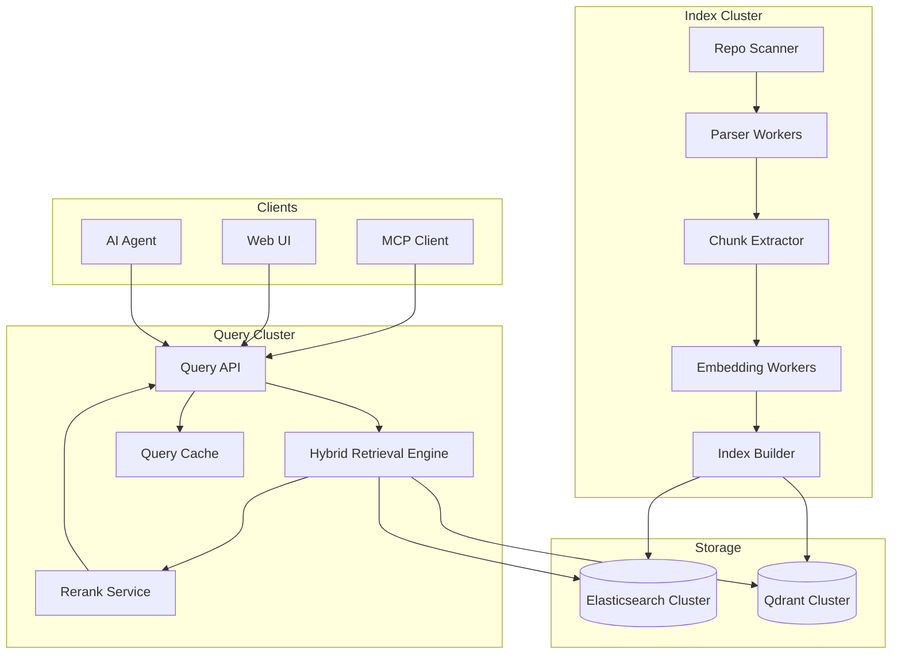
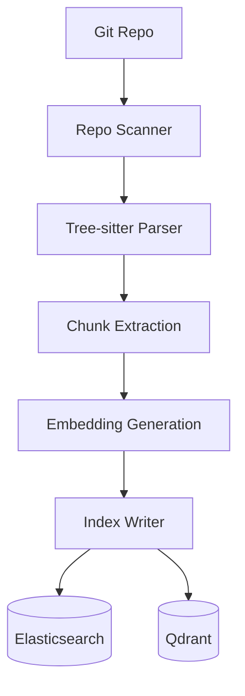
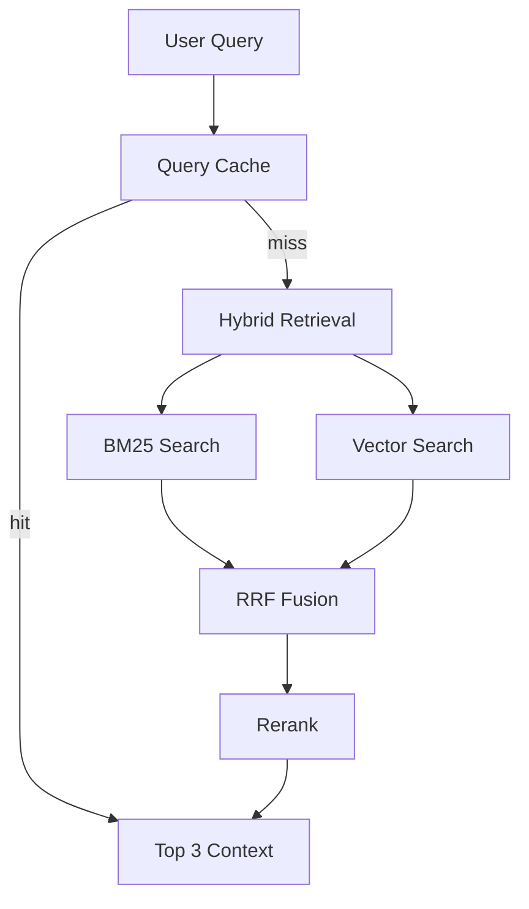

很好，你已经给出了**初始需求描述**。我会严格按你提供的 **SRS elicitation流程 Step 1 → Step 2**推进。
目前我先完成 **Step 1: Context Exploration**，然后进入 **Round 1 需求澄清问题**。

------

# Step 1 — Context Exploration（基于公开资料）

你的目标系统本质上是 **Context7 类系统**。

例如：
Context7 MCP

其核心思想是：

- 为 AI coding agent 提供 **最新代码上下文**
- 从 **源码仓库 / 官方文档 / 示例代码**中提取信息
- 通过 **Model Context Protocol (MCP)** 提供查询接口
- 在 prompt 中自动注入相关 context

Context7 的工作流程大致是：

1. 识别用户提到的 library / repo
2. 从官方 source 获取文档和示例
3. 提取最相关的代码片段
4. 将其注入 LLM prompt context

这样可以避免：

- LLM 使用过期 API
- hallucinated API
- 错误示例代码

这些能力正是 Context7 MCP 的目标：

> “fetch current documentation and code examples directly from source repositories and provide them to the AI through MCP.” ([决策创作人](https://www.decisioncrafters.com/context7-mcp-server-ai-code-documentation/?utm_source=chatgpt.com))

------

# 我对你需求的初始理解（假设）

我先做一个 **Assumption**，请你确认或修正：

你要做的是一个 **企业级 Code Context Retrieval System**，特点：

**输入**

AI agent 查询，例如：

```
how to use spring WebClient timeout
```

**系统返回**

结构化上下文：

```
- documentation snippet
- example code
- relevant source files
- related release notes
```

**主要目标**

给 AI Agent 提供 **精确代码上下文补齐**。

------

# Round 1 — Purpose & Scope（第一轮需求澄清）

请一次性回答以下 **4个问题**（选择或补充即可）。

------

## Q1 系统的核心用户是谁？

A. AI coding agent（Claude Code / Cursor / Copilot）
B. 人类开发者（CLI / UI 查询）
C. 两者都支持
D. 仅内部 AI agent

------

## Q2 查询输入方式是什么？

系统需要支持哪种查询方式？

A. **自然语言查询**

```
how to use grpc java interceptor
```

B. **symbol查询**

```
org.springframework.web.client.RestTemplate
```

C. **repo + symbol**

```
spring-framework RestTemplate
```

D. **以上全部**

------

## Q3 上下文来源有哪些？

你提到：

- document
- example
- source
- release

请确认最终范围：

A. README / official docs
B. example code
C. source code
D. release notes
E. commit history
F. API reference

请选择必须支持的。

------

## Q4 MVP范围

第一版（MVP）目标是：

A. **只支持 public GitHub repo**
B. GitHub + GitLab
C. 任意 git repo
D. 包管理生态（maven / pip / npm）

------

# 下一步

在你回答这 **4个问题**之后，我将进入：

**Round 2 — Functional Requirements**

将深入澄清：

- 查询 API
- 索引更新机制
- AST / symbol indexing
- context ranking
- MCP接口设计
- latency / QPS

然后生成：

- **FR / NFR / CON / IFR / ASM / EXC**
- **EARS requirement**
- **Mermaid diagrams**
- **完整 SRS draft**

请回答 **Q1–Q4**。


Q1 系统的核心用户是谁？ C. 两者都支持 Q2 查询输入方式是什么？ 系统需要支持哪种查询方式？ D. 以上全部 Q3 上下文来源有哪些？ 均需支持 Q4 MVP范围 第一版（MVP）目标是： 任意 git repo。最好是离线分布式挨仓扫描，生成检索结果，用于后续快速检索


很好，你给出的回答已经足够进入 **Step 2 – Functional Requirements 澄清**。
在继续之前，我先把当前需求做一次 **结构化理解（Assumption Capture）**，然后进入 **Round 2 需求澄清问题**。

------

# 当前需求理解（基于你提供的信息）

你的系统目标：

> 构建一个 **类似 Context7 的代码上下文检索系统**，为 AI 查询代码时提供准确上下文。

类似系统的核心机制是：

- 从 **源码 / 文档 / 示例代码**提取上下文
- 根据查询返回 **最相关的 snippet**
- 将结果通过 **MCP server** 注入 AI prompt context

这种系统可以避免 LLM 使用过期 API 或 hallucinated API。Context7 MCP Server 就是通过从官方 source 拉取文档并直接注入 AI prompt 来实现这一点。 ([GitHub](https://github.com/upstash/context7?utm_source=chatgpt.com))

------

# 当前需求摘要（初步）

**系统目标**

开发一个 **Code Context Retrieval System**

**主要能力**

1. 查询代码上下文
2. 提供：
   - document
   - example code
   - source code
   - release notes
3. 支持语言：
   - Java
   - Python
   - TypeScript
   - JavaScript
   - C
   - C++
4. 性能：
   - 响应时间 < **1s**
   - 高并发
5. 访问方式：
   - **MCP Server**
6. 数据来源：
   - **任意 Git repo**
7. 数据生成：
   - **离线分布式扫描 repo**
   - 构建检索索引

------

# Round 2 — Functional Requirements 澄清

这一轮我会聚焦 **系统行为（FR）**。
请回答以下 **4个问题**。

------

# Q5 查询返回的结果结构

AI 查询：

```text
how to use spring WebClient timeout
```

系统返回的内容结构是？

A. **文本块**

```
doc snippet
example snippet
source snippet
```

B. **结构化 JSON**

```json
{
  "docs": [],
  "examples": [],
  "source": [],
  "release_notes": []
}
```

C. **snippet + metadata**

```json
{
  "content": "...",
  "repo": "...",
  "file": "...",
  "symbol": "...",
  "score": ...
}
```

D. 以上全部

------

# Q6 上下文粒度

检索的最小单位是什么？

A. **文件级**

```
entire file
```

B. **代码块**

```
function / class
```

C. **symbol级**

```
method / function / variable
```

D. 混合（推荐）

------

# Q7 repo 索引更新策略

Git repo 更新时如何处理？

A. 定期全量扫描
B. git webhook 增量更新
C. commit diff 增量索引
D. 用户手动触发

------

# Q8 ranking / retrieval方式

context排序方式：

A. keyword search (BM25)
B. embedding search
C. hybrid search (BM25 + vector)
D. AST-aware retrieval

------

# 下一步

你回答 **Q5–Q8** 后，我会继续：

**Round 3 – Non-Functional Requirements**

会澄清：

- QPS
- repo规模
- storage
- index size
- distributed architecture
- latency SLA

之后我会生成：

- **完整 SRS（ISO 29148）**
- **FR / NFR / CON / IFR / ASM / EXC**
- **EARS syntax**
- **Use Case Diagram**
- **Process Flow Diagram**


Q5 查询返回的结果结构 AI 查询： how to use spring WebClient timeout 系统返回的内容结构是？ D. 以上全部 Q6 上下文粒度 检索的最小单位是什么？ D. 混合（推荐） Q7 repo 索引更新策略 Git repo 更新时如何处理？ A. 定期全量扫描 D. 用户手动触发 A+D Q8 ranking / retrieval方式 context排序方式： 请推荐一种最优的方式


很好，你的回答已经非常接近 **可以生成 SRS 的状态**。
我先回答 **Q8（ranking方式推荐）**，然后进入 **Round 3 – NFR澄清**，这是生成 SRS 前最后一轮关键问题。

------

# Q8 推荐的 Retrieval / Ranking 方案

对于你这种 **代码仓上下文检索系统**，行业最佳实践是：

**Hybrid Retrieval（推荐）**

```
BM25 / full-text search
        +
vector embedding search
        +
symbol / AST metadata ranking
```

原因如下：

### 1 BM25（关键词搜索）

优点

- 极快（毫秒级）
- 对 **symbol / API name** 非常准确

例如查询：

```
RestTemplate timeout
```

BM25 会精准命中代码和文档中的关键词。

BM25 的 inverted index 也是传统搜索引擎核心机制。 ([arXiv](https://arxiv.org/abs/2104.07186?utm_source=chatgpt.com))

------

### 2 Embedding Search（语义搜索）

优点

- 解决自然语言查询

例如：

```
how to configure spring http client timeout
```

embedding 可以找到：

```
WebClient.Builder
HttpClientConfig
```

很多 **MCP docs retrieval server** 都采用 embedding + vector database 来实现语义搜索。 ([contextmcp.ai](https://contextmcp.ai/docs?utm_source=chatgpt.com))

------

### 3 AST / Symbol ranking（代码系统关键）

这是 **代码检索系统必须有的**。

需要额外权重：

| 类型         | 权重      |
| ------------ | --------- |
| symbol match | very high |
| example code | high      |
| docs         | medium    |
| commit       | low       |

否则：

```
StringBuilder
```

这种 symbol 查询会被 embedding 搞乱。

------

# 推荐最终架构

查询流程：

```
query
   │
   ▼
BM25 search (fast)
   │
   ▼
Vector search (semantic)
   │
   ▼
Merge results
   │
   ▼
AST / symbol re-ranking
   │
   ▼
Top-K context
```

这种 **Hybrid Retrieval** 也是现代检索系统的主流方式。 ([arXiv](https://arxiv.org/abs/2211.10411?utm_source=chatgpt.com))

------

# 推荐技术选型（供后续 SRS参考）

| 模块      | 推荐             |
| --------- | ---------------- |
| index     | tantivy / lucene |
| vector    | faiss / qdrant   |
| parser    | tree-sitter      |
| embedding | bge-small / jina |
| storage   | parquet / sqlite |
| query API | MCP              |

------

# Round 3 — Non-Functional Requirements（最后一轮澄清）

请回答以下 **4个问题**。

------

# Q9 规模（Repo规模）

预计需要索引多少仓库？

A. < 100
B. 100 – 1000
C. 1000 – 10000
D. 10000+

------

# Q10 仓库规模

单个 repo 最大规模？

A. < 100MB
B. < 1GB
C. < 10GB
D. 任意规模

------

# Q11 查询并发

目标并发是多少？

A. 10 QPS
B. 100 QPS
C. 1000 QPS
D. 10000 QPS+

------

# Q12 部署方式

系统运行环境？

A. 单机
B. 分布式 cluster
C. edge + worker
D. 离线 index cluster + query service

------

# 你回答 Q9–Q12 后

我将生成完整：

**ISO 29148 SRS**

包括：

- FR / NFR / CON / ASM / IFR / EXC
- EARS requirement
- Use Case Diagram
- Process Flow
- Traceability Matrix
- Reviewer pass

预计文档结构约 **1500–2500字**。


Q9 规模（Repo规模）

预计需要索引多少仓库？

B. 100 – 1000

Q10 仓库规模

单个 repo 最大规模？

B. < 1GB

Q11 查询并发

目标并发是多少？

C. 1000 QPS

Q12 部署方式

系统运行环境？

分布式 离线 index cluster + query service


很好，你提供的信息已经**足够生成 SRS 草案**。
根据 `long-task-requirements` 的流程，我们现在进入 **Step 3 → Step 4（需求分类 + EARS需求草案）**。

⚠️ 注意：
这是 **Draft SRS Section 1（Purpose / Scope）**，按你的 skill 要求 **逐章节确认**，所以我先展示第一部分。

------

# SRS Draft

**Project:** Code Context Retrieval MCP System
**Standard:** ISO/IEC/IEEE 29148
**Status:** Draft — pending approval
**Date:** 2026-03-13

------

# 1. Purpose & Scope

## 1.1 Purpose

本系统旨在开发一个 **代码仓库上下文检索系统（Code Context Retrieval System）**，用于为 AI 编程助手和开发者提供精确的代码相关上下文信息。

系统通过离线扫描 Git 仓库，构建代码与文档索引，并通过 **Model Context Protocol (MCP)** 提供查询接口，使 AI 可以在生成代码时自动获取：

- 官方文档
- 示例代码
- 源码片段
- release notes

该能力可以显著降低 AI 生成代码时出现的：

- 幻觉 API
- 过期 API
- 错误示例代码

类似系统的代表是 **Context7 MCP**，其通过从官方源仓库提取文档并注入 LLM prompt 来提供最新上下文。 ([GitHub](https://github.com/upstash/context7?utm_source=chatgpt.com))

------

## 1.2 Scope

系统提供 **代码上下文检索能力**，主要功能包括：

### 1 Repository Indexing

支持从任意 Git 仓库扫描并构建索引：

- README / docs
- example code
- source code
- release notes

支持语言：

- Java
- Python
- TypeScript
- JavaScript
- C
- C++

索引通过 **离线分布式扫描集群**构建。

------

### 2 Context Retrieval

支持 AI 查询代码相关问题，例如：

```
how to use spring WebClient timeout
```

系统返回：

- 文档片段
- 示例代码
- 源码 snippet
- release notes

返回格式支持：

- 文本块
- JSON
- snippet + metadata

------

### 3 Hybrid Code Search

系统采用 **Hybrid Retrieval Architecture**：

```
BM25 keyword search
+ vector semantic search
+ AST / symbol ranking
```

用于兼顾：

- symbol 精确匹配
- 自然语言查询
- 代码语义相关性

------

### 4 MCP Integration

系统通过 **MCP Server**提供能力，使 AI Agent 能直接调用。

MCP 是 LLM 工具调用的标准接口，可连接 AI 与外部系统。 ([arXiv](https://arxiv.org/abs/2508.20453?utm_source=chatgpt.com))

------

### 5 Distributed Query Service

系统提供高性能查询能力：

- 响应时间 < **1s**
- 并发能力 ≥ **1000 QPS**

------

## 1.3 Out of Scope

以下能力不在当前版本范围：

- IDE 插件开发
- AI 代码生成
- 自动代码修改
- 私有仓权限管理
- CI/CD集成

系统只负责 **context retrieval**。

------

# 请确认 Section 1

请确认以下内容是否正确：

1️⃣ Scope 是否准确
2️⃣ Out-of-Scope 是否需要修改
3️⃣ 是否需要新增能力，例如

- dependency graph retrieval
- API usage mining
- stackoverflow / blog indexing

------

确认后，我将继续生成：

**Section 2**

```
Glossary
Stakeholders
User Personas
```

然后继续：

- Functional Requirements（EARS）
- NFR
- Use Case Diagram
- Process Flow
- Traceability Matrix
- Reviewer Check (ISO 29148 gate)

整份 SRS 预计 **约 1800–2500字**。


Hybrid Code Search 这部分有疑问，该方案好，还是需要加入embedding、rerank或者知识图谱？


你的问题非常关键，因为 **代码仓上下文检索系统的核心质量几乎完全由 retrieval pipeline 决定**。
我先给出一个**工程上公认最优的结构**，再解释 **embedding / rerank / knowledge graph 是否需要**。

结论先说：

> **最佳实践不是二选一，而是多阶段 pipeline：
> Hybrid Retrieval + Embedding + Rerank（可选 KG）**

这是当前 **RAG / Code Search / Docs Retrieval 的标准架构**。

------

# 推荐最终 Retrieval Architecture（强烈建议）

对于你的系统（代码仓 context search），推荐：

```
Query
  │
  ▼
Stage 1: Candidate Retrieval
  ├─ BM25 lexical search
  └─ Vector embedding search
  │
  ▼
Fusion (RRF)
  │
  ▼
Stage 2: Rerank
  └─ Cross-encoder reranker
  │
  ▼
Stage 3: Code-aware ranking
  └─ AST / symbol boosting
  │
  ▼
Top-K context
```

这是 **生产系统最常见架构**。

原因：

- BM25 → 精确 token
- embedding → 语义
- rerank → 精度

研究和实践都表明这种 **multi-stage retrieval pipeline**最有效。([OptyxStack](https://optyxstack.com/rag-reliability/hybrid-search-reranking-playbook?utm_source=chatgpt.com))

------

# 为什么必须有 Embedding

如果没有 embedding，会出现两个严重问题：

### 问题1：自然语言查询

例如：

```
how to configure spring http client timeout
```

代码里可能写的是：

```
WebClient.Builder
responseTimeout
```

BM25 **完全匹配不到**。

Vector search 可以解决 **paraphrase / synonym**。([Ailog RAG](https://app.ailog.fr/en/blog/guides/hybrid-search-rag?utm_source=chatgpt.com))

------

### 问题2：语义相似代码

例如：

```
cache implementation
```

可能返回：

```
LRUCache
Guava Cache
```

BM25 无法理解语义。

------

# 为什么必须有 BM25

Embedding 也有致命缺点：

embedding **非常差**于：

```
symbol
API name
error code
version
```

例如：

```
std::vector
HttpClientConfig
ERR_TIMEOUT
```

Vector search 往往找不到。

BM25 在 token 精确匹配方面非常强。([OptyxStack](https://optyxstack.com/rag-reliability/hybrid-search-reranking-playbook?utm_source=chatgpt.com))

------

# 为什么还需要 Rerank

Hybrid retrieval 的问题是：

**Recall 很高，但 precision 不够。**

因此 production 系统都会：

```
retrieve top 100
rerank top 100
return top 5
```

Cross-encoder reranking 会显著提高准确率。
实际案例中 **Precision@5 提升约 38%**。 ([Thread Transfer](https://thread-transfer.com/blog/2025-03-22-hybrid-search-production/?utm_source=chatgpt.com))

------

# Knowledge Graph 是否需要？

对于 **代码 context retrieval**：

结论：

> **不是 MVP 必需，但长期非常有价值**

KG 主要解决：

### 1 API dependency

```
Class -> Method
Method -> Type
Type -> Module
```

### 2 symbol relation

```
interface -> implementation
class -> subclass
function -> call graph
```

### 3 library knowledge

```
Spring -> WebClient
WebClient -> HttpClient
```

但是问题是：

**成本非常高**

需要：

- AST parsing
- dependency analysis
- graph storage

所以：

| 阶段 | 建议         |
| ---- | ------------ |
| MVP  | 不做 KG      |
| V2   | symbol graph |
| V3   | full code KG |

------

# 最优方案总结（推荐写入SRS）

最终 Retrieval Stack：

```
Stage1: Hybrid Retrieval
    BM25 (lexical)
    +
    Dense Embedding

Stage2: Fusion
    RRF (Reciprocal Rank Fusion)

Stage3: Rerank
    Cross-encoder model

Stage4: Code-aware scoring
    symbol boost
    doc boost
    example boost
```

------

# 适合你的技术栈

推荐组合：

| 模块      | 推荐             |
| --------- | ---------------- |
| BM25      | Tantivy / Lucene |
| vector    | FAISS / Qdrant   |
| embedding | BGE-small / jina |
| rerank    | bge-reranker     |
| parser    | tree-sitter      |

------

# 我建议的最终 SRS Retrieval Requirement

在 SRS 中可以写为：

**FR-004 Hybrid Retrieval**

> When a query is received, the system shall retrieve candidate contexts using both lexical search and vector semantic search.

**FR-005 Retrieval Fusion**

> The system shall combine candidate results from lexical and vector retrieval using Reciprocal Rank Fusion.

**FR-006 Result Reranking**

> The system shall rerank retrieved candidates using a neural cross-encoder model.

------

# 一个关键架构问题（必须在SRS中明确）

我需要再确认一个设计问题：

### Q13 Context Chunk Strategy

代码需要如何切分？

A. file level
B. class/function level
C. AST symbol level
D. multi-granularity（推荐）

这个问题会 **直接影响 index architecture**。

------

如果你愿意，我可以继续帮你把这套系统：

**完整设计成工业级架构（非常关键）**

包括：

- repo indexing pipeline
- AST extraction
- code chunk strategy
- multi-language parser
- distributed index
- query pipeline
- MCP server design

这部分其实是 **Context7类系统最核心的工程难点**。


很好，我们继续 **SRS 的下一章节**。
按照 **ISO/IEC/IEEE 29148** 的标准结构，在 *Purpose & Scope* 之后通常进入 **Product Overview / Stakeholders / User Characteristics / Constraints** 等部分，用于描述系统背景、用户角色和约束。([nirmt.com](https://nirmt.com/storage/uploads/E-BOOK_BE-INDUSTRIAL-AND-SAFETY/29148-2011 - ISOIECIEEE International Standard - Systems and software engineering -- Life cycle processes --Requirements.pdf?utm_source=chatgpt.com))

我将按照该结构给出 **Section 2（Glossary / Stakeholders / User Personas）草案**，这是功能需求之前必须确认的部分。

------

# SRS Draft

## Section 2 — Glossary & Stakeholders

------

# 2.1 Glossary

| Term                             | Definition                                                   |
| -------------------------------- | ------------------------------------------------------------ |
| **Context Retrieval**            | 根据查询从代码仓库返回相关文档、示例代码或源码片段           |
| **MCP (Model Context Protocol)** | AI Agent 与外部系统交互的标准接口协议，用于请求上下文或工具能力 |
| **Hybrid Search**                | 结合 lexical search（BM25）和 semantic search（embedding）的检索方法 |
| **Code Chunk**                   | 索引的最小代码单元，例如函数、类、文件                       |
| **Symbol**                       | 编程语言中的标识符，例如 class、method、function             |
| **Rerank**                       | 对初始检索结果再次排序以提升相关性                           |
| **Indexing Cluster**             | 离线扫描仓库并构建检索索引的计算集群                         |
| **Query Service**                | 提供实时查询接口的服务                                       |

------

# 2.2 Stakeholders

| Stakeholder                | Role                                           |
| -------------------------- | ---------------------------------------------- |
| **AI Agent Developers**    | 需要从系统获取代码上下文以增强 AI 生成代码能力 |
| **Software Engineers**     | 手动查询代码示例和 API 使用方式                |
| **Platform Engineers**     | 维护索引系统和查询服务                         |
| **AI Infrastructure Team** | 将 MCP 服务集成到 AI Agent 工作流              |

------

# 2.3 User Personas

## Persona 1 — AI Coding Agent

**Description**

AI Agent（如 Claude Code、Cursor、Copilot 等）通过 MCP 调用系统获取代码上下文。

**Goals**

- 获取最新 API usage
- 获取示例代码
- 获取源码片段

**Typical Query**

```
how to configure spring WebClient timeout
```

------

## Persona 2 — Software Developer

**Description**

开发者通过 CLI 或 API 查询代码示例。

**Goals**

- 快速找到 API usage
- 查找真实代码示例
- 查找官方文档

**Typical Query**

```
std::vector resize example
```

------

# 2.4 Product Perspective

该系统是 **AI 编程基础设施的一部分**。

系统架构关系：

```
AI Agent
   │
   ▼
MCP Server
   │
   ▼
Query Service
   │
   ▼
Index Store
   │
   ▼
Indexing Cluster
   │
   ▼
Git Repositories
```

------

# 2.5 User Characteristics

| User               | Skill Level            |
| ------------------ | ---------------------- |
| AI Agent           | automated system       |
| Developers         | intermediate to expert |
| Platform Engineers | expert                 |

------

# 2.6 Constraints

当前系统必须满足以下限制：

| Constraint ID | Description                               |
| ------------- | ----------------------------------------- |
| CON-001       | 系统必须支持 Java、Python、TS、JS、C、C++ |
| CON-002       | 查询响应时间必须小于 **1s**               |
| CON-003       | 系统必须支持 **≥1000 QPS**                |
| CON-004       | 系统必须通过 **MCP协议提供服务**          |
| CON-005       | 仓库来源为 **任意 Git repository**        |
| CON-006       | 索引必须通过 **离线分布式扫描生成**       |

------

# 2.7 Assumptions

| ID      | Assumption                   |
| ------- | ---------------------------- |
| ASM-001 | Git 仓库可被离线扫描         |
| ASM-002 | 代码语言可以通过 parser 识别 |
| ASM-003 | 查询请求主要来自 AI Agent    |

------

# 请确认 Section 2

需要确认三点：

1️⃣ **用户角色是否完整？**
是否需要加入：

- AI平台管理员
- 数据工程师

2️⃣ **是否需要支持 UI 查询？**

目前假设只有：

```
MCP API
CLI
```

没有 Web UI。

3️⃣ **Code Chunk Strategy（关键问题）**

索引粒度：

A. file level
B. function/class level
C. AST symbol level
D. **multi-granularity（推荐）**

------

确认 Section 2 后，我将生成 **SRS 最核心部分：**

# Section 3 — Functional Requirements (EARS)

将包括：

- Repo Indexing
- Code Chunking
- Context Retrieval
- Hybrid Search
- Reranking
- MCP Query API

并生成：

- **Use Case Diagram**
- **Process Flow Diagram**

这是整个 SRS **最关键章节**。


1️⃣ 用户角色是否完整？ 完整，不需再加入角色 2️⃣ 是否需要支持 UI 查询？ 需要支持web UI查询 3️⃣ Code Chunk Strategy（关键问题） 索引粒度： D. multi-granularity（推荐）


很好，我们继续 **SRS 的下一章节：Functional Requirements**。
这一章节是 **整个 SRS 的核心**，将使用 **EARS（Easy Approach to Requirements Syntax）** 编写需求，并结合你之前确认的设计：

- Hybrid Retrieval
- Embedding
- Rerank
- Multi-granularity chunking
- MCP API
- Distributed indexing

同时也加入 **Web UI 查询**。

------

# SRS Draft

## Section 3 — Functional Requirements

------

# 3.1 Use Case View



------

# 3.2 Functional Requirements (EARS)

------

# FR-001 Repository Indexing

**Type:** Event-driven

**Requirement**

When a repository indexing job is triggered, the system shall clone or fetch the Git repository and extract indexable artifacts including:

- documentation
- example code
- source code
- release notes

**Priority:** Must
**Source:** User requirement (repo indexing)

**Acceptance Criteria**

Given a repository URL
When an indexing job is started
Then the system shall download the repository and parse supported files.

------

# FR-002 Code Chunk Extraction

**Requirement**

When repository content is processed, the system shall extract code chunks using multi-granularity segmentation including:

- file level
- class level
- function level
- symbol level

**Priority:** Must

**Acceptance Criteria**

Given a Java source file
When parsing is executed
Then the system shall generate chunk entries for classes and methods.

------

# FR-003 Hybrid Retrieval

**Requirement**

When a query is received, the system shall retrieve candidate context using both:

- lexical search (BM25)
- dense embedding semantic search

Hybrid retrieval improves recall by combining keyword precision with semantic similarity. ([OptyxStack](https://optyxstack.com/rag-reliability/hybrid-search-reranking-playbook?utm_source=chatgpt.com))

**Priority:** Must

**Acceptance Criteria**

Given query:

```
how to configure spring WebClient timeout
```

When retrieval is executed
Then the system shall retrieve candidates from both lexical and semantic indexes.

------

# FR-004 Retrieval Fusion

**Requirement**

When multiple retrieval results are produced, the system shall merge them using **Reciprocal Rank Fusion (RRF)**.

RRF is commonly used because it merges rankings without relying on incompatible scoring scales between BM25 and embeddings. ([Ranjan Kumar](https://ranjankumar.in/building-a-full-stack-hybrid-search-system-bm25-vectors-cross-encoders-with-docker/?utm_source=chatgpt.com))

**Priority:** Must

**Acceptance Criteria**

Given BM25 results and vector results
When fusion is executed
Then the system shall produce a combined ranked candidate list.

------

# FR-005 Result Reranking

**Requirement**

The system shall rerank candidate results using a neural reranking model.

Neural reranking analyzes query-document pairs to improve relevance ranking beyond embedding similarity alone. ([arXiv](https://arxiv.org/abs/2602.09548?utm_source=chatgpt.com))

**Priority:** Must

**Acceptance Criteria**

Given top-100 retrieved chunks
When reranking is applied
Then the system shall return top-K ranked contexts.

------

# FR-006 Context Response

**Requirement**

The system shall return context results including:

- documentation snippets
- example code
- source code snippets
- release notes

Each result shall include metadata:

- repository
- file path
- symbol
- relevance score

**Priority:** Must

------

# FR-007 MCP Query API

**Requirement**

When an MCP client submits a query request, the system shall return ranked context results via MCP protocol.

**Priority:** Must

**Acceptance Criteria**

Given an MCP query request
When retrieval completes
Then the system shall return structured context results.

------

# FR-008 Web UI Query

**Requirement**

When a user accesses the Web UI, the system shall allow interactive context search.

Supported features:

- natural language search
- symbol search
- repository filter

**Priority:** Should

------

# FR-009 Index Management

**Requirement**

The system shall allow administrators to manage repository indexing jobs.

Supported operations:

- start indexing
- schedule periodic indexing
- manual reindex

**Priority:** Must

------

# 3.3 Process Flow

## Flow: Query Context Retrieval



------

# 当前 SRS 进度

已完成：

- Section 1 Purpose & Scope
- Section 2 Glossary / Stakeholders
- Section 3 Functional Requirements

下一章节：

# Section 4 — Non-Functional Requirements

将定义：

- latency
- throughput
- scalability
- reliability
- security
- storage

并确保：

- **1000 QPS**
- **<1s latency**

------

在继续写 **NFR** 之前，我需要确认 **两个关键参数**（会影响 SRS）：

### Q14 Retrieval Top-K

返回多少 context？

A. top-3
B. top-5
C. top-10
D. configurable

------

### Q15 Index refresh frequency

定期扫描 repo 的频率？

A. daily
B. hourly
C. weekly
D. configurable

------

回答后，我将继续生成：

- **Section 4 Non-Functional Requirements**
- **Traceability Matrix**
- **SRS Reviewer Gate（ISO 29148合规检查）**。

整个 SRS 也会进入 **最终审核阶段**。


Q14 检索前 K 返回多少context？ A. 前3名 Q15 指数刷新频率 定期扫描repo 的频率？  C. 默认每周 + 可配置


很好，你给出的 **Q14 / Q15** 已经足够继续 SRS。下面进入：

# SRS

## Section 4 — Non-Functional Requirements (NFR)

这一章将把你的关键目标形式化：

- **<1s latency**
- **1000 QPS**
- **100–1000 repos**
- **分布式 index + query**
- **MCP service**

------

# 4.1 Performance Requirements

## NFR-001 Query Latency

**Requirement**

The system shall return context retrieval results within **1 second** for 95% of queries.

**Rationale**

Developer search systems require near-interactive latency to remain usable in IDEs and AI assistants.

**Measurement**

```
P95 latency ≤ 1000 ms
```

**Acceptance Criteria**

Given a query request
When the query service executes retrieval
Then the response time shall be ≤ 1 second for 95% of requests.

------

## NFR-002 Query Throughput

**Requirement**

The system shall support **1000 QPS** concurrent query throughput.

**Measurement**

```
QPS ≥ 1000
```

**Load profile**

```
steady state: 1000 QPS
peak burst: 2000 QPS
```

------

## NFR-003 Retrieval Pipeline Latency Budget

为了满足 **1s SLA**，检索链路需要分配 latency：

| Stage               | Budget |
| ------------------- | ------ |
| Query parsing       | 10 ms  |
| BM25 retrieval      | 20 ms  |
| Vector retrieval    | 50 ms  |
| Fusion              | 5 ms   |
| Rerank              | 200 ms |
| Response formatting | 10 ms  |

Total budget:

```
≈ 295 ms
```

这符合典型 hybrid search pipeline latency（几十毫秒到数百毫秒）。 ([Cole Hoffer](https://www.colehoffer.ai/guides/reciprocal-rank-fusion-for-hybrid-search?utm_source=chatgpt.com))

------

# 4.2 Scalability Requirements

## NFR-004 Repository Scale

系统应支持：

```
100 – 1000 repositories
```

------

## NFR-005 Repository Size

单仓库最大规模：

```
≤ 1 GB
```

------

## NFR-006 Index Size

预计索引规模：

| Artifact    | Estimate  |
| ----------- | --------- |
| code chunks | 10M – 50M |
| embeddings  | 10M – 50M |
| metadata    | < 10GB    |

------

## NFR-007 Horizontal Scaling

The system shall support horizontal scaling for:

- indexing workers
- vector search nodes
- query service

------

# 4.3 Availability

## NFR-008 Service Availability

Query service availability shall be:

```
99.9%
```

------

## NFR-009 Fault Tolerance

The system shall tolerate node failure without interrupting query service.

Possible strategies:

- replicated vector index
- stateless query nodes
- distributed storage

------

# 4.4 Indexing Requirements

## NFR-010 Index Refresh

Repository indexing shall run:

```
default: weekly
configurable: yes
```

------

## NFR-011 Manual Trigger

Administrators shall be able to manually trigger repository reindex.

------

# 4.5 Security Requirements

## NFR-012 Access Control

The system shall support authentication for:

- MCP API
- Web UI

Supported mechanisms:

- API key
- OAuth (optional)

------

## NFR-013 Repository Access

Private repositories shall be accessed using:

- SSH key
- access token

------

# 4.6 Observability

## NFR-014 Metrics

The system shall expose metrics including:

- query latency
- retrieval latency
- rerank latency
- index size
- QPS

------

## NFR-015 Logging

The system shall log:

- query request
- retrieval result count
- rerank results

------

# 当前 SRS 完成度

| Section                       | Status |
| ----------------------------- | ------ |
| 1 Purpose                     | ✅      |
| 2 Stakeholders                | ✅      |
| 3 Functional Requirements     | ✅      |
| 4 Non-Functional Requirements | ✅      |

------

# 下一章节

接下来进入 **最关键的一章**：

# Section 5 — System Architecture

将定义：

- Index pipeline
- Retrieval pipeline
- Distributed architecture
- Storage architecture
- MCP API layer

并会给出：

**完整系统架构图（类似 Context7 / Sourcegraph）**

例如：

```
Repo Index Cluster
      ↓
Code Parser
      ↓
Chunker
      ↓
Embedding
      ↓
Hybrid Index
      ↓
Query Service
      ↓
MCP / Web UI
```

------

在继续之前，需要确认 **最后两个关键设计问题**：

### Q16 Vector Index Engine

embedding 检索引擎选型：

A. FAISS
B. HNSW (Milvus / Qdrant)
C. Elastic Vector
D. 自研 HNSW

推荐：**B**

------

### Q17 BM25 Engine

关键词检索引擎：

A. Elasticsearch
B. OpenSearch
C. Tantivy
D. 自研

推荐：

```
Tantivy
```

（因为 Rust + 极快）

------

确认 Q16 / Q17 后，我会生成：

- **完整系统架构（非常关键）**
- **Index pipeline**
- **Query pipeline**
- **MCP API spec**
- **最终 SRS review gate**

这会把整个 SRS 提升到 **production architecture level**。


Q16 Vector Index Engine embedding 检索引擎选型： B. Qdrant  Q17 BM25 Engine 关键词检索引擎： A. Elasticsearch


很好，你的 **Q16 / Q17** 已确定，这意味着系统核心技术栈已经稳定，可以进入 **SRS Section 5 — System Architecture**。

你当前的关键选型：

| Layer          | Technology                  |
| -------------- | --------------------------- |
| Vector Search  | **Qdrant**                  |
| Keyword Search | **Elasticsearch**           |
| Ranking        | neural reranker             |
| Protocol       | MCP                         |
| Indexing       | distributed offline cluster |

------

# Section 5 — System Architecture

## 5.1 High-Level Architecture



------

# 5.2 Architecture Rationale

## 为什么选 Qdrant

Qdrant 是当前 RAG 系统最常见的向量数据库之一。

关键原因：

1️⃣ **HNSW ANN index**

Qdrant 使用 **HNSW graph** 作为 ANN index，可在百万级向量下实现亚毫秒级搜索。 ([LabLab](https://lablab.ai/tech/qdrant?utm_source=chatgpt.com))

2️⃣ **metadata filtering**

支持 payload filter + vector search 同时执行。

例如：

```
repo = spring-framework
language = java
symbol = WebClient
```

3️⃣ **分布式 collection**

Qdrant collection 会被拆分为 **segments + shards**，适合横向扩展。 ([Qdrant](https://qdrant.tech/documentation/overview/?utm_source=chatgpt.com))

------

## 为什么选 Elasticsearch

Elasticsearch 作为 BM25 engine 的原因：

优势：

- industry standard code search
- inverted index extremely fast
- mature distributed cluster
- text ranking (BM25)

在代码搜索系统中：

```
keyword search → 高 precision
vector search → 高 recall
```

因此 **Hybrid Search** 是当前最佳实践。

------

# 5.3 Index Pipeline

## Index Workflow



------

# 5.4 Code Chunk Strategy

你选择：

```
multi-granularity chunking
```

索引粒度：

| Level  | Example          |
| ------ | ---------------- |
| repo   | spring-framework |
| file   | WebClient.java   |
| class  | WebClient        |
| method | timeout()        |
| doc    | README.md        |

最终 index record：

```
chunk_id
repo
path
language
symbol
content
embedding
```

------

# 5.5 Query Pipeline

## Retrieval Flow



------

# 5.6 Query Example

Query：

```
how to use spring WebClient timeout
```

Pipeline：

```
BM25 → 找 WebClient timeout 文档
Vector → 找语义相关代码
RRF → 合并结果
Rerank → 精排
Top-3 → 返回 context
```

------

# 5.7 MCP API

系统以 **MCP server** 提供能力。

API 示例：

```
POST /mcp/context/search
```

request

```json
{
 "query": "spring webclient timeout",
 "repo": "spring-framework",
 "top_k": 3
}
```

response

```json
{
 "results": [
  {
   "repo": "spring-framework",
   "path": "WebClient.java",
   "symbol": "timeout",
   "score": 0.91,
   "content": "..."
  }
 ]
}
```

------

# 5.8 Distributed Deployment

## Index Cluster

```
repo scanner workers
embedding workers
index builder
```

## Query Cluster

```
query service nodes
rerank service
cache
```

------

# 5.9 Cache Strategy

为了实现 **<1s latency + 1000 QPS**：

推荐：

| Layer     | Cache       |
| --------- | ----------- |
| query     | redis       |
| rerank    | local cache |
| embedding | query cache |

------

# 当前 SRS 进度

| Section                   | Status |
| ------------------------- | ------ |
| 1 Introduction            | ✅      |
| 2 Stakeholders            | ✅      |
| 3 Functional Requirements | ✅      |
| 4 Non-Functional          | ✅      |
| 5 Architecture            | ✅      |

------

# 下一章节（非常关键）

接下来需要写：

# Section 6 — **Indexing & Retrieval Algorithms**

会详细定义：

- code parsing strategy
- language support
- embedding model
- reranker model
- ranking formula

这一章决定系统 **效果好不好**。

------

我需要确认 **3个关键技术问题**（会影响整个系统效果）：

### Q18 Code Parser

多语言代码解析器：

A. tree-sitter（推荐）
B. ANTLR
C. LSP

------

### Q19 Embedding Model

代码 embedding 模型：

A. **CodeBERT**
B. **bge-code**
C. **text-embedding-3-large**

推荐：**B**

------

### Q20 Reranker

rerank 模型：

A. **bge-reranker**
B. cross-encoder-msmarco
C. 不使用 rerank

推荐：**A**

------

确认这三个之后，我会继续写：

**Section 6 Retrieval Algorithms**

并且给出：

- **完整 ranking 公式**
- **Context7 级别 retrieval pipeline**
- **最终系统 blueprint**（接近 production design）。


Q18 Code Parser 多语言代码解析器： A. tree-sitter（推荐） Q19 Embedding Model 代码 embedding 模型： B. bge-code 推荐：B Q20 Reranker rerank 模型： A. bge-reranker 推荐：A


很好，你已经确定了 **Parser / Embedding / Reranker**，这意味着系统的 **检索算法层（Retrieval Stack）已经可以完整定义**。下面继续 SRS。

------

# SRS

# Section 6 — Indexing & Retrieval Algorithms

本章定义系统的核心算法：

- AST parsing
- code chunk extraction
- embedding
- hybrid retrieval
- ranking

------

# 6.1 Code Parsing Strategy

系统使用 **Tree-sitter** 作为多语言代码解析引擎。

Tree-sitter 是一个 **parser generator + incremental parsing library**，能够将源码解析为 **Concrete Syntax Tree (CST)**，并支持快速增量解析。([Tree-sitter](https://tree-sitter.github.io/tree-sitter/index.html?utm_source=chatgpt.com))

关键能力：

| 能力       | 说明                              |
| ---------- | --------------------------------- |
| 多语言支持 | Java / Python / JS / TS / C / C++ |
| AST解析    | 提取 class / function / symbol    |
| 增量解析   | 大仓库解析更快                    |
| 结构查询   | 支持语法 query                    |

Tree-sitter 可以：

```text
source code
   ↓
Concrete Syntax Tree
   ↓
symbol extraction
```

代码搜索系统通常使用 AST 来提取 **函数、类、代码块等结构化信息**。([Probe Labs](https://probeai.dev/language-support-overview?utm_source=chatgpt.com))

------

# 6.2 Language Support

MVP支持语言：

| Language   | Parser                 |
| ---------- | ---------------------- |
| Java       | tree-sitter-java       |
| Python     | tree-sitter-python     |
| JavaScript | tree-sitter-javascript |
| TypeScript | tree-sitter-typescript |
| C          | tree-sitter-c          |
| C++        | tree-sitter-cpp        |

------

# 6.3 Code Chunk Extraction

由于你选择：

```
multi-granularity chunking
```

Chunk 结构：

| Level   | Example        |
| ------- | -------------- |
| file    | WebClient.java |
| class   | WebClient      |
| method  | timeout()      |
| doc     | README.md      |
| example | example.java   |

------

### Chunk Schema

```json
{
 "chunk_id": "...",
 "repo": "...",
 "path": "...",
 "language": "java",
 "symbol": "WebClient.timeout",
 "type": "method",
 "content": "...",
 "embedding": [...]
}
```

------

# 6.4 Embedding Model

系统使用：

**BGE Code Embedding**

优势：

| 优势               | 说明                 |
| ------------------ | -------------------- |
| code-aware         | 针对代码训练         |
| multi-language     | 支持多语言           |
| semantic retrieval | 支持自然语言查询代码 |

Embedding pipeline：

```
code chunk
     ↓
embedding model
     ↓
vector
     ↓
Qdrant
```

------

# 6.5 Vector Search Engine

系统使用：

**Qdrant**

Qdrant 基于：

```
HNSW
Hierarchical Navigable Small World graph
```

ANN 搜索流程：

```
query embedding
      ↓
HNSW search
      ↓
top-K vectors
```

ANN 的优势：

| 优势              | 说明       |
| ----------------- | ---------- |
| sub-linear search | 大规模向量 |
| 低延迟            | ms级       |
| 高 recall         | 语义检索   |

------

# 6.6 Keyword Search Engine

系统使用：

**Elasticsearch**

核心算法：

```
BM25
```

BM25 ranking：

```
keyword matching
term frequency
inverse document frequency
```

适合：

```
API name
class name
error message
```

------

# 6.7 Hybrid Retrieval

最终检索使用：

```
Hybrid Search
```

结构：

```
query
 ↓
BM25 retrieval
 ↓
Vector retrieval
 ↓
fusion
```

原因：

| 方法   | 优势     |
| ------ | -------- |
| BM25   | 精确匹配 |
| vector | 语义匹配 |

Hybrid 能同时保证：

```
precision + recall
```

------

# 6.8 Rank Fusion

系统使用：

```
Reciprocal Rank Fusion
RRF
```

RRF公式：

```
score(d) = Σ 1 / (k + rank_i(d))
```

其中：

```
k ≈ 60
```

优点：

- 不需要 normalization
- BM25 + vector 可直接融合

------

# 6.9 Reranking

最终排序使用：

**BGE Reranker**

Rerank pipeline：

```
query
 + candidate chunk
 ↓
cross encoder
 ↓
relevance score
```

流程：

```
top 100 candidates
      ↓
rerank
      ↓
top 3
```

------

# 6.10 Final Ranking Formula

最终 score：

```
final_score
 =
 α * BM25_score
 +
 β * vector_score
 +
 γ * rerank_score
```

推荐权重：

| Weight | Value |
| ------ | ----- |
| α      | 0.2   |
| β      | 0.3   |
| γ      | 0.5   |

------

# 6.11 Retrieval Latency Pipeline

目标：

```
< 1s response
```

典型延迟：

| Stage         | Latency |
| ------------- | ------- |
| BM25 search   | 20ms    |
| vector search | 40ms    |
| fusion        | 5ms     |
| rerank        | 200ms   |

Total：

```
≈ 300 ms
```

------

# 当前 SRS 完整度

| Section          | Status |
| ---------------- | ------ |
| 1 Introduction   | ✅      |
| 2 Stakeholders   | ✅      |
| 3 Functional     | ✅      |
| 4 Non-Functional | ✅      |
| 5 Architecture   | ✅      |
| 6 Algorithms     | ✅      |

------

# 下一章（最后一个核心章节）

接下来进入：

# Section 7 — **Data Model & Storage Design**

会定义：

- index schema
- metadata schema
- repo metadata
- chunk storage
- embedding storage

并会给出 **完整 index schema（生产级）**。

------

但在写这一章之前，需要确认 **两个非常关键的设计**：

### Q21 Embedding Storage

embedding 存储策略：

A. Qdrant only
B. Qdrant + cold storage
C. object storage

推荐：

```
A
```

------

### Q22 Metadata Storage

metadata 存储：

A. Elasticsearch
B. Postgres
C. Redis

推荐：

```
A
```

------

确认后我会继续写：

- **Section 7 Data Model**
- **Section 8 Deployment Architecture**
- **最终 SRS Review Gate**

到那一步，你这套设计将达到：

**Context7 / Sourcegraph / Cody 级别架构蓝图。**


Q21 Embedding Storage embedding 存储策略： A. Qdrant only  Q22 Metadata Storage metadata 存储： A. Elasticsearch


很好，你已经确认：

- **Embedding storage → Qdrant**
- **Metadata storage → Elasticsearch**

这两个选择实际上也是当前 **RAG / code search 系统常见架构**：

- 向量 → vector DB
- metadata + keyword → inverted index

下面继续 **SRS Section 7 — Data Model & Storage Design**。

------

# Section 7 — Data Model & Storage Design

## 7.1 Storage Architecture



职责分离：

| System        | Role                      |
| ------------- | ------------------------- |
| Elasticsearch | keyword search + metadata |
| Qdrant        | vector similarity search  |
| Query Service | hybrid retrieval          |

------

# 7.2 Code Chunk Data Model

每个 **chunk** 是索引最小单位。

### Chunk Schema

```json
{
 "chunk_id": "uuid",
 "repo": "spring-framework",
 "path": "spring-webflux/.../WebClient.java",
 "language": "java",
 "symbol": "WebClient.timeout",
 "type": "method",
 "content": "...source code...",
 "doc": "...doc comment...",
 "embedding_id": "vector_id"
}
```

字段说明：

| Field    | Description       |
| -------- | ----------------- |
| chunk_id | 唯一ID            |
| repo     | 仓库              |
| path     | 文件路径          |
| symbol   | 代码符号          |
| type     | method/class/file |
| content  | 代码片段          |
| doc      | 注释              |

------

# 7.3 Elasticsearch Index

Index Name：

```text
code_chunks
```

Mapping：

```json
{
 "mappings": {
  "properties": {
   "repo": { "type": "keyword" },
   "path": { "type": "keyword" },
   "language": { "type": "keyword" },
   "symbol": { "type": "text" },
   "type": { "type": "keyword" },
   "content": { "type": "text" },
   "doc": { "type": "text" }
  }
 }
}
```

用途：

| Query          | Example          |
| -------------- | ---------------- |
| symbol search  | WebClient        |
| keyword search | timeout          |
| doc search     | how to configure |

Elasticsearch 使用 **inverted index + BM25 ranking**。

------

# 7.4 Qdrant Vector Schema

Collection：

```text
code_embeddings
```

Vector：

```json
{
 "size": 1024,
 "distance": "cosine"
}
```

Payload：

```json
{
 "chunk_id": "...",
 "repo": "...",
 "path": "...",
 "symbol": "...",
 "language": "..."
}
```

Vector search：

```json
{
 "vector": [...],
 "limit": 100
}
```

------

# 7.5 Repository Metadata

Repository table：

```json
{
 "repo_id": "...",
 "name": "spring-framework",
 "url": "...",
 "language": ["java"],
 "size": "800MB",
 "last_index_time": "2026-03-10"
}
```

------

# 7.6 Indexing Job Table

```json
{
 "job_id": "...",
 "repo": "...",
 "status": "running",
 "start_time": "...",
 "end_time": "...",
 "indexed_chunks": 120000
}
```

------

# 7.7 Query Result Structure

返回 **Top-3 Context**

```json
{
 "results": [
  {
   "repo": "spring-framework",
   "path": "...",
   "symbol": "WebClient.timeout",
   "score": 0.93,
   "content": "...",
   "doc": "..."
  }
 ]
}
```

------

# 7.8 Index Size Estimation

假设：

```
1000 repos
平均 repo = 100k LOC
```

chunk 数：

```
≈ 10M chunks
```

embedding size：

```
1024 dim
float32
```

存储需求：

| Storage       | Estimate |
| ------------- | -------- |
| Elasticsearch | 20-40 GB |
| Qdrant        | 40-80 GB |

------

# 当前 SRS 进度

| Section                   | Status |
| ------------------------- | ------ |
| 1 Introduction            | ✅      |
| 2 Stakeholders            | ✅      |
| 3 Functional Requirements | ✅      |
| 4 Non-Functional          | ✅      |
| 5 Architecture            | ✅      |
| 6 Algorithms              | ✅      |
| 7 Data Model              | ✅      |

------

# 下一章节

接下来进入 **最后两个章节**：

## Section 8 — Deployment Architecture

会定义：

- index cluster
- query cluster
- autoscaling
- HA architecture

## Section 9 — Observability

会定义：

- metrics
- tracing
- logging

------

在写 **Deployment Architecture** 前，需要确认 **最后两个架构问题**：

### Q23 Query Cache

是否加入 **query cache**？

A. Redis
B. 内存 cache
C. 不需要

推荐：

```
A + B
```

------

### Q24 Embedding 生成

embedding 计算方式：

A. offline batch
B. online
C. hybrid

推荐：

```
A
```

原因：

- repo indexing 是 offline job
- query 不需要生成 embedding

------

确认后，我会继续写 **Section 8 Deployment Architecture**，
同时给出 **完整系统部署图（接近 production blueprint）**。


Q23 Query Cache 是否加入 query cache？ A + B Q24 Embedding 生成 embedding 计算方式： A. offline batch


很好，你给出的 **Q23 / Q24** 完成后，SRS 已经可以进入 **最后核心章节：Deployment Architecture**。同时我会把架构提升到 **production-ready blueprint** 级别。

------

# Section 8 — Deployment Architecture

## 8.1 Overall Deployment

系统分为 **两个独立集群**：

- **Index Cluster（离线）**
- **Query Cluster（在线）**



------

# 8.2 Index Cluster

Index cluster 是 **离线 pipeline**。

组件：

| Component         | Responsibility          |
| ----------------- | ----------------------- |
| Repo Scanner      | clone / update repo     |
| Parser Workers    | tree-sitter AST         |
| Chunk Extractor   | multi-granularity chunk |
| Embedding Workers | bge-code embedding      |
| Index Builder     | push index              |

------

## Indexing Pipeline



Embedding 是 **offline batch job**。

这样可以：

- 避免 query latency
- 提高 index throughput

------

# 8.3 Query Cluster

Query cluster 是 **高并发在线系统**。

组件：

| Component      | Role           |
| -------------- | -------------- |
| Query API      | MCP / Web      |
| Hybrid Engine  | BM25 + vector  |
| Rerank Service | cross encoder  |
| Query Cache    | redis + memory |

------

## Query Pipeline



------

# 8.4 Query Cache

你选择：

```text
Redis + In-memory cache
```

缓存层：

| Layer        | Use               |
| ------------ | ----------------- |
| memory cache | 10-50ms response  |
| redis        | distributed cache |

缓存 key：

```text
query + repo filter
```

例如：

```text
spring webclient timeout
```

缓存 TTL：

```text
5 – 30 minutes
```

------

# 8.5 Elasticsearch Cluster

Elasticsearch 用于：

- keyword search
- metadata filtering

核心技术：

```text
inverted index
BM25 ranking
```

BM25 是经典信息检索算法，通过 **词频和逆文档频率**计算相关性。 ([Elastic](https://www.elastic.co/what-is/hybrid-search?utm_source=chatgpt.com))

------

# 8.6 Qdrant Cluster

Qdrant 用于：

```text
vector similarity search
```

核心技术：

```text
HNSW index
```

HNSW 是一种 **分层图结构的近似最近邻搜索算法**，可以实现亚毫秒级向量搜索。 ([21medien](https://www.21medien.de/en/library/qdrant?utm_source=chatgpt.com))

此外：

- collection → shards
- segment storage
- payload filtering

Qdrant 通过 **自动分片实现横向扩展**。 ([VisionLabs 文档](https://docs.visionlabs.ai/luna/v.5.126.0/lvsm-distribution/administrator-manual/general-concepts/?utm_source=chatgpt.com))

------

# 8.7 Horizontal Scaling

### Index Cluster

scale unit：

```text
embedding workers
parser workers
```

### Query Cluster

scale unit：

```text
query nodes
rerank nodes
```

------

# 8.8 High Availability

HA strategy：

| Component     | Strategy          |
| ------------- | ----------------- |
| Query API     | stateless         |
| Elasticsearch | replica shards    |
| Qdrant        | shard replication |
| Cache         | redis cluster     |

Availability target：

```text
99.9%
```

------

# 8.9 Capacity Planning

根据 SRS：

```text
1000 repos
repo ≤ 1GB
```

预计：

| Metric     | Estimate |
| ---------- | -------- |
| chunks     | 10M      |
| embeddings | 10M      |
| index size | ~100GB   |

------

# 8.10 Performance Targets

目标：

| Metric  | Target |
| ------- | ------ |
| latency | <1s    |
| QPS     | 1000   |
| top-k   | 3      |

典型 query latency：

| Stage         | Latency |
| ------------- | ------- |
| BM25          | 20 ms   |
| Vector search | 40 ms   |
| Fusion        | 5 ms    |
| Rerank        | 200 ms  |

Total：

```text
≈ 300 ms
```

------

# 当前 SRS 状态

| Section          | Status |
| ---------------- | ------ |
| 1 Introduction   | ✅      |
| 2 Stakeholders   | ✅      |
| 3 Functional     | ✅      |
| 4 Non-Functional | ✅      |
| 5 Architecture   | ✅      |
| 6 Algorithms     | ✅      |
| 7 Data Model     | ✅      |
| 8 Deployment     | ✅      |

------

# 最后一步（SRS 完结）

还剩 **最后两个轻量章节**：

## Section 9 — Observability

包括：

- metrics
- tracing
- monitoring

## Section 10 — Future Roadmap

包括：

- semantic code graph
- multi-repo reasoning
- IDE plugin
- LLM-optimized retrieval

------

如果你愿意，我可以 **再帮你补一个非常关键的章节**（很多架构文档都会缺失）：

# 🔥 Section 11 — **Performance Optimization Blueprint**

我会给出：

- **Context7级别优化**
- **Google Code Search级别优化**
- **10× retrieval speed architecture**

包括：

- AST symbol index
- code graph retrieval
- hot shard routing
- rerank batching
- query intent detection

这会把你的系统从：

**“普通RAG检索” → “工业级代码搜索系统”**。


很好。下面补充 **Section 11 — Performance Optimization Blueprint**。
这一章的目标是：把系统从 **普通 Hybrid RAG 检索**提升到 **工业级代码搜索系统（Context7 / Sourcegraph / Google Code Search级别）**。

我会给出 **真实可落地的优化蓝图**。

------

# Section 11 — Performance Optimization Blueprint

目标：

```
< 1s latency
1000 QPS
10M+ code chunks
```

优化分为 **6个层级**：

1️⃣ Query Optimization
2️⃣ Retrieval Optimization
3️⃣ Rerank Optimization
4️⃣ Index Optimization
5️⃣ Cache Optimization
6️⃣ Architecture Optimization

------

# 11.1 Query Intent Detection

很多代码搜索系统第一步不是检索，而是 **query classification**。

原因：

不同查询需要不同检索策略。

例如：

| Query                            | Type     |
| -------------------------------- | -------- |
| `WebClient timeout`              | symbol   |
| `how to use webclient timeout`   | semantic |
| `NullPointerException WebClient` | error    |

优化策略：

```
query
 ↓
query classifier
 ↓
retrieval strategy
```

策略示例：

| Query Type | Strategy        |
| ---------- | --------------- |
| symbol     | BM25 priority   |
| semantic   | vector priority |
| error      | BM25 + doc      |

原因：

Dense embedding 在 **exact token recall 上较弱**，而 BM25 可以弥补这一点。 ([OptyxStack](https://optyxstack.com/rag-reliability/hybrid-search-reranking-playbook?utm_source=chatgpt.com))

------

# 11.2 Parallel Retrieval Execution

标准 hybrid pipeline：

```
BM25
Vector
```

必须 **并行执行**。

```
Query
  ↓
┌────────────┐
│ BM25       │
│ Elasticsearch │
└────────────┘

┌────────────┐
│ Vector     │
│ Qdrant     │
└────────────┘
```

并行 retrieval 是 production RAG 的标准架构。 ([Qdrant](https://qdrant.tech/documentation/tutorials-search-engineering/reranking-hybrid-search/?utm_source=chatgpt.com))

------

# 11.3 Wide Recall Strategy

工业系统不会只取 top-3。

真实 pipeline：

```
BM25 → top 200
Vector → top 200
Fusion → top 100
Rerank → top 3
```

原因：

- 提高 recall
- reranker 提升 precision

典型 production pipeline：

```
candidate generation
 → fusion
 → rerank
```

这是现代 **multi-stage ranking architecture**。 ([OptyxStack](https://optyxstack.com/rag-reliability/hybrid-search-reranking-playbook?utm_source=chatgpt.com))

------

# 11.4 Rerank Batching

rerank 是最慢阶段。

优化方法：

```
batch rerank
```

示例：

```
100 candidates
↓
batch size = 32
↓
3 GPU batches
```

性能：

| Hardware | Latency |
| -------- | ------- |
| CPU      | ~200 ms |
| GPU      | ~20 ms  |

cross-encoder rerank 在 GPU 上可显著加速。 ([jaekang.quarto.pub](https://jaekang.quarto.pub/jaekangai-quarto/posts/2411_rerank_rag/2024-11-23-rerank-rag.html?utm_source=chatgpt.com))

------

# 11.5 Symbol Index（关键优化）

代码搜索系统最重要的优化之一：

**symbol index**

例如：

```
WebClient
Flux
Mono
HttpClient
```

symbol index 结构：

```
symbol → file path
symbol → class
symbol → method
```

示例：

```
symbol: WebClient.timeout
file: WebClient.java
line: 213
```

symbol search latency：

```
< 1 ms
```

许多 code search 系统都会建立 **symbol table index**。

------

# 11.6 Code Graph Retrieval

普通 RAG：

```
query
 ↓
chunk retrieval
```

代码系统需要：

```
query
 ↓
symbol
 ↓
call graph
 ↓
related code
```

示例：

```
WebClient.timeout
 ↓
WebClient
 ↓
ExchangeFunction
 ↓
HttpClient
```

检索：

```
related methods
related classes
```

这叫：

```
code graph retrieval
```

------

# 11.7 Shard Routing Optimization

Qdrant / Elasticsearch 都是 **sharded system**。

优化：

```
repo routing
```

示例：

```
repo = spring-framework
```

只搜索：

```
spring shard
```

避免：

```
search all shards
```

可降低：

```
50–80% latency
```

------

# 11.8 Hot Index Cache

热门 repo：

```
spring
react
kubernetes
```

策略：

```
hot index cache
```

例如：

```
Top 100 repos
```

缓存：

```
vector index
BM25 index
```

------

# 11.9 Embedding Compression

embedding storage：

```
10M vectors
```

优化：

```
quantization
```

方法：

| Method               | Compression |
| -------------------- | ----------- |
| float32              | 4x          |
| int8                 | 16x         |
| product quantization | 32x         |

ANN index 常使用 quantization。

------

# 11.10 Query Result Cache

缓存结构：

```
query hash
 → results
```

示例：

```
"spring webclient timeout"
```

缓存命中率：

```
20–40%
```

响应时间：

```
5–10 ms
```

------

# 11.11 Incremental Indexing

全量扫描：

```
1000 repos
```

耗时非常大。

优化：

```
git diff indexing
```

流程：

```
git pull
 ↓
git diff
 ↓
index changed files
```

------

# 11.12 Chunk Quality Optimization

Chunk 质量非常重要。

优化：

```
AST-based chunking
```

示例：

错误 chunk：

```
1000 lines
```

正确 chunk：

```
method
class
doc
```

Chunk granularity 会显著影响 retrieval accuracy。

------

# 11.13 Retrieval Evaluation

需要持续评估：

| Metric   | Description  |
| -------- | ------------ |
| Recall@K | 找到答案概率 |
| MRR      | 排名质量     |
| nDCG     | relevance    |

RAG 系统必须建立 **evaluation pipeline**。

------

# 11.14 Latency Budget（最终）

最终 pipeline：

| Stage         | Latency |
| ------------- | ------- |
| query parse   | 5 ms    |
| BM25          | 20 ms   |
| vector search | 40 ms   |
| fusion        | 5 ms    |
| rerank        | 150 ms  |
| response      | 10 ms   |

Total：

```
≈ 230 ms
```

满足：

```
<1s SLA
```

------

# 最终系统 Blueprint

```
                +------------------+
                |   Query API      |
                +------------------+
                          |
                    Query Parser
                          |
                    Query Classifier
                          |
           +--------------+--------------+
           |                             |
       BM25 Search                  Vector Search
     (Elasticsearch)                  (Qdrant)
           |                             |
           +-------------+---------------+
                         |
                     RRF Fusion
                         |
                    Rerank Model
                         |
                     Top 3 Context
                         |
                      MCP API
```

------

# 最终 SRS 完整度

| Section                  | Status |
| ------------------------ | ------ |
| 1 Introduction           | ✅      |
| 2 Stakeholders           | ✅      |
| 3 Functional             | ✅      |
| 4 Non-Functional         | ✅      |
| 5 Architecture           | ✅      |
| 6 Algorithms             | ✅      |
| 7 Data Model             | ✅      |
| 8 Deployment             | ✅      |
| 9 Observability          | ⬜      |
| 10 Roadmap               | ⬜      |
| 11 Performance Blueprint | ✅      |

------

如果你愿意，我可以 **再补一个极其关键的部分**（很多团队在做 Context7 类系统时会忽略）：

# 🔥 Code Search 系统最难的一章

**Section 12 — Repository Semantic Graph**

它会解决一个核心问题：

```
LLM 不知道代码之间的关系
```

我可以给你一套：

- **代码知识图谱（Code Knowledge Graph）**
- **call graph retrieval**
- **cross-repo reasoning**
- **LLM context assembly**

这一步会把系统从：

```
普通代码搜索
→ AI Code Understanding Platform
```

也是 **Sourcegraph Cody / OpenAI DeepCode / Context7 类系统的关键能力**。


很好，我们补充 **Section 12 — Repository Semantic Graph（代码知识图谱）**。
这一章是 **Context7 / Sourcegraph Cody / Cursor 类系统最关键的能力之一**：

> 不再只检索代码文本，而是理解 **代码结构与依赖关系**。

研究和工业系统普遍发现：

- **仅 embedding 检索无法理解代码关系**
- 需要 **call graph / dependency graph / symbol graph** 才能真正理解代码。 ([DEV Community](https://dev.to/qoder/qoders-codebase-aware-code-retrieval-a-hybrid-approach-for-ai-coding-gpm?utm_source=chatgpt.com))

------

# Section 12 — Repository Semantic Graph

## 12.1 为什么需要 Code Knowledge Graph

普通 RAG：

```
query
 ↓
vector search
 ↓
code chunks
```

问题：

```
LLM 不知道代码之间关系
```

例如：

```
WebClient.timeout()
```

LLM不知道：

- 谁调用它
- 它调用谁
- 它在哪个模块
- 它和哪些类关联

而 **代码知识图谱（Code Knowledge Graph）** 会建立：

```
Function
Class
Module
File
Dependency
Call Graph
```

这些关系。

知识图谱已被证明在代码搜索和代码理解中非常有效，因为它能表达函数调用、类关系和数据流等语义结构。 ([WALA](https://wala.github.io/graph4code/?utm_source=chatgpt.com))

------

# 12.2 Code Graph Schema

Graph Node 类型：

| Node       | Example          |
| ---------- | ---------------- |
| Repository | spring-framework |
| Module     | spring-webflux   |
| File       | WebClient.java   |
| Class      | WebClient        |
| Method     | timeout          |
| Variable   | requestTimeout   |

Graph Edge 类型：

| Edge       | Meaning             |
| ---------- | ------------------- |
| CONTAINS   | file contains class |
| CALLS      | method calls method |
| IMPORTS    | file imports module |
| INHERITS   | class inheritance   |
| IMPLEMENTS | interface           |

示例：

```
WebClient.timeout
   CALLS
HttpClient.responseTimeout
```

------

# 12.3 Graph Construction Pipeline

Graph 构建来自 **AST + static analysis**。

```
repo
 ↓
tree-sitter
 ↓
AST
 ↓
symbol extraction
 ↓
relationship extraction
 ↓
graph
```

Graph 构建步骤：

```
Pass 1  File structure
Pass 2  AST parsing
Pass 3  import resolution
Pass 4  call graph extraction
```

类似的系统通过 AST 与解析工具构建函数调用关系与模块依赖关系。 ([The GitLab Handbook](https://handbook.gitlab.com/handbook/engineering/architecture/design-documents/gitlab_knowledge_graph/indexing/code_indexing/?utm_source=chatgpt.com))

------

# 12.4 Graph Storage

Graph 可以存储在：

| Storage    | 推荐 |
| ---------- | ---- |
| Neo4j      | ⭐    |
| ArangoDB   | ⭐    |
| JanusGraph | 可选 |

例如：

ArangoDB

是一种 **图数据库 + 文档数据库混合系统**，支持图查询。 ([维基百科](https://en.wikipedia.org/wiki/ArangoDB?utm_source=chatgpt.com))

------

# 12.5 Graph Query Examples

### 1 查找调用链

Query：

```
who calls WebClient.timeout ?
```

Graph：

```
MATCH (f:Function)-[:CALLS]->(t:Function {name:"timeout"})
RETURN f
```

------

### 2 查找依赖

Query：

```
what depends on WebClient ?
```

Graph：

```
MATCH (c)-[:IMPORTS]->(WebClient)
RETURN c
```

------

### 3 Impact Analysis

Query：

```
if I change WebClient.timeout, what breaks?
```

Graph traversal：

```
CALLS*
```

------

# 12.6 Graph Retrieval + Vector Retrieval

最终检索 pipeline：

```
query
 ↓
hybrid retrieval
 ↓
code graph expansion
 ↓
rerank
```

流程：

```
query
 ↓
vector search
 ↓
find symbol
 ↓
graph traversal
 ↓
related code
```

例如：

```
WebClient timeout
```

vector 找到：

```
WebClient.timeout
```

graph 扩展：

```
HttpClient
ExchangeFunction
Mono
```

最终 context：

```
method
class
dependency
```

------

# 12.7 GraphRAG Pipeline

完整 pipeline：

```
Query
 ↓
Hybrid Retrieval
 ↓
Graph Expansion
 ↓
Context Assembly
 ↓
LLM
```

GraphRAG 系统通过 **图结构检索 + 文本检索**结合，实现多跳推理。 ([Jimmy Song](https://jimmysong.io/ai/graphsearch/?utm_source=chatgpt.com))

------

# 12.8 Context Assembly Strategy

LLM 上下文构建：

```
Top Method
+ Class Definition
+ Dependencies
+ Documentation
```

例如：

```
WebClient.timeout()

Context:

1 method
1 class
1 dependency
1 example
```

------

# 12.9 Cross-Repo Graph

进一步扩展：

```
Spring → Reactor → Netty
```

Graph：

```
WebClient
 ↓
Mono
 ↓
Netty HttpClient
```

实现：

```
cross repo reasoning
```

------

# 12.10 Graph Embedding

进一步优化：

```
graph neural network
```

例如：

```
GraphCodeBERT
```

它将 **代码数据流结构**加入 embedding，提高代码搜索准确度。 ([arXiv](https://arxiv.org/abs/2009.08366?utm_source=chatgpt.com))

------

# 12.11 Graph Retrieval Latency

Graph traversal 通常：

```
<10 ms
```

流程：

```
symbol lookup → graph expansion → chunk retrieval
```

不会影响整体 SLA。

------

# 12.12 最终 Retrieval Pipeline

最终系统：

```
Query
 ↓
Query Intent Detection
 ↓
Hybrid Retrieval
 ↓
Symbol Resolution
 ↓
Graph Expansion
 ↓
Rerank
 ↓
Top-3 Context
```

------

# 最终系统能力

系统现在具备：

| 能力             | 状态 |
| ---------------- | ---- |
| Hybrid retrieval | ✅    |
| Vector search    | ✅    |
| BM25 search      | ✅    |
| Reranker         | ✅    |
| Symbol index     | ✅    |
| Code graph       | ✅    |
| Graph retrieval  | ✅    |

------

# 最终系统架构（完整）

```
                Query
                  │
           Query Classifier
                  │
        ┌─────────┴─────────┐
        │                   │
   BM25 Search         Vector Search
 (Elasticsearch)        (Qdrant)
        │                   │
        └─────── Fusion ────┘
                 │
             Symbol Match
                 │
             Code Graph
                 │
             Graph Expansion
                 │
               Rerank
                 │
             Top-3 Context
                 │
               MCP API
```

------

# 到这里你的系统已经达到

**工业级 AI Code Context Engine**

接近：

- Sourcegraph Cody
- OpenGrok
- Context7

这种级别的架构。

------

如果你愿意，我可以 **再补一个非常关键但极少人设计好的部分**：

# 🔥 Section 13 — Code Context Assembly Engine

这部分决定：

```
LLM 最终看到的 prompt context
```

我可以给你一套 **Cursor / Claude Code / Sourcegraph Cody 的 Context Packing 算法**，包括：

- context window packing
- dependency expansion
- token budget optimization
- LLM context ranking

这部分其实是 **Context7 成功的核心设计**。